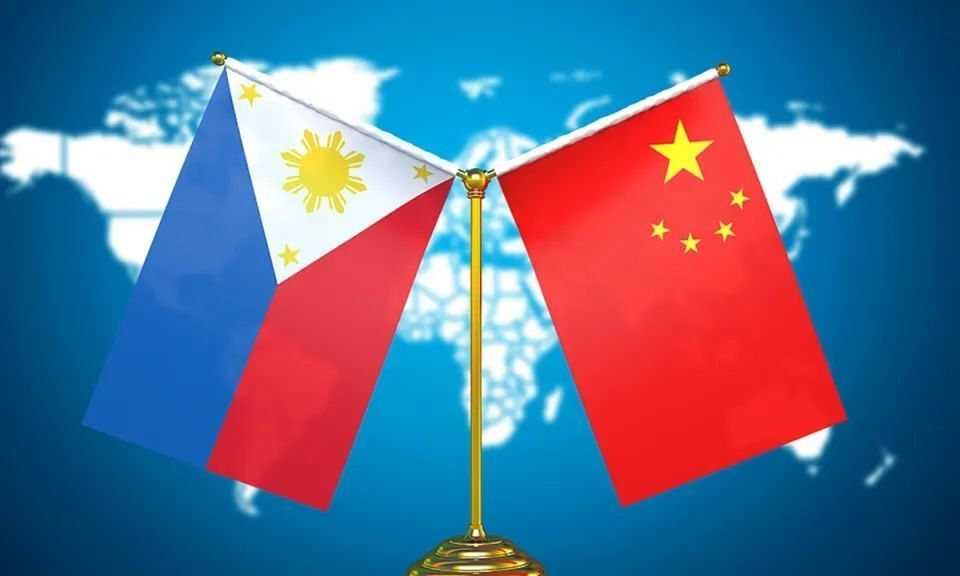
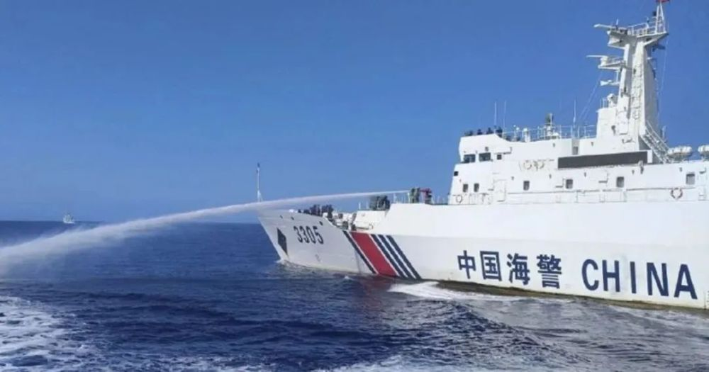
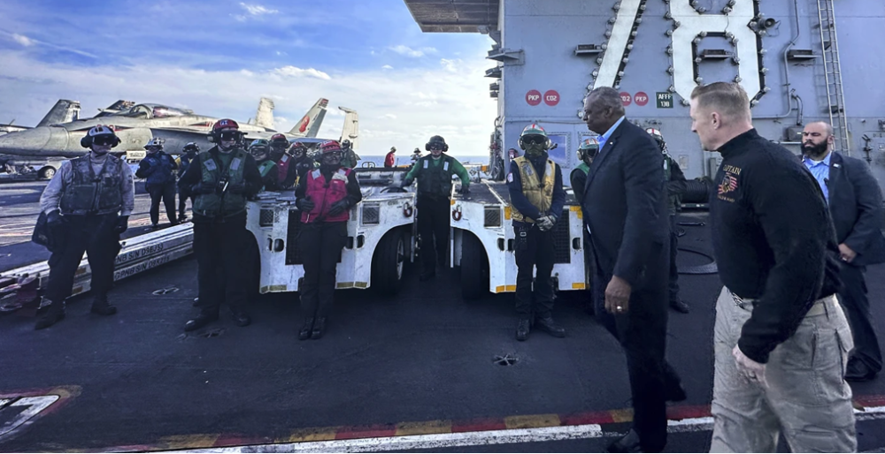

# 专家：中国外长警告菲律宾慎重行事，措辞直白严厉

**直新闻：中菲外长20日通电话，王毅告诫中菲关系面临严重困难，菲方应慎重从事，管先生，你对这次通话有何特别观察？**

**特约评论员 管姚**
：我注意到一个关键细节，就这次通话，中国外交部网站发布官方通报，上传时间是在周三（21日）23时04分，而菲律宾外交部发布通报，是在今天上午，菲律宾两家主要英文媒体，包括《菲律宾星报》与《菲律宾每日问询者报》，报道这次通话的稿件，上传发布相隔不到一小时，也都在上午。所以可以推定，这次中菲外长通话大概率在昨晚，而外交部网站的“小编”们熬到深夜时分也要抢先发布，确实相当拼。而在我看来，这种在关键、敏感时刻的拼劲，也确实是全方位大国外交的刚需，一定程度上也为传播大国声音与立场抢得先声，抢先站上舆论制高点。我注意到，王毅对菲方慎重行事的严正告诫，出现在多家外媒报道的标题中，比如今天《菲律宾星报》的即时报道，就以此为题，China
warns Philippines to exercise caution after maritime
confrontations，在经历海上对抗后，中国警告菲律宾慎重行事。法新社上午发自北京的电稿，也在标题中引用了王毅的这一告诫，即“act with
caution”。

从外交部通告来看，王毅这次与菲外长通话，措辞相当直白严厉，其所折射的，正是当前中菲关系承压现状。王毅以“站在十字路口”“面临严重困难”，评估当下双边关系，也把脉分析这种困难的根源所在：菲方改变自身政策立场，背弃已有承诺，不断在海上挑衅滋事。王毅奉劝菲方不要沿着错误方向走下去，当务之急是妥处管控好当前海上局势。我注意到，外交部通报稿也显示，菲外长在通话中介绍了菲方在仁爱礁问题上的看法，这意味着，仁爱礁是中菲妥处管控当前海上局势的最大焦点，菲律宾一艘破军舰的“坐滩”闹剧已经演了20多年，今年菲方一再发难，以补给为名行挑衅滋事之实，甚至前不久菲军参谋长也强行登上坐滩舰，这就是赤裸裸的升级对抗行径。必须要指出，上午菲律宾外交部发布的声明放低了调门，以“坦率、直接”这两个关键词，形容这次通话，强调双方对各自在一系列问题上的立场，有了更加清晰的了解，双方也都意识到解决这些问题、保持对话的重要性。所以通过这次外长通话，中菲两国推动管控分歧降温紧张局势，确实迎来了一个重要契机。

**直新闻：那么你预判，中菲在南海部分地区的紧张局势会因此降温吗？菲方会停止挑衅滋事吗？**

**特约评论员 管姚**
：这很大程度上取决于菲方的抉择与行动，尤其取决于菲方最高决策者本人，能不能对当前南海大势，乃至百年未有之大变局下的地区与世界大势，建构清醒、理性的认知判断。

举个眼前例子，上周六（16日）菲总统小马科斯在访日参加东盟与日本特别峰会期间，接受日媒访问，特别提到一个西方舆论场爱用的说法，“paradigm
shift”，即所谓“范式转移”。小马科斯称，处理南海问题，现在需要“范式转移”，他称马尼拉过去几年以外交努力表达自身利益诉求的做法，正通往“错误方向”，言下之意菲方要另起炉灶，这其实就是菲总统投西方舆论场所好，打所谓苦情牌，变着法子讨“外援”。

但菲方决策者千万不能错估形势，更不能对域外势力有不切实际的幻想。我注意到，王毅昨天直接把话挑明了，如果菲方误判形势，一意孤行
，甚至与不怀好意的外部势力相互勾联，继续生事生乱，中方必将依法维权，坚决回应。

哪些外部势力不怀好意，在大肆搅动南海？外界对此有目共睹，此前菲媒甚至在炒作所谓美舰将协同菲舰“联合补给”，菲方也在向美扩大开放军事基地，甚至有些基地成为距离台海最近的所谓“战略前沿”。菲方也总有人拿所谓美菲共同防御说事。就在今天，菲军总参谋长也与日本自卫队高官会谈，讨论所谓“紧迫地区安全议题”，大谈构建联盟反抗所谓“南海侵略”的重要性
。从现在的态势发展看，美日作为域外国家，插手搅局南海的姿态异常明确，菲律宾如果对这种拉拢与接近背后的真实意图看不清想不明，就一定会陷入新加坡总理李显龙所反复告诫的选边站险境，甚至是凶境，菲律宾就很难回到菲中关系的的正确道路。

值得注意的是，菲总统接受日媒采访口口声声外交努力是错误方向，但恰恰是菲外长几天后主动发起，中国外长应约通话，而且菲方也明确表态，愿本着诚意同中方加强对话，要发挥好两国海上问题沟通机制的作用，共同寻求解决问题的办法。所以菲外长的姿态也很明确，就是要回到外交沟通管控分歧的既定轨道上来，这也正是王毅昨天所着力强调的一点，对存在的争议应该商量着办。因此，中菲就南海问题举行的双边磋商机制会议，能否尽快恢复，何时恢复，将是我们观察南海局势能否实质性降温的一个重要窗口。

**直新闻：美国防长奥斯汀20日突然飞抵部署在地中海的“福特”号航母，这又释放何种信号？**

**特约评论员 管姚** ：对奥斯汀的这一举动，美联社随行记者发自“福特”号航母的电稿称，这是“an unannounced visit
”，是突然到访。奥斯汀登上美军最先进航母，一方面是为舰上官兵打气安抚，“福特”号已三度延期海外任务，都是由防长本人拍板，看来航母官兵这个圣诞与新年假期都得在海上漂着了，疲劳与怨气不小。同时，奥斯汀也在航母上高调喊话，“福特”号是美军军力威慑的核心大杀器，是防止巴以军事冲突外溢升级的关键。同时，按照英国《经济学人》的观察，奥斯汀是在美国海军正迎战新一轮苏伊士河危机之际，登上航母战斗群的。就在此前一天，就也门胡塞武装频频在无人机及导弹袭击多国商船，奥斯汀宣布成立多国红海及亚丁湾护航部队，很值得关注的是，多国护航部队由10国公开参与，另有9国秘密参加，后面这些国家为何不愿抛头露面，其中内情很值得探究。

奥斯汀在航母上喊话，防止冲突外溢，“福特”号是关键杀着，但至少在经贸领域，前所未有的外溢冲击已经形成。而且我们也看到，尽管多国军舰护航阵仗颇大，摆出大兵压境之势，但胡塞武装也没有任何退让，扬言只要以色列在加沙不收兵，他们对过往商船的袭击就不会停。更有专家担心，以多国海军护航之庞大投入，能否挺到彻底肃清海上袭击威胁，根本就是未知数。毕竟，以200万美元导弹截杀2000美元无人机，完全是牛刀杀鸡的极致。美军退役少将大卫·巴诺最新撰文预警，从乌克兰到加沙战场，无人机的大量应用，正颠覆对所谓“制空权”的界定，巴诺还比照“濒海战斗舰”理念，提出所谓
“air
littoral”即“濒空”概念，强调在传统空域之下的无人机活动空间，也应成为军事制胜的重要场域。也门胡塞武装一再偷袭得手，也是对所谓“濒空制胜”的再度佐证。

作者丨管姚，深圳卫视《直播港澳台》特约评论员

编辑丨林舒琪，深圳卫视直新闻主编

