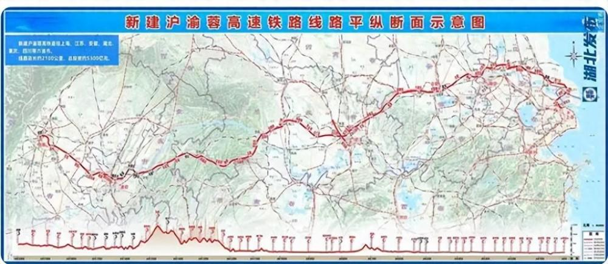
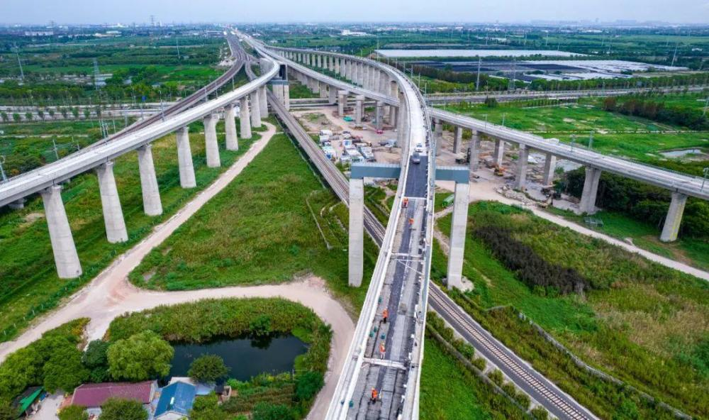

# 中国最重要的东西“大动脉”，来了

近日，横贯中国东西部的高铁“大动脉”又有新动作。

新建合肥至武汉高铁（以下简称“合武高铁”）初步设计日前已获批复，计划于12月底正式开工建设。合武高铁是沪渝蓉高速铁路（以下简称“沪渝蓉高铁”）承东启西的关键区段，其动工标志着沪渝蓉高铁进入全面加速建设期。

沪渝蓉高铁起自上海，途经江苏、安徽、湖北、重庆，止于四川成都站，贯穿4省2市，线路总长约2100公里，预计2030年前全面建成。

_新建沪渝蓉高铁线路平纵断面示意图。图/湖北发布官方微信公众号_

建成后的沪渝蓉高铁将取代原有沪汉蓉快速客运通道，作为我国贯穿东西的沿江大通道，串联起长江经济带上、中、下游的11个省（市），成为长江流域综合立体交通体系主骨干、全国“八纵八横”高铁网主动脉之一。

中国区域科学协会长江经济带研究专委会主任、四川省区域科学学会会长周江在接受中国新闻周刊采访时提到，长江经济带作为中国的经济重心之一，具有交通便捷、城市密集、产业基础雄厚、资源优势突出等特点，承载着国家重要的战略任务。

同时，周江指出，尽管长江经济带发展迅速，但也面临着资源分布不均、环境污染、城乡发展不平衡等问题，沪渝蓉高铁的建设可以提升区域内的交通便利性和效率，促进流域经济增长、实现区域均衡发展。

沪渝蓉高铁建成后，上海至成都、上海至重庆的运营里程预计将分别缩短为1875千米、1594千米，旅行时间将分别由现在的12.2小时、10.7小时缩减至6.7小时、5.3小时。

**与黄金水道形成互补优势**

长江经济带横跨中国东中西三大区域，覆盖上海、江苏、浙江、安徽、江西、湖北、湖南、重庆、四川、云南、贵州等11个省（市），面积约205.23万平方公里，约占全国面积的21.4%。

周江告诉中国新闻周刊，2022年长江经济带地区生产总值为559766亿元，增长3.0%，人口和生产总值均超过全国的40%。

在不少人的印象中，横贯长江经济带的“高铁”通道似乎早已有一条。

已经通车数年的沪汉蓉快速客运通道，起于上海，途经南京、合肥、武汉、重庆等城市，止于成都，的确是一条沿江而行、贯穿东西的铁路“大动脉”。

不过，中国城市规划设计研究院交通分院院长赵一新对中国新闻周刊表示，原有的沪汉蓉快速客运通道由于不同路段技术标准不一，难以充分发挥铁路的技术经济优势和通道整体能力，对实施长江经济带发展战略的支撑不足，在沿江综合交通体系中短板明显。

据了解，既有的沪汉蓉铁路的设计时速，仅上海至南京段、重庆至成都段为时速350公里，南京—合肥—武汉—宜昌，以及利川—重庆时速均为200～250公里，宜昌—利川时速仅160公里。

目前，从成都到上海，全程旅行时间为12.2小时。沪渝蓉高铁建成后，从成都到上海的时间将被缩短至6.7小时。因此，在不少受访者看来，这是真正意义上的中国东西铁路“大动脉”。

 _沪渝蓉高铁施工现场。图/中新社发 钟鑫旺 摄_

国家发改委国土开发与地区经济研究所综合研究室主任贾若祥在接受中国新闻周刊采访时指出，长江经济带的发展需要推进综合立体交通走廊建设，而沪渝蓉高铁作为其中关键支撑，显得尤为重要。

他说，长江经济带涉及省份多，区域面积大，上中下游间经济社会发展并不平衡。下游长三角地区经济发达，发展水平明显高于中上游地区，存在一定区域发展梯度差。

贾若祥认为，缩短长江经济带各区域之间交通的时间距离，将增强下游地区对中上游地区的辐射和带动能力，同时促进长三角地区的创新链与中西部地区的产业链更加紧密联系，从而推动长江经济带内相关城市群的协同发展。他举例称，一些在长三角地区发展较为成熟的产业，如纺织服装、食品加工和电子信息组装等相关产业，可以随着高铁快速通道的不断完善实现区域间的梯度转移，推动产业链、供应链的完善和升级，溯江而上促进高质量发展。

周江表示，通过改善交通基础设施条件，可以促使资源更加均衡地分配于长江经济带的不同地区，减少区域发展不平衡的问题。此外，还可以推动长江中上游地区的成渝双城经济圈与经济较为发达的长江三角洲地区进行有效对接，快速融入双循环大格局。

湖北省统计局原副局长叶青对中国新闻周刊表示，一条高铁线意味着一条黄金经济带。高铁线路沿途的每个站点都可以成为一个新的经济增长点。沪汉蓉高铁串起的几十座城市将辐射带动铁路沿线的中小城市、小城镇发展，从而有力促进三大城市群协同发展，促进长江经济带加速一体化发展。

沪渝蓉高铁的建设不但可以促进区域内经济发展，还可以提升区域内客运和货运的效率。

北京交通大学交通运输学院教授杨浩告诉中国新闻周刊，过去生产要素的流通以南北方向为主，对于西部地区来说，客运和货运需求并不高。沪汉蓉快速客运通道曾预留了货运条件，但由于技术条件存在差异，难于客货兼容，只能客运专用。

杨浩认为，随着长江经济带的发展，当下沿江东西向交通运输通道难以满足长江经济带发展需求，因此必须重新规划铁路网络功能布局，通过技术改造恢复旧线货运功能，并修建沪渝蓉高铁以满足未来的客运需求。

2022年，长江干线港口完成货物吞吐量35.9亿吨，同比增长1.7%。中国社会科学院研究员牛凤瑞对中国新闻周刊谈到，长江沿岸南北宽度较大，除黄金水道外，还需要东西向的其他运输方式来补充和优化。他认为，沪渝蓉高铁的建设对于长江经济带和整个中国高铁网络的加密优化至关重要，可以与长江黄金水道形成优势互补。

对于不少网民曾质疑为何不在原有铁路基础上进行提速，而需要重新修建一条新铁路，赵一新解释称，现有铁路设计时速不一，有些地方为160公里/小时，有些为250公里/小时，受制于地形条件和技术，不是所有路段都能提升到350公里/小时。

不过，他也提到，并非所有路段都为重新修建，“能保留的都尽量保留了，只是所占比例较小，大部分还是需要重新修建”。

**实现错位发展**

对于在上海从事艺术品收藏工作的重庆姑娘张瑞来说，沪渝蓉高铁的建设改变了她对事业的布局。由于工作需求，她经常需要将客户从重庆带到上海参加活动，她一直犹豫是否有必要在上海置办办公地点，但沪渝蓉高铁一旦开通，从重庆到上海仅需5.3小时，她认为这将有助于她更好开拓事业，因此，她决定将部分工作重心转移到上海。

然而，并非所有人都持乐观态度。在湖北天门市从事小商品贸易刘凯对中国新闻周刊表示，由于他们城市的经济体量并不大，他担心沪渝蓉高铁会让越来越多家乡的年轻人选择外出打拼。

沪渝蓉高铁连接上海、苏州、南京、合肥、武汉、重庆、成都等19个城市。周江介绍称，在这些城市中，2022年GDP超过1万亿元的城市达到了8个，如上海为4.47万亿元，苏州为2.4万亿元，重庆是2.9万亿元，成都突破2.1万亿元，同样，也有GDP低于1000亿元的城市，如四川的资阳市为948.2亿元，湖北的天门市只有730.05亿元。

周江认为，沪渝蓉高铁对上海、苏州、重庆、成都、南通、南京、合肥和武汉等城市而言，意味着更多的经济交流和发展机遇。而对于六安市、天门市、恩施土家族苗族自治州和资阳市等经济规模相对较小的城市而言，在进一步便利资源要素的流通和人才的流动同时，也可能会加剧一些城市的“虹吸效应”，即此类城市的资源和人才可能加速流向更大的城市，加剧区域内的不平衡发展。

在牛凤瑞看来，城市化本身具有极化效应，只有人口、产业和资金的集聚，才能实现更高的要素配置效率。他认为，这种聚集效应和规模效应对国家整体的综合经济实力以及区域发展利大于弊。

不过，牛凤瑞也提到，虽然对于一些处于“虹吸效应”之下的地区来说，目前可能并非都是利好，但随着中心城市地区的发展，其效益会外溢给周边城市和地区，总体发展仍会趋向于平衡。

他进一步解释称，当前区域壁垒主要包括城乡二元体制造成的要素流动受阻，以及行政手段配置资源不当而造成的行政区划壁垒。他说，“我们需要构建全国统一大市场，为了实现通过市场机制配置要素资源，必须打破这些区域壁垒。”

对于那些体量较小的城市，周江认为，此类城市可以立足于自身特点，通过培育特色产业来实现错位发展，避免直接与大城市竞争。还可以通过与大城市形成产业协同效应，共同开发区域市场，实现资源共享。此外，他认为，注重绿色建设和环保，提高城市的宜居性，也是中小城市可行的发展路径。

由于高铁建设涉及一些新站的建设，赵一新认为，在新建的线路中，城市内站点的设置要更加注重与城市融合在一起，“不应再像过去那样将站点设置远离城市中心，这对城市和高铁之间的互动关系并不利”。

作者：陈淑莲

编辑：孙晓波

