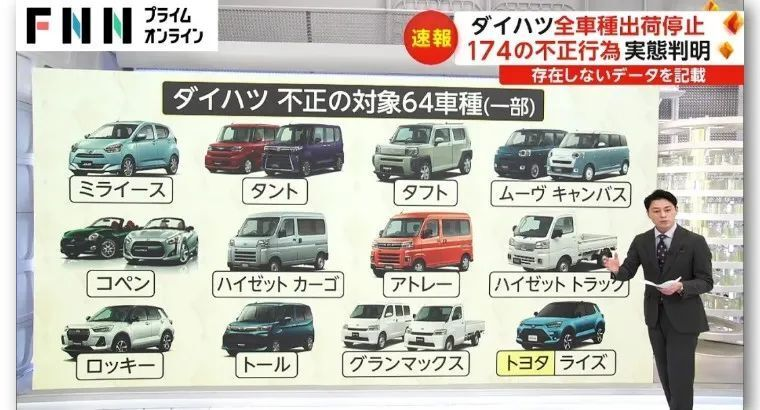

# 丰田将全球召回112万辆车，子公司大发汽车数据造假“爆雷”

2023年12月20日，日本现代工业发展史上，将被留下重重一笔的日子。

丰田汽车与全资子公司大发汽车联合召开记者会，承认 **“涉嫌碰撞测试数据造假的车型，从早先被曝的6款，扩大到64款”。**

这64款车型，除了正在销售的“现役款”，还包括尚处于研发阶段的未来新款，更包括已经停产的老款。

没办法， **大发汽车的数据造假，起码在34年前就开始了！** 这还仅因目前已经掌握到的最早证据是1989年的。

今年4月，大发汽车被发现在检测安全性能的碰撞测试数据上造假，涉嫌的两款车型被喊停出厂。

岂料不查不知道，一查吓一跳，第三方委员会查出 **“日本汽车制造业前所未闻”**
的严重事态：大发汽车在25个测试项目上，至少有174处造假，涉嫌车型增加到28款。

到12月20日，大发汽车出来召开记者会时，涉嫌车型又扩大到64款。记者会上宣布，包括海外工厂在内的旗下全部车型都暂停出厂。

以社长奥田总一郎为首的大发高层，对 **“背叛消费者的信任，身为汽车生产商，却动摇产业根干”** 齐齐起身，鞠躬谢罪。

12月21日上午9点半，日本国土交通省调查组进入大发汽车位于大阪的本部。对其已递交的报告内容与实际情况进行核对检查。

第三方委员会在回答记者提问时，曾明确表示调查能力有限， **这次的造假数据“仅是已查到的部分”，有可能冰山一角而已。**

随着国交省调查组进驻，就看会不会真有魄力，查出点别的大料了。

大发汽车将需召回多少万辆车，目前还未知。但丰田汽车已确定，将全球召回112万辆“可能有问题”的车。

美国当地时间12月20日，丰田汽车北美总部宣布将召回全球112万辆“安全气囊恐有问题”的车。其中，仅美国市场就有100万辆。

召回车型：RAV4、Camry、Avalon、Corolla、Sienna，以及雷克萨斯ES和RX车型。

丰田声明中称，安装在部分丰田和雷克萨斯品牌轿车和SUV前排副驾驶位置的传感器，可能因制造问题短路，造成对乘客体重的分类不当。从而导致安全气囊在可能发生的碰撞中无法按设计展开。

丰田将对召回车辆进行免费检查维修。

丰田是日本的工业磐石，称之为日本经济的定海神针也不为过。

大发汽车是丰田的全资子公司，经营权受丰田支配。其现任社长就是从丰田派过去的。

大发汽车在今年4月，首次被曝安全测试数据造假，涉嫌的两款车型中，有一款是为丰田生产的RAIZE。

丰田将召回112万辆车，全资子公司大规模安全检测数据造假，单独哪一件都是震撼日本汽车制造业的大事。

尽管就目前的信息来看，两者间没有明确关联性，丰田主动召回问题车，积极修理甚至可以视为还不错的企业态度。但是，两件大事在同一时间点，叠加在了一起，造成的负面影响1+1大于2。

“丰田也造假，所以车出问题了？”

“丰田默许大发造假？”

普通人的普通质疑，角度合理，影响可怕……

**乡民痛评**

●最坏的时间点。不禁让人觉得“丰田系又出事了吗”。今天的日本股市受昨天美股影响下降，不过汽车行业，尤其丰田系的跌幅很大呀。

●汽车是零部件的集合体。厂商过度压榨零部件外包商，从结果来说，创造历史最高收益，但这些都建立在外包商的血与泪上。

外包商也想做出好产品，可利润微薄，难免导致零部件品质低下。召回车辆数量大，其原因之一就在于此吧。

●日本车的安全气囊质量，以前也出过大问题。还记得那之后，外包承接安全气囊的那家公司倒闭。

日本车仍是世界第一。因为质量好，所以很安全，这一公众形象极为重要。在国外，日本车被视作高档车，这也是大家想买的理由。如今，亚洲其它各国在汽车领域抬头，希望日系车别输给它们。

●日野、大发，以及本次召回事件，丰田集团面临严峻局面。首先是经营掌舵能否去到正确方向。并且有必要认识到，市场反应将比预想中的更为严厉。

●不容乐观呀。最近才知道传感器出了问题，但已经有100万台问题车出厂了。很明显，在生产过程和检查环节就存在问题。

●丰田集团、本田这些代表日本的车企业，请不要焦躁，安全第一。为对抗中国，请努力生存下来。请聘用优秀的退休人才，勿懈怠检查。技术，有传承下去的必要。

●丰田的企业理念、常识，有本质上的问题。

丰田被发现过5000件以上的车检造假，大发以前也被发现过大规模造假。但是，什么行政处分都没有，国家反而还给了1800亿日元的支援。

自民党、公明党政客与企业勾结，媒体又因（丰田、大发）是重要赞助商，报道起来轻轻带过。

●继大发造假问题，动摇丰田集团的事态在持续进行中。年仅53岁就任top，其言行做派至今仍只看得出是在模仿“章男会长”。从现在开始，就看佐藤新社长有没有真本事了。

