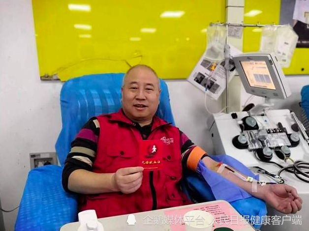

# 大幅降温致献血人数减少，一些血站库存告急

（人民日报健康客户端记者 杨晓露 谭琪欣）随着气温的降低，献血人数骤减。山东潍坊、河南新乡、山西运城等多地血站发布消息称血液库存告急，呼吁市民积极献血。

 _黄哲从1997年开始献血，至今已有26年献血史。受访者供图_

12月20日，多地血库工作人员告诉人民日报健康客户端记者，由于天气寒冷，无偿献血人数减少，血液库存持续走低。“献血人少了，但临床用血量并没有减少，血库比较紧张。目前临床急重症用血尚可保障，但慢性病患者用血已经相对紧张，希望热心市民能踊跃到家附近的献血点献血，缓解目前的季节性缺血情况。”10月20日，山东潍坊市中心血站的工作人员告诉人民日报健康客户端记者。

山西太原市血液中心的工作人员表示，市里每天的临床供血量约600单位～700单位左右，近期太原市所有血型的库存都已经临近警戒线，其中O型血液库存偏型严重。

同样血液库存已经在警戒线附近徘徊的还有湖南岳阳市中心血站，其工作人员介绍，今年因为流感等呼吸道感染人数增加，叠加寒冷天气，导致无偿献血的人数减少。按照临床用血的需求，平均每天得有约百余人献血才能满足市里的临床基本供应。

血库告急并不是今年才出现的情况，有26年献血史的黄哲告诉人民日报健康客户端记者，每年冬季几乎都是用血荒，主要还是天冷市民出行受影响，此外，大学生是献血的主力军，大学生放寒假返程，也是血库告急的原因之一。

“但今年的情况较往年更为严重。”陕西某血站主任告诉人民日报健康客户端记者，每年的寒冬腊月献血人数都会减少，我们会采取各种措施鼓励献血，基本还是能满足临床的需要，但今年的情况与往年大不一样，团献和街头自愿无偿献血的献血者明显减少，我们也采取了一些措施，可是效果都不明显。

“尽管国家也出台了一些指导性的激励政策，但如何能将这些政策落到实处，需要各级政府和采供血部门共同制定一个长效激励机制，才能解决这个问题。”李凤琴建议。

“血液不能制备，而且还有保质期，只能靠健康的人去捐献，定期献血，无损健康，反而可以督促自己养成好习惯，希望健康人士都能加入这个队伍中来。”黄哲呼吁。

