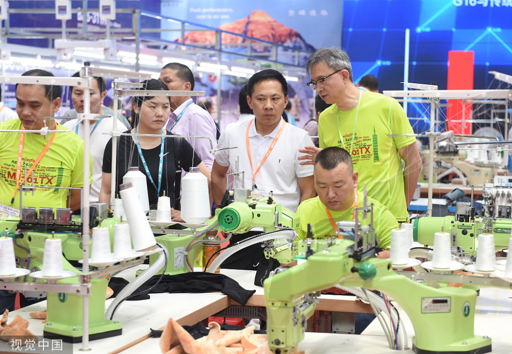

# 大陆中止部分ECFA关税减让，台媒：业界“吓坏”，冲击恐遍及上下游

（观察者网讯）进入12月，从商务部认定台湾地区对大陆贸易限制措施构成贸易壁垒，到国务院宣布部分中止《海峡两岸经济合作框架协议》（ECFA）项下给予台湾产品的关税优惠，让岛内业界感到丝丝凉意。

“吓坏！大陆取消ECFA部分关税优惠，台湾业者低调急开会”，台湾《工商时报》21日称，当天对丙烯等12项产品进口中止ECFA协议税率的公告出炉后，岛内各大相关公司早上纷纷开会讨论，业内对此低调处理，仅称会依照规定办理。

据台湾“中央社”21日报道，台湾石化公会对媒体表示，由于石化产业原料在生产过程上互有关联，本次公告虽仅中止12项产品优惠关税，但对岛内石化产业冲击遍及上下游产业链，光是关税影响就超过60亿美元；台湾工业总会则建议民进党当局与大陆建立协商沟通渠道。

_台湾最大的林园石化工业区（资料图） 图片来源：台网络媒体“报导者”_

国务院21日公告指出，因台湾地区单方面对大陆产品出口采取歧视性的禁止、限制等措施违反了ECFA规定，自2024年1月1日起，对原产于台湾地区的附件所列丙烯、对二甲苯等12个税目进口产品，中止适用ECFA协定税率，按现行有关规定执行。

对此，台湾石化公会表示，相比此前商务部只针对丙烯下游如聚碳酸酯（PC）等少量产品低价倾销，要求进口经营者提供相应保证金，这次直接取消丙烯、氯乙烯等12项石化产品优惠关税，影响层面大很多，光是关税影响就超过60亿美元，实际对产业的冲击影响更大。

台湾石化公会说，因石化原料与上下游生产有密切关系，不是单一产品，这次公告初看仅有12项，但乙烯、丙烯、丁二烯基本原料都会受到冲击，因为石化产品上下游相互牵动，受打击层面相当大，可说是岛内几乎石化产业全面都受到打击。一旦对下游产品取消关税优惠，连带上游需求也会遭到波及。

_国务院公告附件截图_

台石化公会理事长、台塑石化公司总经理曹明认为，尽管这一波取消关税优惠的影响程度仍待评估，但此举对岛内石化产业一定会产生冲击。他指出，岛内约四成的石化产品都是销往大陆与香港，台湾石化产业去年对大陆出口约62.4亿美元，其中受惠ECFA的规模在17亿美元左右。

《工商时报》引述业内人士观点说，全球经济不佳已冲击台湾石化产业营收，如今被取消ECFA对12项关税优惠，处境更雪上加霜。在曹明看来，此次中止ECFA部分关税优惠可能不是最后一次，后续很可能还会陆续宣布。他希望台当局要重视对岛内产业的影响，站在贸易公平的立场上，积极协商解决。

台湾商业总会理事长许舒博也担心后续潜在的更多措施可能会逼得台湾产业出走。他说，目前大陆中止的部分产品都是单项，但一旦中止整个产业，对台湾产业影响会很大。未来台湾的生产基地面临高关税，并因此失去竞争能力时，势必被逼到第三地投资。

台湾工业总会分析称，对于全球布局的石化大厂来说，会以增加海外产能应对此次关税减让中止，而缩减岛内产能的结果，势必会冲击岛内就业。至于规模不大的中小企业厂商，也只能透过加速海外投资布局进行应对，但其结果影响的也是岛内就业。

台湾工业总会进一步指出，如果台湾对陆出口的其他产品，如机械、纺织等的既有关税优惠也被取消，对台湾从业人口众多、高度依赖大陆市场的传统产业来说，都将是很大的冲击。台湾工业总会建议，台当局在协助加速台湾厂商全球布局的同时，也要与大陆建立协商沟通渠道。

_2018年中国义乌纺博会上，台湾参展商演示一款台湾产四针拚缝机。图片来源：视觉中国_

有专家认为，此次中止部分ECFA产品关税减让，是对于民进党当局的一种警示。据台湾联合报21日报道，上海东亚研究所助理所长包承柯称，两岸经贸关系一直受到政治因素的冲击和影响，大陆方面的大部分惠台政策都希望能在将来过渡到两岸“双向”交流，但由于民进党当局无法与大陆进行沟通，不承认“九二共识”，也让互动的安排无法出现。

包承柯分析说，21日公布的这12个税目产品，其首要基本目的在于平衡两岸的贸易，但也是对民进党当局的一种警告措施，提醒民进党当局要想办法处理两岸经贸存在的问题，不要只是视乎而不见言语性地说，台湾不需要大陆市场，也不要一边顺应美国要求对大陆产品采取歧视性措施，一边享受大陆对台优惠政策。

《工商时报》16日社论也指出，当前两岸贸易依存度仍然很高，因此大陆对台的任何经贸举措，对台湾的影响都不小。自2016年以来，台当局提出“新南向”等政策，希望借此降低对陆经贸依赖，但迄今大陆仍是台湾最主要的经贸伙伴。随着大陆产业的快速发展，该市场对台商乃至全球企业仍具相当吸引力，台湾短期内很难摆脱对大陆的依赖。

据悉，台湾地区外贸出口比重占台湾GDP的70%，台湾对大陆的贸易比重是40%。根据国台办此前公布数据，ECFA生效实施以来，两岸贸易额从2010年1453.7亿美元增长至2022年3196.8亿美元，截至今年上半年，在货物贸易领域，ECFA给予台湾的关税优惠高达88亿美元，给两岸特别是台湾相关企业和民众带来实实在在利益。

据“中时新闻网”报道，台湾“中央大学”经济系教授吴大任表示，如果台湾失去ECFA，考虑到长期内加入国际经贸组织相当困难，ECFA中断后台湾地区的出口竞争力也将大受打击。若出口受挫带动就业冲击，岛内家庭支出连动受影响，进而扩及内需、服务业，台湾经济将陷入恶性循环。

**本文系观察者网独家稿件，未经授权，不得转载。**

