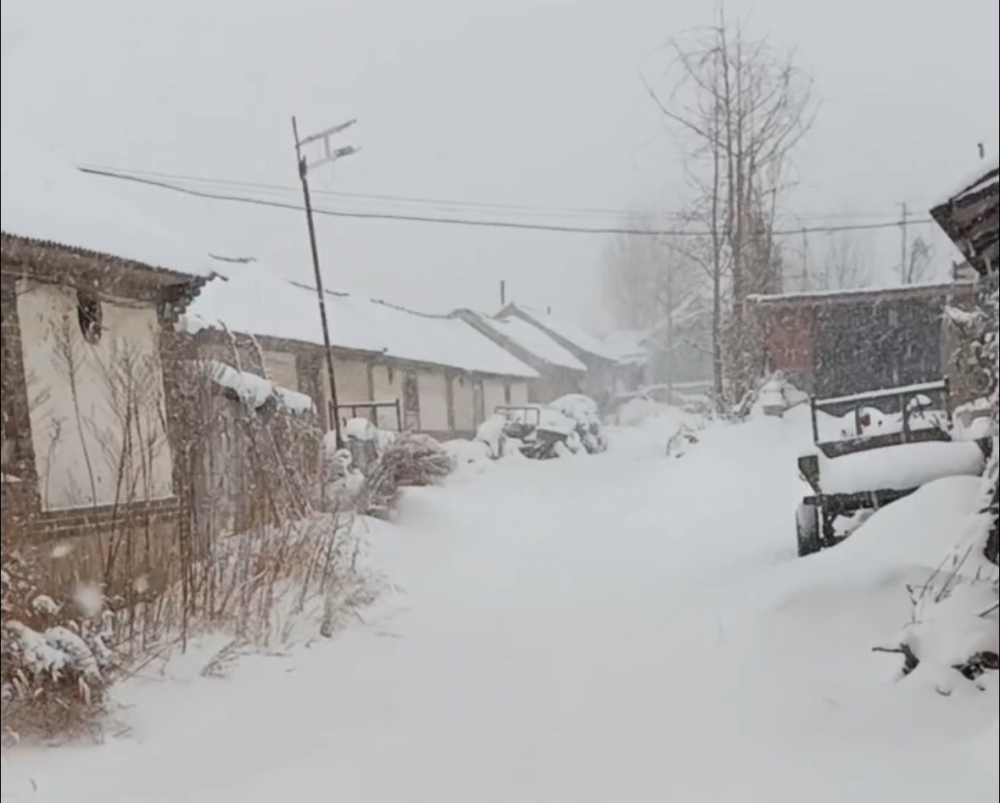

# 山东烟台威海遭遇极端性冷流暴雪，网友：宛如北极科考

“冷流雪正在狂暴，宛如北极科考!”

_烟台大学东门附近，冷流雪正在狂暴，宛如北极科考。微博网友观云梦雨 视频截图_

12月20日，位于山东半岛的烟台、威海地区遭遇冷流暴雪。网友拍下了烟台大学附近海边的雪景并配文：冷流雪正在狂暴，宛如北极科考！

山东省气象台首席预报员杨成芳介绍说，从12月15日下午到17日，受强冷空气影响，威海、烟台地区出现冷流暴雪，其中牟平、文登、荣成和威海市区有4个气象站累计降雪量达到了大暴雪量级，文登降雪量最大，达到35.6毫米，已属特大暴雪量级。

仅12月16日，文登降雪量27.5毫米，这是数值已突破山东半岛冷流暴雪日降雪量的历史极值。

“这次暴雪过程属于一次极端事件。”杨成芳说，12月17日，积雪深度文登、荣成分别达到35和36厘米。

 _12月21日，“雪窝”烟台冷流雪还在继续。_

然而，降雪还将持续。杨成芳说，12月20日到22日，受强冷空气的再次影响，烟台和威海地区将再次出现强冷流降雪，烟台北部和威海有大到暴雪，局部大暴雪，尤其是威海，累计降雪量可能超过35毫米，积雪深度会超过40厘米。

杨成芳表示，由于两次强降雪过程间隔时间短气温低，积雪深度较大，积雪长时间不化会给这两地的城市运行、交通和能源保供等方面产生不利影响。

冷流雪不同于一般性降雪，其特色是阵性强，局地性明显，积雪效率高，垂直对流强，常有“列车效应”，且云很低，有云中撒雪的“雪幕”景观，可能伴随晴天，降雪景观独特!图为刚刚在烟台南站外面拍摄的太阳雪。

