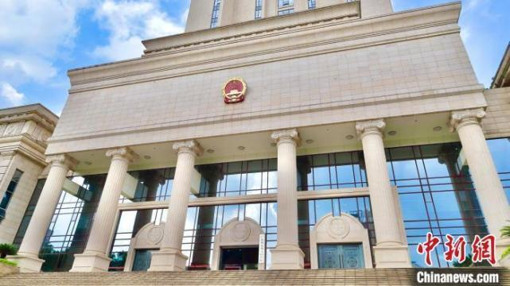

# 广东多人用无人机在深港边境搭高空线缆走私手机，偷逃税超5千万获刑

_广东省高级人民法院 中新网 资料图_

据广东省高级人民法院微信号消息，12月21日，广东省高级人民法院发布一批打击走私犯罪典型案例，这些案例包括依法严惩通过跨境电商刷单、利用离岛免税政策进行“套代购”、架设空中走私通道、走私珍贵动物制品、走私“洋垃圾”等犯罪行为，体现了广东法院充分发挥审判职能作用，依法严厉打击各类走私犯罪，切实维护国家监管秩序、社会和谐稳定和人民群众财产安全的坚定决心。

**01 利用跨境电商平台“刷单”走私**

**——熊某等人走私普通货物、物品案**

**基本案情**

2018年11月至2020年5月，熊某、陈某、向某等人为获取非法利益，制作虚假的订单、物流、支付信息，使其符合跨境电商平台“三单一致”的要求。再将本应以一般贸易方式或行邮物品申报进口的护肤品、化妆品等货物，通过多个跨境电商平台零售进口的渠道走私进口逃避正常缴税。经核定，熊某等人走私普通货物、物品偷逃税款达2000万余元。

**裁判结果**

清远市中级人民法院认为，被告人熊某、陈某、向某等人违反海关法规，非法走私货物、物品，其行为均构成走私普通货物、物品罪，分别对熊某等人判处有期徒刑十五年至两年不等，并判处罚金。该案经广东省高级人民法院二审审理，裁定驳回上诉，维持原判。

**典型意义**

本案是利用跨境电商平台实施走私犯罪的典型案例。近年来，不法分子利用行业监管漏洞实施跨境电商类走私犯罪易发多发。根据商务部、海关总署等六部门发布的《关于完善跨境电子商务零售进口监管有关工作的通知》要求，与海关联网的跨境电商企业、跨境电商平台及支付、物流企业均应当向海关实时传输施加电子签名的跨境电商零售进口交易、支付、物流电子数据。现实中，一些不法分子为牟取利益，利用跨境电商零售进口税费优惠政策，采取伪造“三单”信息的方式，将本应以一般贸易或行邮物品进口的货物、物品伪装成跨境电商零售进口货物、物品申报进口，逃避海关监管，给国家造成巨大的税收损失，应以走私普通货物、物品罪予以惩处。

**02 离岛免税“套代购”走私**

**——唐某等人走私普通货物、物品案**

**基本案情**

2020年至2021年，唐某通过多个社交媒体发布海南离岛免税商品的信息招揽客户，整理客户购物清单后招募“水客头”组织“水客”前往海南带货，利用他人离岛免税额度购买免税商品后转售牟利。经统计，被告人唐某累计套购免税商品375万余元，涉嫌偷逃税款85万余元。

**裁判结果**

湛江市中级人民法院生效判决认为，被告人唐某为牟取非法利益，利用海南离岛免税政策，组织“水客”套购海南免税商品后转售，偷逃应缴税款数额巨大，构成走私普通货物、物品罪，依法判处被告人唐某有期徒刑三年，并判处罚金。

**典型意义**

离岛免税“套代购”是一种新型走私违法犯罪行为。根据财政部、海关总署、税务总局发布的《关于海南岛旅客免税购物政策的公告》规定，已经购买的离岛免税商品属于消费者个人使用的最终商品，不得进入国内市场二次销售。不法分子利用国家对海南离岛免税政策组织“水客”套购免税商品后进行二次销售，严重扰乱海关监管秩序和国家对外开放政策的实施，应以走私普通货物、物品罪予以惩处。

**03 利用无人机架设“飞线”走私**

**——余某等人走私普通货物、物品案**

**基本案情**

2020年12月起，余某、林某等人组织人员遥控无人机将绳线固定在两岸较为坚固的树木等锚定点后，形成“飞线”走私通道，由预先安排在香港境内边界处的人员利用电机传动和深港两地的地势差将手机滑运走私入境。深圳境内的人员接收走私入境的手机后，利用在境内架设的多段“飞线”线缆将货物运至某小区停车场。2020年12月至2021年4月，余某等人组织人员以上述飞线方式走私手机入境，经海关计核，累计涉嫌偷逃应缴税款人民币5000万余元。

**裁判结果**

广东省高级人民法院生效判决认为，被告人余某等人无视国家法律，逃避海关监管，走私普通货物入境，其行为均已构成走私普通货物、物品罪。结合余某等人在共同犯罪中的地位、作用，以走私普通货物、物品罪判处余某等人有期徒刑十年至一年不等，并判处罚金。

**典型意义**

近年来，不法分子为牟暴利不断翻新走私手法，呈现“海陆空”立体模式。除了传统通过船只从海上、水上走私，通关时隐匿夹带外，还逐渐发展出利用地下通道进行“地下战”式走私，利用界河两岸楼房、树木架设高空飞线，使用无人机、滑轮等新手法。本案被告人即是利用无人机在深港边境区域架设“飞线”进行空中走私。人民法院依法惩处此类走私犯罪行为，警示不法分子不管使用何种犯罪手段牟取利益，都必将受到法律惩处。

**04 走私珍贵、濒危野生动物制品**

**——梁某等人走私珍贵动物制品案**

**基本案情**

2015年8月至2018年6月，梁某、王某组建跨国走私犯罪团伙，伙同他人从墨西哥走私加利福尼亚湾石首鱼鱼鳔入境后销售牟利。梁某长期在墨西哥收购、加工石首鱼鱼鳔并组织分批走私入境；王某负责接送货、对数及款项收付等工作；陈某等人通过预付货款收购走私入境的石首鱼鱼鳔。在梁某、王某的安排下，黄某等人多次参与石首鱼鱼鳔走私的带货、接送货工作，张某负责石首鱼鱼鳔走私和销售的记账工作并偶尔参与接货。经核计，梁某等人共走私、销售石首鱼鱼鳔1.5万余个，总价值人民币7.4亿余元。

**裁判结果**

江门市中级人民法院认为，被告人梁某等人逃避海关监管，共同走私珍贵动物制品入境，情节特别严重，构成走私珍贵动物制品罪，结合梁某等人在共同犯罪中的地位、作用，以走私珍贵动物制品罪判处梁某等人有期徒刑十五年至五年不等，并判处罚金。该案经广东省高级人民法院二审审理，裁定驳回上诉，维持原判。

**典型意义**

本案是走私珍贵、濒危野生动物制品犯罪的典型案例。加利福尼亚湾石首鱼于1976年被列入《濒危野生动植物种国际贸易公约》CITES附录I，属于世界自然保护联盟（IUCN）红色名录的易危（VU）物种。本案所涉石首鱼鱼鳔数量多、货值高，案件涉境内外跨国犯罪，走私链条长，社会影响巨大。人民法院依法惩处走私珍贵、濒危野生动物制品犯罪是积极履行《濒危野生动植物种国际贸易公约》规定国际义务的具体表现，向社会传递了人民法院全面发挥刑事审判职能作用、依法保障生态文明建设的决心，对于引导社会公众树立法律意识，自觉保护生态环境尤其是野生动植物资源，具有教育示范意义。

**05 非法转让许可证帮助他人走私“洋垃圾”**

**——刘某等人走私废物案**

**基本案情**

2016年10月，为完成工作指标，某再生资源投资有限公司直接负责主管人员及其他直接责任人员刘某、唐某、叶某以伪报收货人的方式非法转让《限制进口类可用作原料的固体废物进口许可证》，被某国际货运代理有限公司（另案处理）用于进口废金属2柜，合计50.07吨。2017年1月至11月，刘某明知且同意唐某、叶某、向某等人以伪报收货人的方式非法转让前述许可证供他人使用，并代理进口废金属148柜，合计3432.89吨。

**裁判结果**

清远市中级人民法院生效判决认为，某再生资源投资有限公司违反海关法规，逃避海关监管，将许可证提供给他人用于走私固体废物，情节特别严重；被告人刘某、唐某、叶某、向某作为单位犯罪的直接负责主管人员或者其他直接责任人员，其行为已构成走私废物罪，分别对刘某等人判处有期徒刑二年二个月至七个月不等，并判处罚金。

**典型意义**

本案是非法转让许可证帮助他人走私“洋垃圾”的典型案件。“洋垃圾”，是我国禁止进境的固体废物。利用许可证走私进口可用作原料的固体废物，包括持证企业与他人通谋，非法将本单位许可证交由不具备相应环评资质的单位或者个人走私进口可用作原料的固体废物的行为。近年来，非法进口的“洋垃圾”会被国内接收方以极低的价格买入，并经过入境、转运、加工、销售等环节层层处理，再次翻新成产品出售。上述不同环节由不同组织分别经营并且之间产生单线联系，最终形成上下游产业链，严重影响了环境安全和人民健康。本案彰显了人民法院严厉打击走私“洋垃圾”等犯罪行为的态度，有利于强化国家固体废物进口管理制度，维护国家生态环境安全和人民群众生命健康。

