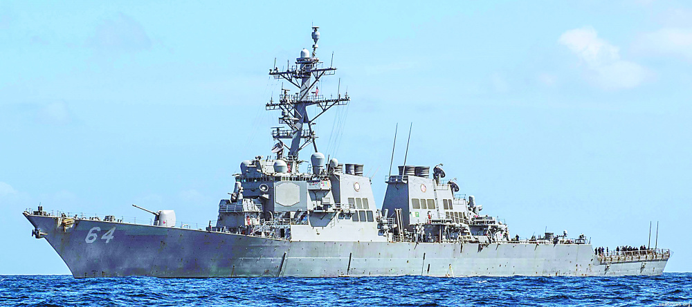
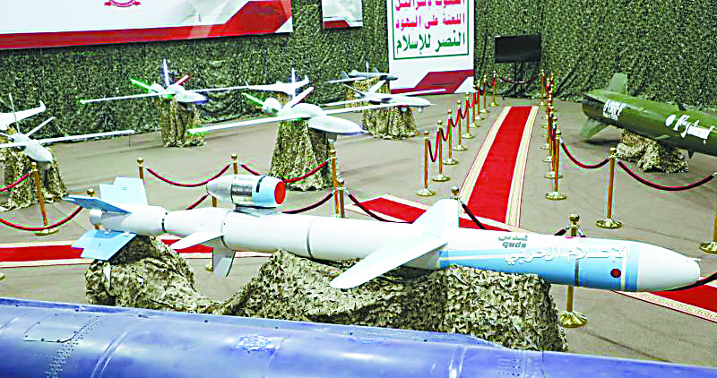

# 拦截成本太高，护航能力有限……美组建红海多国舰队效果被质疑

【环球时报特约记者 晨阳 环球时报记者
马俊】新一轮巴以冲突爆发后，也门胡塞武装在红海多次袭击“与以色列有关”船只。美国18日以保障“航行自由”为由，拉拢英国、法国等组成“繁荣卫士”联盟，建立联合巡逻舰队在红海执行护航行动，但此举却遭到包括美国媒体在内的外界舆论的普遍质疑。

**2000美元 VS 200万美元**

美国政治新闻网站19日称，过去两个月，美国海军驱逐舰在红海已经击落了胡塞武装发射的38架无人机和多枚导弹，仅“卡尼”号驱逐舰16日就拦截了14架自杀无人机。但这些“辉煌战果”不但没有鼓舞士气，反而引起不少争议。前五角大楼和中央情报局官员米克·马尔罗伊表示，“这很快就会成为一个问题——即使我们全部击落来袭的导弹和无人机，对他们（胡塞武装）也是有利的。”他强调说，美国需要寻找能以更低成本击败这些攻击的方法。

_美国“卡尼”号导弹驱逐舰_

报道称，五角大楼官员以行动安全为由，不愿证实美军驱逐舰使用什么类型的武器或拦截无人机时的作战范围。但美国专家认为，只有一种武器适合这项工作：“标准-2”中程防空导弹。“根据具体型号的不同，其射程可达170-240公里。最新型号的单价为210万美元”。

作为对比，西方专家估计胡塞武装的自杀无人机成本最多只有2000美元。美国智库战略与国际问题研究中心导弹防御项目研究员沙恩·谢赫表示，即便是较大的“沙希德-136”无人机，价值也不过2万美元。

一名熟悉情况的前美国海军官员表示，驱逐舰还可以使用该舰的127毫米主炮拦截无人机，在类似场景的测试中已经取得不错效果。“这是一种成本较低的选择，但只能攻击18公里内的目标——这可能太近了。”另外的选择还包括“改进型海麻雀”防空导弹和“密集阵”近防系统，但它们面临同样的问题：“改进型海麻雀”每次发射成本高达180万美元；“密集阵”系统发射的20毫米炮弹只能攻击两公里范围内的目标。美国海军分析中心顾问塞缪尔·本德特承认，目前除了正在使用的这些武器之外，“美国海军似乎没有更好的选择。”

美国有线电视新闻网（CNN）19日也表达了类似的担忧：“由于美军面临的是可以大量生产和部署、造价低于10万美元的无人机，长期的拦截行动最终可能会加重美国海军资源的负担。”伦敦国王学院战争与战略教授阿莱西奥·帕塔拉诺表示，“美国驱逐舰配备的先进防空系统的平均行动成本约为200万美元，使得拦截无人机不具有成本效益。”

曾在美国太平洋司令部联合情报中心任职的卡尔·舒斯特表示，美国驱逐舰的“密集阵”近防系统能够以每分钟发射4500发炮弹的速度拦截距离军舰约1英里范围内的无人机或导弹，“这是一种相对低成本的防御方法，但如果无人机已如此接近，那么该系统就是美军舰艇的最后一道防线，一旦出现失误可能会导致美国人丧生。”CNN称，尽管被一枚导弹或一架无人机命中，通常不会导致美国驱逐舰沉没，但可能杀死舰上人员或造成损害，导致船只需要撤回港口进行维修。伦敦皇家联合军种研究所海上力量研究员西德哈斯·考沙尔表示，更关键的问题是拦截费用较低的“密集阵”系统射程非常近，只能为驱逐舰提供自我防护，无法为美国驱逐舰护航的商船提供保护，因为后者通常与军舰保持数英里远的距离航行。而商船才是胡塞武装无人机的主要袭击对象。

**胡塞武装攻击手段很多**

西方专家注意到，除了巨大的成本差异外，拦截胡塞武装无人机的长期化还带来另一个挑战。政治新闻网站称，尽管在俄乌冲突中，乌军拦截俄军自杀无人机时面临同样的成本问题，但美军驱逐舰应对胡塞武装的自杀无人机时出现一个新挑战——海上难以补充弹药储备。

_胡塞武装拥有多种无人机和导弹。_

考沙尔表示，美军驱逐舰上的防空导弹由垂直发射系统发射，“垂直发射系统的每个单元可以包含多种武器（具体数量保密），但任何一艘船上的导弹数量都不是无限的。”据介绍，美国海军“阿利·伯克”级驱逐舰通常配备有96单元的MK41垂直发射系统，但其中部分单元填装的是反潜导弹或“战斧”巡航导弹，因此可拦截无人机或导弹的防空导弹数量有限。目前美国海军在红海周边部署了至少4艘驱逐舰，北卡罗来纳州坎贝尔大学海军专家萨尔瓦托雷·梅尔科利亚诺表示，如果胡塞武装通过连续发动袭击而耗尽美国驱逐舰的防空弹药库存，美军舰艇可能会发现自己缺乏弹药来保护商船。“虽然美国海军装备精良，目前可以挫败胡塞武装无人机的攻击，但令人担忧的是，随着无人机攻击的范围和规模扩大，护航舰艇无法维持一定的防御水平来保护商业航运。”

CNN称，更让美国海军头疼的是，当前胡塞武装尚未尝试过真正的无人机集群攻击，“类似于俄罗斯在乌克兰多次实施、由数十架无人机同时发动的攻击”。梅尔科利亚诺说：“无人机集群攻击可能会削弱单艘军舰的防御能力，但更重要的是，它意味着这些自杀武器可以越过军舰攻击商船。”

他还提醒说，由于当前美国海军驱逐舰已经不具备海上填装导弹的能力，必须返回港口才能重新装载武器，周围地区唯一具备这种能力的港口在吉布提。

接受《环球时报》记者采访的专家表示，持续多年、得到联合国授权的索马里护航任务针对的是只有轻武器的海盗，各国军舰本身的存在就足以起到震慑效果；而美军牵头组建的红海护航舰队需要应对的是拥有多种精确打击武器的胡塞武装，很可能是一场长期的消耗战，费用和危险性都要高得多。美国“动力”网站提到，除了装备有大量的廉价自杀无人机外，胡塞武装还从伊朗引进了多种反舰导弹。针对海上目标而优化设计的反舰巡航导弹通常采用掠海飞行模式，由于地平线遮蔽效果，想要尽量远距离提前发现来袭导弹，美军必须利用空基侦察力量对附近海域保持长时间监视，将耗费大量的人力物力。而且通常美军驱逐舰每次需要发射两枚防空导弹以尽可能确保命中，势必进一步加剧美军舰艇的弹药不足困境。让人吃惊的是，美国中央司令部18日发布的声明证实，红海南部的一艘商船遭到胡塞武装发射的反舰弹道导弹袭击。考虑到反舰弹道导弹的拦截难度更高，这必然对美军的护航舰艇提出更大挑战。“动力”网站提到，除了大量自杀无人机、反舰弹道导弹和巡航导弹之外，胡塞武装还拥有装满炸药的无人艇和水雷可以用于红海地区的袭击行动。

**盟友配合也是问题**

美国防长奥斯汀18日宣布参加多国舰队的国家包括美国、英国、巴林、加拿大、法国、意大利、荷兰、挪威、塞舌尔和西班牙，但西班牙国防部随后于19日否认了参与这一行动，称无法单方面作出该决定。胡塞武装首席谈判代表兼发言人阿卜杜勒-
萨拉姆19日在社交媒体上发布声明称，美国等国家组建海上联军，对外宣称是“为了保护红海海上航行”，实际却是“为了以色列实体及以色列船只”。俄罗斯卫星网20日称，胡塞武装高级官员接受伊朗电视台节目采访时称，哪个国家针对胡塞武装，哪个国家的船只就会成为该组织的攻击目标，他们会“瞄准所有来自针对该组织采取行动的国家的船只”。

目前外界尚不清楚参加多国舰队的其他国家将出动多少人员和舰艇。“动力”网站提到，英国和法国已有过与胡塞武装无人机交手的经历。英国海军45型驱逐舰“钻石”号和法国“阿基坦”级护卫舰“朗格多克”号此前各自击落过“来自也门的无人机”，但它们的防空导弹数量远低于美国驱逐舰。

卡塔尔半岛电视台20日注意到，没有任何红海沿岸国家（沙特阿拉伯、埃及、苏丹、吉布提、厄立特里亚和以色列）加入美国主导的“繁荣卫士”联盟。美国智库昆西政策研究所副所长特里塔·帕西批评说，“这告诉了我们，拜登总统的外交没有吸引力。如果拜登支持加沙停火，又会是什么样子？”英国《卫报》援引伦敦国际事务智库查塔姆研究所也门问题研究员穆里米的话报道称，中东大国如若缺席，“繁荣卫士”的有效性将大打折扣。

