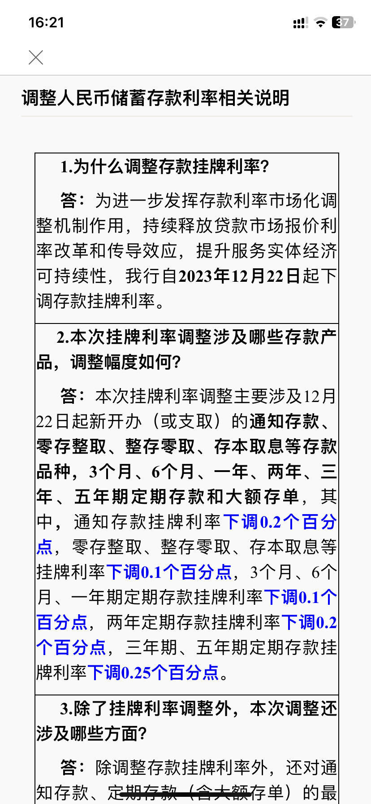

# 新一轮存款降息来袭，工行、中行领头调降，多家中小银行正加价抢客

**财联社12月21日讯（记者 梁柯志）** 临近年末，在不少银行谋划提前开门红的时候，新一轮存款降息突然来袭。

12月21日下午，工商银行app挂出《调整人民币储蓄存款利率相关说明》，称“为进一步发挥存款利率市场化调整机制作用，持续释放贷款市场报价利率改革和传导效应，提升服务实体经济可持续性，我行自2023年12月22日起下调存款挂牌利率”。

工行称，本次挂牌利率调整主要涉及3个月、6个月、一年、两年、三年、五年期定期存款和大额存单，其中，通知存款挂牌利率下调0.2个百分点，零存整取、整存零取、存本取息等挂牌利率下调0.1个百分点，3个月、6个月、一年期定期存款挂牌利率下调0.1个百分点，两年定期存款挂牌利率下调0.2个百分点，三年期、五年期定期存款挂牌利率下调0.25个百分点。

此外，工行还宣布对通知存款、定期存款（含大额存单）的最优惠利率水平作了优化，以反映市场利率形势的变化。

12月21日，中国银行广州分行某网点负责人向财联社证实，已经接到上级通知，从12月22日起该行的存款利率将进一步下调，不过具体公告尚未发布。

据当地媒体报道，广州地区国有大行将于12月22日下调存款利率，1年及以内、2年、3年、5年期的定期存款挂牌利率分别下调10BP、20BP、25BP、25BP。这距离上一轮调降存款利率隔了3个多月，此轮降息幅度接近。

12月21日，南粤银行、华兴银行等广州地区中小银行对财联社表示，暂时没有动作，但会密切关注市场的情况。

**中小行逆势提高利率抢客，大行主动调息来降温？**

11月以来，银行机构密集开展开门红的预备工作。

近日，广东多位银行支行人士对财联社表示，11月已经开始明年开门红的项目储备，除对公业务之外，存款、理财的考核也会比较重视，考核任务会重一些。

与往年中小银行延迟跟大行降息步伐不同，今年年末小银行的存款利率不降反升。

如11月1日，广东鹤山珠江村镇银行宣布便将整存整取1年期执行利率从2.1%调整至2.25%，上调15个基点；广西兴安民兴村镇银行自11月21日起，对6个月和1年期2款“县域专属定期”存款利率分别上调30个基点和15个基点。

河南淮滨农商银行宣布，自12月12日起阶段性上调新开户个人整存整取定期存款利率，起存金额大于等于1万元的执行上调后利率。河南固始农商行等地方小银行都开始进行存款利率竞争。

前述中行网点负责人表示，频繁调整存款利率，对客户而言会影响到他们存款的行为。比如越来越多人会赶在存款利率下调之前，进行中长期存款，锁定利率。

**银行息差依然受压**

大行降低存款利率与净息差压力有关。

根据国家金融监管总局的数据，截至2023年上半年末，我国商业银行净息差已经跌至1.74%，比2022年底降低17个基点，比2021年末降低34个基点。

2023年一季度与二季度，我国商业银行净息差已经跌至1.74%，且已经低于《合格审慎评估实施办法（2023年修订版）》中1.8%的值。

11月，国信证券银行业首席分析师王剑认为，银行应该保持合理利润，不能过高而挤占实体经济的利润空间，也不能过低而损害银行本身的生存能力以及放贷能力。王剑团队经过测算，得到中国商业银行目前对应净息差的估计值，约为1.69%。

换言之，截至6月末的净息差水平已经接近最低合估值。

11月底，国泰君安分析师张宇认为，当前存款定价正处于下降通道，仍有较大的潜在改善空间。但结构方面，存款定期化的影响对冲了定价的下行。预计2024年各项存款降息政策的效果将加速显现，驱动银行负债成本率由升转降。

2024年仍有多项因素压制资产收益率表现，包括：存量按揭贷款利率下调、LPR调降的影响消化、化债落地以及对公贷款占比提升。综合考虑后，预计2024年资产收益率同比仍将下行21bp左右。

与此同时，12月21日，杭州地区某城商行支行信贷人士对财联社表示，地方中小银行的利率议价能力较高，明年如经济环境进一步好转，贷款的市场利率可能轻微上升。

（财联社记者 梁柯志）

