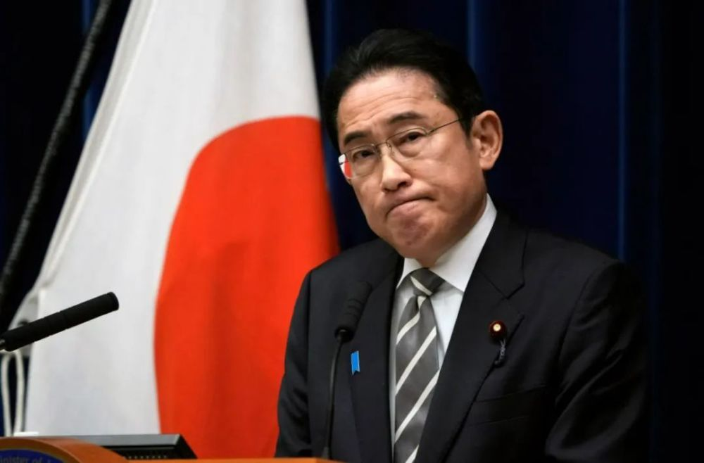

# 日本新任驻华大使抵京，7年来首位“非知华派”大使如何稳住中日关系

身为“非知华派”的金杉宪治，会如何拓展中日关系？

 _▲日本新任驻华大使金杉宪治。图/IC photo_

**文 | 徐立凡**

据参考消息报道，日本新任驻华大使金杉宪治已于12月19日飞抵北京。另据日本驻华大使馆消息，金杉宪治表示，与中国构筑具有建设性、稳定的双边关系，不仅对日中两国，而且对地区和国际社会都具有重要意义。

金杉宪治是日本资深外交官，但与前两任日本驻华大使横井裕、垂秀夫不同，金杉宪治并非出自日本外务省“知华派”大本营中文研修班。他历任日本驻美大使馆参赞、外务省亚洲大洋洲局局长、负责经济事务的外务审议官等，这通常是日本外务省英文研修班出身外交官晋升的背景。在出任驻华大使前，金杉宪治是日本驻印尼大使。

金杉宪治对亚洲事务有了解，但算不上是“中国通”。事实上，他是日本近7年来首位不是所谓“知华派”的驻华大使。岸田文雄任命金杉宪治为新任驻华大使是何考量？非“知华派”又能否拓展中日关系？

**什么是日本“知华派”**

首先应该了解，日本外务省不仅有“知华派”，还有“知美派”“知俄派”等。不管是“知华派”“知美派”，还是“知俄派”，指的也不是派系，而是指在考入外务省后分别研修中文、英文、俄文的群体。

日本外务省很“卷”。要想上升需要参加日本国家公务员“1类”考试，能通过者则成为重点培养的精英。而精英在外务省做到头也就是当到局长、外交事务次官。

但“知华派”“知美派”“知俄派”比其他人多了一条晋升渠道。因为是从事针对世界大国的外交工作，一旦当到特命全权大使，地位甚至高过事务次官。

日本外务省通常是“知美派”的天下，但由于中国的大国地位，“知华派”也有一定的话语权。其作用主要是参与对华政策的制定，同时搜集情报。

而“知华派”要想在更高的位置上发挥作用，自然离不开首相府的青睐，同时也需要与中方建立起畅通稳定的联系。

了解了日本外务省“知华派”的背景，就能够知道，“知华派”与“知美派”“知俄派”一样，首先是日本外务省精英上升的重要台阶，
**“知华派”不代表就是“亲华派”** 。

当然，确实也有不少“知华派”在深入了解中国后，在情感上、理性上都主张对华友好。金杉宪治会如何做，可以拭目以待。

_▲日本首相岸田文雄。图/新华社_

**他们都有共同点**

金杉宪治是在10月24日由日本政府在内阁会议上决定出任驻华大使的。同日，日本政府内阁会议还通过了山田重夫为驻美大使、武藤显为驻俄罗斯大使的任命。

一日之内连换日本驻华、驻美、驻俄三大国的大使，极为罕见，自然也引发了不少媒体关注。

**金杉宪治主要从事对美外交**
，也曾参与2018年6月在新加坡举行的朝美首脑会谈；山田重夫曾任日本驻华大使馆参赞、公使，也曾任日本驻美大使馆公使；武藤显曾担任日本外务省欧洲局俄罗斯课课长，也担任过日本驻美使馆公使衔参赞、日本驻洛杉矶总领事。

日本新任驻华、驻美、驻俄大使有一个共同点，就是都曾从事过对美外交，在美国有一定人脉。

其中，相对熟悉对华外交事务的山田重夫出任驻美大使，可能有助于让美方进一步了解日本对华政策。而相对熟悉亚洲事务的金杉宪治出任驻华大使，或是为了在所谓印太战略的框架下稳住日中关系。

所以有分析指出，日方的新任命有在中美关系缓和之际，平衡日美、日中关系的考量。当然也有分析认为，在岸田文雄清洗“安倍派”的当下，可选择的人选本就不多，无需过度解读。

**所谓印太战略不能成中日关系障碍**

金杉宪治抵京履新后表示，“能在对日本而言极为重要的国家工作，让我觉得肩负重任”。他还表示，将以11月两国领导人会见为契机，推动停滞的对话与协议，营造对话环境。

11月16日，中日领导人在美国旧金山出席亚太经合组织领导人非正式会议期间会晤，重新确认了全面推进“战略互惠关系”的两国关系定位。

中日“战略互惠关系”的定位，起因是2001-2006年小泉纯一郎担任日本首相期间，因多次参拜靖国神社导致中日关系陷入低谷。之后在2008年福田康夫任日本首相期间，中日两国签署政治文件建立了“战略互惠关系”。这一关系的产生就包含了中日关系的起伏，以及修复中日关系的一段历史过程。

如今中日双方重新确认全面推进“战略互惠关系”，是修复中日关系的再次起步，而形势已与2008年有所不同。

近来，所谓“印太战略”“印太经济框架”“小院高墙”“台海有事就是日本有事”等日方行动和言论严重侵蚀了中日关系的基础。要修复中日关系，不能让所谓“印太战略”等成为障碍，而要从更高的站位处理两国关系。这比日方目前急着解决的日本水产品输华等技术问题更重要。

日方需要营造有利于稳定和维护两国关系的政治氛围和舆论环境，需要与中方一道把“战略互惠关系”落到实处，需要妥善解决历史遗留问题。当然，这不是金杉宪治这位新任驻华大使的一己之力就能做到的事。

撰稿 / 徐立凡（专栏作家）

编辑 / 马小龙

校对 / 赵琳

