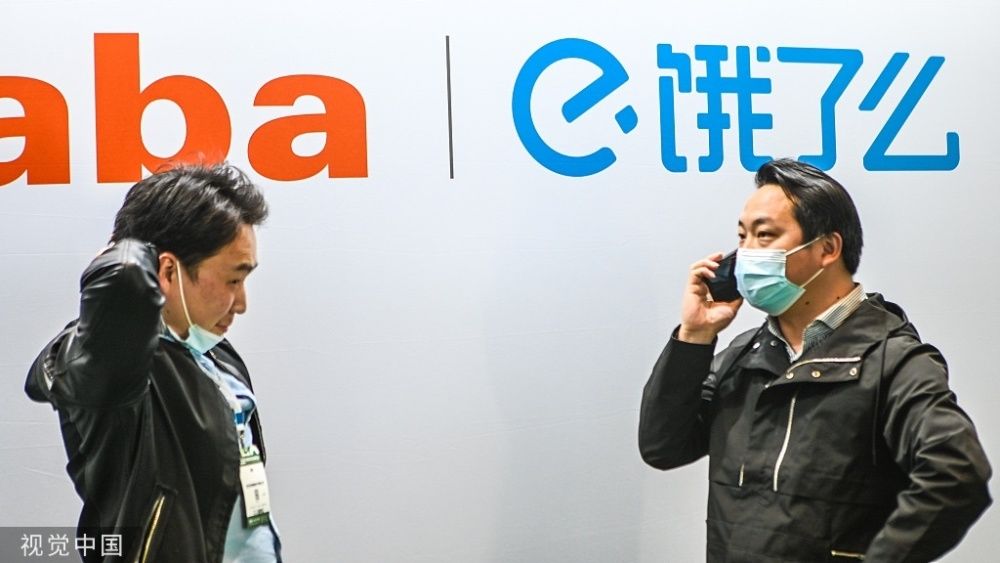

# 独家｜阿里核心高管回应：出售饿了么是谣言

作者 ｜ 程潇熠

编辑 ｜ 康晓

出品｜深网·腾讯小满工作室

饿了么出售传闻持续发酵。继抖音负责人否认收购饿了么之后，12月20日，又有市场消息称，饿了么正在对外寻求收购。据《雷峰网》报道，阿里本地生活集团CEO俞永福和饿了么总裁方永新（花名“大炮”）亲自负责资产出售事宜，目前已有过几次对外洽谈。

对此消息，一位要求匿名的阿里内部核心高管回复腾讯新闻《深网》，出售饿了么是谣言。

12月19日，网传抖音正与阿里洽谈饿了么收购事宜，收购价格大约在70亿美元。抖音负责人回应：没有这个计划。一位饿了么内部员工也回应媒体，双方合作一直在稳步推进，但所谓“收购”完全是无稽之谈。

自去年8月，饿了么与抖音官宣合作后，屡屡传出抖音将收购饿了么的传言。但从本地生活战略布局来看，阿里目前将饿了么转手卖出的可能性不大。

2018年4月，阿里联合蚂蚁金服以95亿美元完成对饿了么全资收购，在当时创下中国互联网有史以来全现金收购新纪录。

彼时，阿里掌舵人逍遥子张勇曾在内部信中阐述收购饿了么的战略意义：作为本地生活服务的最高频应用之一，外卖服务是本地生活重要的切入点。同时，依托外卖服务所形成的庞大立体的本地即时配送网络，将成为广大新零售场景下必需的商业基础设施。

言下之意，除了饿了么本身的外卖服务，彼时正在大力发展新零售的阿里还看中了其本地即时配送网络。

2020年7月，饿了么宣布从外卖平台升级为解决用户身边一切即时需求的生活服务平台，聚焦消费者的“身边经济”。这意味着饿了么身负阿里本地生活入口重任。

在俞永福接手阿里本地生活业务后，饿了么仍是本地生活的重要战略业务。据《晚点LatePost》，在俞永福看来，本地生活业务实质上是由 “即时商流” 与
“即时物流” 双轮驱动的业务，相对的也就是饿了么 App 和蜂鸟两个产品。

从实际业绩来看，虽然相比美团有差距，但饿了么业务依然在持续增长，且经营亏损持续同比收窄。

据阿里最新财报，2023年三季度，阿里本地生活集团收入同比增16%，订单同比增长近20%。财报称，饿了么本季度经营亏损持续同比收窄，并带动本地生活集团经调整EBITA经营损益收窄至25.64亿元人民币。另据QuestMobile数据，饿了么微信小程序8月DAU曾实现同比增长720.9%。

除饿了么外，12月20日还有市场消息传出，阿里集团CEO吴泳铭已做出了一系列资本规划，其中盒马已经在考虑出售，饿了么或将有新的资本动作，优酷则正考虑并入阿里影业。

对此，盒马、阿里大文娱也对媒体回应上述消息为不实消息。

