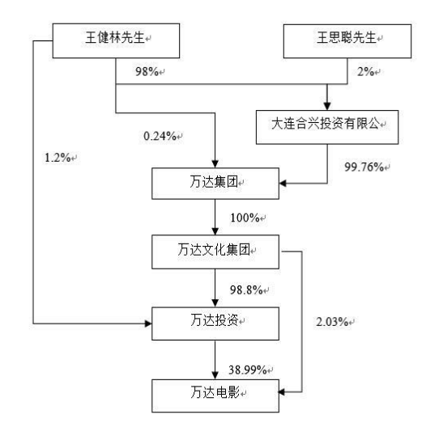
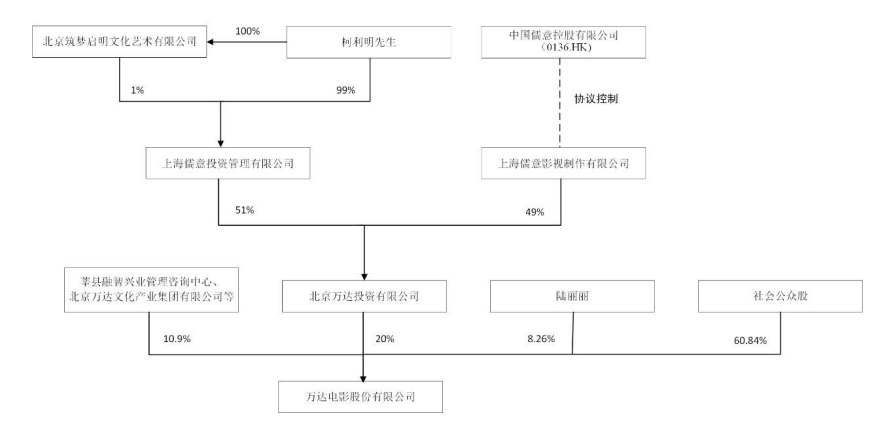

# 王健林割掉了心头肉

作者｜Eastland

头图｜视觉中国

2017年“股债双杀事件”后，万达集团陆续变卖资产、降低债务负担，谋求“平安着陆”，同时争取让万达商管在A股上市，打造稳固融资平台。

作为王健林在A股唯一的资本运作平台，万达电影（SZ：002739）备受重视。2019年万达投资及其一致行动人将旗下与电影、电视剧、游戏相关的业务打包成“万达影视”，作价105亿注入上市公司万达电影。本次收购以3.17亿代价股支付，发行价33.2元。

将优势资产注入万达电影，同时强化对上市公司的股权控制，可谓一箭双雕。

由于未满足业绩承诺，万达影视卖方（包括万达投资）进行了业绩补偿，约5100万股被以1元钱回购并注销。

截至2022年末，万达电影第一大股东为“北京万达投资”，实控人为王健林。

进入2023年，王健林被迫开始出售万达电影股权：

截至7月7日，万达投资在二级市场累计减持约1亿股（约占总股本的4.6%），回笼资金约12.6亿；

7月10日，万达投资向自然人陆丽丽转让1.8亿股，对价21.7亿；

7月12日，万达投资向一致行动人“莘县融智”转让1.77亿股，占万达电影总股本的8.14%，对价23.4亿元；交易完成后，万达投资持有4.36亿股、股比降至20%；“莘县融智”持有2.22亿股、股比提高到10.2%；

7月20日，万达文化集团向上海儒意转让万达投资49%股权。转让后，万达文化集团、王健林分别持有万达投资股比为49.8%、1.2%；

12月6日，万达电影接到通知，万达文化集团、王健林拟将万达投资剩余51%股权转让上海儒意。

通过一系列减持，王健林回笼资金约110亿。代价是失去对万达电影的控制。交易完成后，王健林父子通过万达文化集团持有的2.03%股权，“没入”社会公众股。

万达电影是王健林的“心头肉”，不论遇到多大困难都拒绝“外人”染指。
若非珠海万达商管上市遇阻，不会启动系列减持。若非万达商管年内上市彻底无望，王健林不会放弃万达电影。

万达电影（曾用名“万达院线”）市值一度达到2000亿，经历天灾人祸，如今市值跌至200多亿，王健林清仓减持仅套现100多亿。

下面盘点一下万达电影的剩余价值。

从疫情中复苏

1）营收恢复到2019年的98%

2018年，万达电影营收162.9亿、同比增长7%；2019年回落7%、至154.4亿；

2020年受疫情冲击，营收降至63亿、同比下降59%；

2021年，万达电影营收反弹至125亿；

2022年H2，线下娱乐业再次受到冲击，影院大面积停业，票房、观影人次、放映影片数同比降幅均达40%，万达电影营收97亿、同比下降22%。

2023年前三季，万达电影营收113亿、同比增长47%，相当于2019年同期的98%，基本恢复到疫情前的水平。

2）营收结构的微妙变化

万达电影营收分为四大类：观影（即电影放映）、商品销售（爆米花等）、广告、影视游戏（影视投资、制作、发行，网络游戏发行与运营）。

2018年、2019年观影收入均为91亿，2020年暴跌至32亿，2021年反弹至71亿，2022年再度回落至54亿。

观影收入占总营收的比例稳定在55%左右。商品销售、广告是将观影产生的线下流量变现，合计收入约为观影收入的50%（2017年为50.5%、2022年微降至48.6%）。

影视游戏属于大文娱范畴，是万达“圈内影响力”的变现，2019年通过重组注入万达电影。近年来该板块业绩呈高开低走：2018年收入达22.6亿、占总营收的13.9%；2022年，此类收入12.2亿、占总营收的9.5%。

各行各业陆续从疫情中恢复，万达电影线下流量、放映收入及由线下流量带动的商品销售、广告都达到或接近2019年的水平。

但万达在行业的影响力没有恢复。与线下流量无直接关联的影视投资、制作、游戏发行等业务，收入不及峰值时的一半：2022年，电影制作/发行收入较2018年下降65.2%；电视剧制作/发行收入下降52.2%；游戏发行收入下降78%。

3）没有完成业绩承诺

2019年5月，万达电影实施“重大资产重组”——向万达投资等20家发行股票购买“万达影视”股权（97.77%）。卖家对万达影视2018－2021业绩作出承诺，各年度扣非净利润分别不低于7.63亿、8.88亿、10.69亿、12.74亿。

因疫情影响，承诺于2020年、2021年完成的业绩顺延了一年，即：2021年净利润不低于10.69亿、2022年不低于12.74亿。

2021年，万达影视营收20.9亿、净利润4.2亿，没有完成业绩承诺。

2022年，万达影视营收10.4亿，净亏损7.1亿，实际营收还不及承诺的净利润。

由于未满足业绩承诺，万达投资等卖方进行了业绩补偿，约5100万股被以1元钱回购并注销。

放映业务不赚钱！

1）哪个业务最赚钱

电影放映是万达电影的本行，但此项业务毛利润率不高而且不稳定：

2018年，电影放映的毛利润率只有10%，2019年更是低至7%；

2020年特殊情况下，毛亏损率41%；2021年毛利润5%；2022年再次受到疫情影响，毛亏损率为11%。

万达电影真正的摇钱树是商品销售和广告业务。

2018年，商品销售（例如爆米花）收入18.7亿，毛利润倒有11.2亿、毛利润率59.9%。

2019年，商品销售收入19.3亿，毛利润12.2亿、毛利润率63.3%。

2022年，线下娱乐业尚未恢复，放映、商品销售低迷，但后者毛利润率仍高达61.4%。

曾经，万达电影广告业务毛利润率与商品销售不相上下。

2018年，广告收入达25亿，毛利润17.1亿、毛利润率69.4%，绝对是万达电影的第一摇钱树。

2019年，广告收入19.5亿，毛利润11.5亿、毛利润率降至59%。

2021年、2022年，广告收入分别为10.6亿、12.2亿，毛利润率分别为48%、39%。

同为放映业务的“附庸”，商品销售To C、广告To B。观众看电影少不了爆米花，而广告主收缩战绩，首先要砍的就是广告支出。

2）毛利润每况愈下

万达电影盈利能力每况愈下。2017年毛利润62.5亿、毛利润率41%；

2018年毛利润56亿、毛利润率34%；

2019年，中国电影总票房创新高，万达电影毛利润率却开始下滑。

2021年、2022年，毛利润率先后降至27%、17%。2022年毛利润16亿、相当于2017年的26.4%。

下图右侧堆积柱形图显示了近年万达电影毛利润构成：

2018年比较均衡：广告贡献了毛利润的31%，影视游戏贡献24%，商品销售贡献20%，电影放映及其他业务贡献25%。其中电影放映毛利润9.4亿，占利润总额的16.8%。

到2022年，万达电影毛利润结构已面目全非：

放映收入53.8亿、成本59.7亿，毛亏损5.86亿、亏损率10.9%；

商品销售收入13.9亿、成本5.4亿，毛利润8.55亿（利润率61.3%），占毛利润总额的51.9%。

广告收入12.2亿、成本7.5亿，毛利润4.7亿（利润率38.7%），占毛利润总额的51.9%。

市场竞争造成毛利润率滑坡，疫情冲击是天灾，但万达电影巨亏损的真正原因是人祸。

巨额商誉减值

万达电影自上市以来，注重外延式发展，一系列大手笔并购形成较大商誉。

与绝大多数上市公司的说辞一样，万达管理层称“于每年度终了”依据“外部独立机构出具评估报告”，进行“减值测试”。

截至2018年12月31日，商誉账面价值为134.9亿。

2019年，万达电影首次计提商誉减值准备55.75亿（涉及40余家子公司），商誉账面值跌至80亿；

2020年，再度计提36亿减值准备，期末账面值跌至46.1亿；

2021年，外置部分资产，商誉及累计减值准备同步下降，期末商誉账面值43.5亿；

2022年，计提1.3亿减值准备，商誉账面值42.8亿；

截至2023年9月末，万达电影商誉账面值为42亿。

2011－2018年，8个年度累计获得净利润88.4亿；随后的4个年度，合共计提86.9亿商誉减值准备。

2011－2022年，12个年度总盈亏为负43.8亿，期间共计提商誉减值准备86.9亿；

2023年前三季，万达电影净利润11.2亿（没有计提商誉减值准备），2011年以来总盈亏回升至负32.7亿。

2011年以来，累计商誉减值准备远大于总盈亏。

行业竞争态势、票房大盘增长放缓、疫情冲击等外部因素是“天灾”，激进扩张后被迫为商誉“消肿”则是“人祸”。

作为万达电影的接盘者，儒意可谓喜忧参半，喜的是趁王健林资金紧张，以相对低的价格将中国第一院线收入囊中。

放映场地租约是万达电影的命脉，为了让接盘的儒意放心，万达集团承诺旗下万达广场将与万达电影长期合作，租约不足十年的都延长到十年。

忧的是万达电影盈利能力大不如前。还有，对价高达105亿的万达影视，有可能成为不良资产，长期拖累上市公司业绩。

万达电影要么大幅减记，要么“退货”。问题是——万达影视最大的卖家是万达投资，儒意通过全资收购万达投资成为上市公司实控人。“退货”伤害实控人、利好万达电影公众股东，儒意未必采取行动。

*以上分析仅供参考，不构成任何投资建议！

