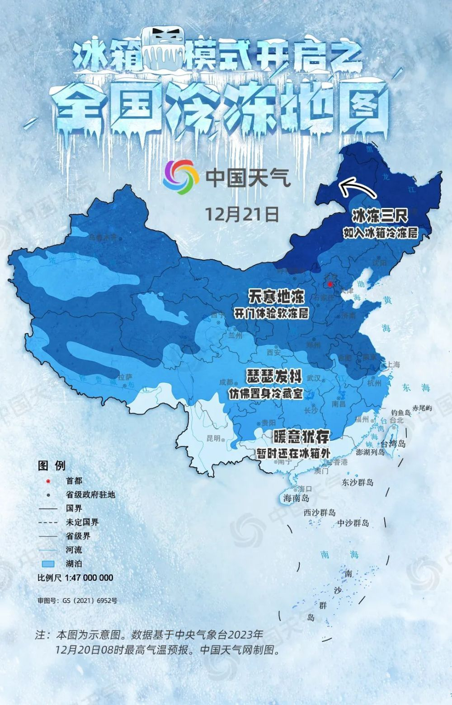
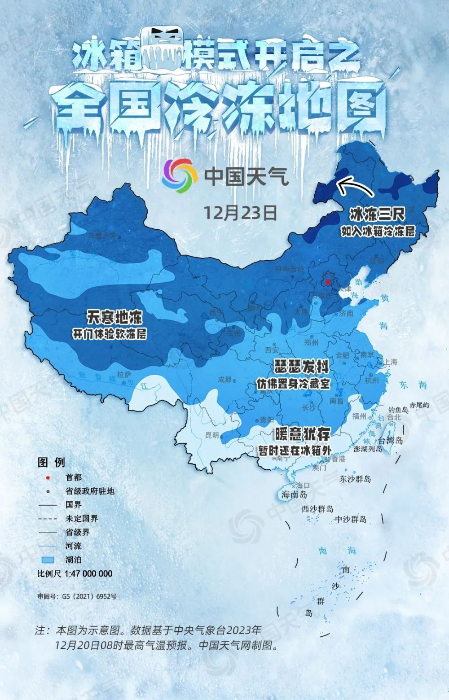

# 超20省份冷如钻进冰箱，全国冷冻地图看你家在“冰箱”哪一层

今冬以来最强寒潮的影响刚刚结束，本周，新一股冷空气又续上了。受其影响，我国北方大部气温继续探底、不断刷新下半年来的新低。不少网友纷纷吐槽，“一出门就进了冰箱冷冻层”、“我这儿的太阳就是冰箱里的灯”。预计今起三天（12月21日至23日），在冷空气影响下，我国江南、华南等地也将继续体验常年三九四九期间的寒意。中国天气网特别推出全国冷冻地图，快来看看你家在冰箱的哪一层。

**超20省份冷如钻冰箱**

上周，今冬以来最强寒潮横扫我国，北方多地最低温打破历史同期纪录，中东部出现大范围雨雪冰冻。本周初，新一轮冷空气又接踵而来。据中国天气网气象分析师王伟跃介绍，在寒潮及冷空气的接连打压下，昨天，我国东北、华北多地最高气温再创下半年来新低。预计今明两天，南方多地气温也将降至近期最低点，最低气温0℃线将向南推进至贵州南部至华南北部一带，超20省份冷如“钻冰箱”。

从中国天气网推出的全国冷冻地图可以看到，12月21日，黑龙江大部以及内蒙古中东部等地最高气温普遍不足-18℃，户外宛如冰箱冷冻层，出门秒变行走的“冻肉”。当地的小伙伴们外出务必做好全套的防寒保暖措施，以免冻伤。西北地区大部、华北、黄淮、江淮等地全天气温都维持在冰点以下，天寒地冻，堪比冰箱的软冷冻层，最厚的羽绒服可以派上用场了。

江南、四川盆地到重庆、贵州等地最高气温普遍都在10℃或以下，温度和冰箱冷藏室不相上下，再加上当地没有集中供暖，为了不发抖，电热毯、暖手宝、暖风机等各类御寒神器都可以安排上了。而华南地区以及云南等地最高气温普遍在10℃以上，暂时还不用“钻冰箱”，但当地气温较常年同期也明显偏低，怕冷的小伙伴们还要注意添加衣物，以免着凉感冒。

12月22日，吉林东部部分地区也加入了冷冻层，但黑龙江、内蒙古冷冻层的区域有所减小。河南大部、山东西南部、安徽南部的部分地区退出软冷冻层，进入冷藏室。而随着冷空气的到来，包括福州在内的福建北部将进入冷藏室，体验瑟瑟发抖的寒意。

12月23日，冷空气对我国的影响趋于结束。黑龙江北部、内蒙古东北部局地还处在冷冻层，寒意不减。软冷冻层区域大幅缩减，江苏、安徽、山东大部以及河北南部、陕西中部等地的部分地区最高气温重回0℃以上，进入冷藏室。而西南地区北部和中部、江南等地的大部地区依然处在冷藏室，防寒保暖工作仍不能松懈。

冷了这么久，到底什么时候才能回温呢？王伟跃表示，23日之后，随着冷空气影响的结束，我国各地气温将明显回升，逐步恢复到常年同期正常水平，各地持续低温的情况也将得到缓解。

**低温需注意哪些健康风险？**

根据国家疾控局发布的《寒潮公众健康防护指南》，气温下降会导致人体血管收缩，呼吸频率加快，增加健康风险，如加重关节炎、类风湿关节炎等患者的疼痛、引发心脑血管系统疾病、加重泌尿系统疾病和内分泌系统疾病等。

在持续低温的“冰箱”模式下，以下三类人群要重点防护：一是敏感人群，如婴幼儿、儿童、孕妇、老年人等；二是有慢性基础性疾病的人群，如患有心脑血管疾病、呼吸系统疾病等人群；三是户外作业人员，如交警、环卫工人、建筑工人、快递员、外卖员等。

当寒潮天气来临时，敏感人群及有慢性基础性疾病的人群应尽量减少户外活动。如确需外出活动时，尽量选择在一天中较温暖的时段，避开早晚气温较低时段，同时要特别注意头部和胸腹部的保暖。户外作业人员应尽量减少户外作业时间。户外作业时，建议使用便携式取暖物品，穿戴防寒工作服，做好防寒保暖工作。

中国天气网提醒，未来几天，我国大部“冰箱”模式持续，小伙伴们还要继续做好防风保暖措施，老人、小孩及体质较弱人群要特别注意低温天气可能带来的不利影响。同时，安全使用取暖设备，防止低温烫伤或火灾事故的发生。

来源：中国天气网 | 作者 张方丽

编辑：曾佳佳

流程编辑：郭丹

