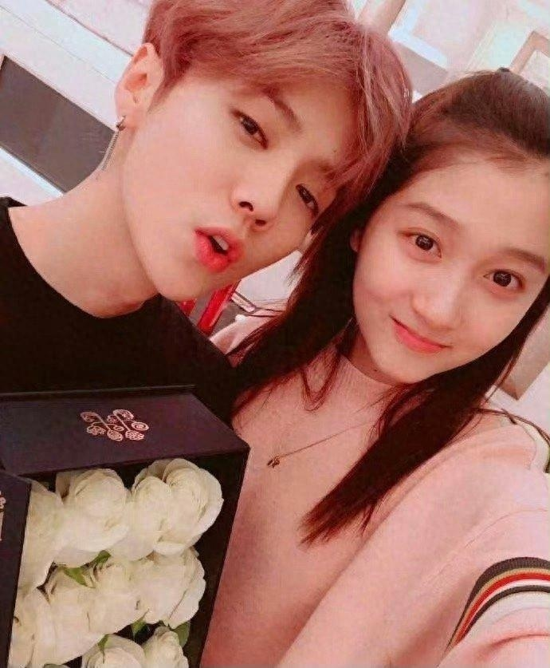
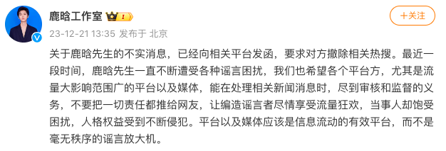
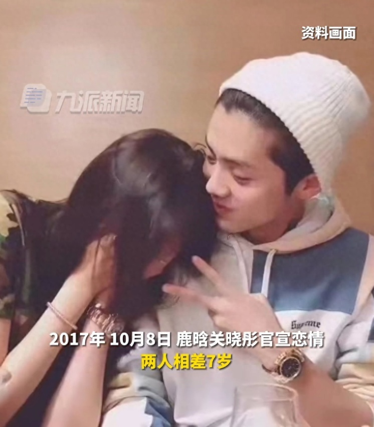
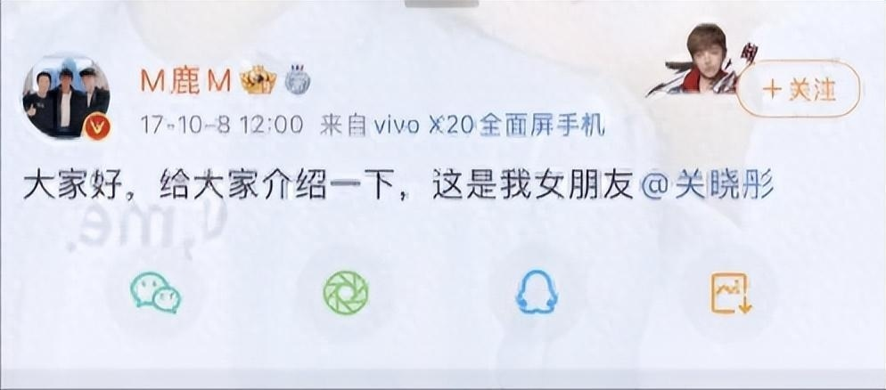

# 鹿晗关晓彤领证？鹿晗工作室回应：消息不实，已向相关平台发函

12月21日，鹿晗关晓彤领证，引发热议。对此，鹿晗工作室发文否认。

关于鹿晗先生的不实消息，已经向相关平台发函，要求对方撤除相关热搜。最近一段时间，鹿晗先生一直不断遭受各种谣言困扰，我们也希望各个平台方，尤其是流量大影响范围广的平台以及媒体，能在处理相关新闻消息时，尽到审核和监督的义务，不要把一切责任都推给网友，让编造谣言者尽情享受流量狂欢，当事人却饱受困扰，人格权益受到不断侵犯。平台以及媒体应该是信息流动的有效平台，而不是毫无秩序的谣言放大机。

公开资料显示，鹿晗1990年4月20日出生于北京市海淀区，中国内地流行乐男歌手、影视演员，代表作有《我们的明天》《勋章》《重返20岁》《我是证人》《盗墓笔记》《择天记》《穿越火线》等。

关晓彤生于1997年9月17日，比男方小7岁4个月。

2017年10月8日，鹿晗关晓彤发微博官宣恋情，自此双方每年都会发文为彼此送上生日祝福。

**【来源：九派新闻综合鹿晗工作室、此前报道】**

