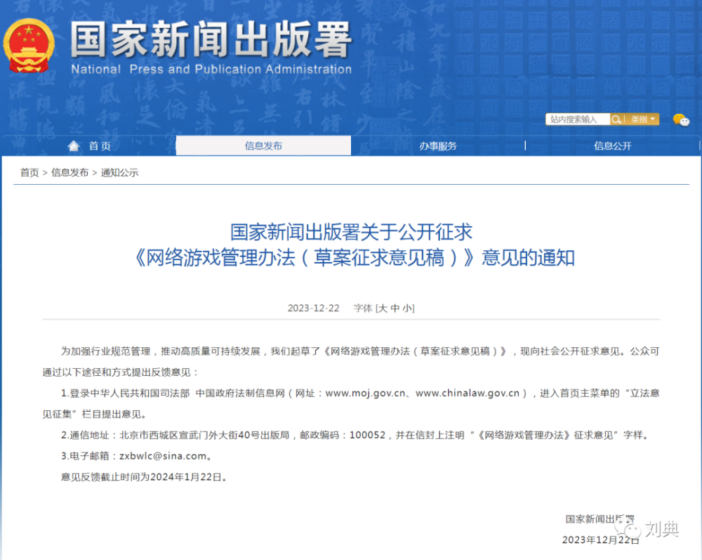

# 11条要点解读网游新规：弱化氪金模式、禁止“借壳上市”

12月22日，国家新闻出版署就 **《网络游戏管理办法（草案征求意见稿）》**
公开征求意见。征求意见稿发布后，引发社会和市场强烈反响。那么本次的网游新规出台到底意味着什么？具体内容上有哪些要点？市场的反应是否“过敏”？就以上问题，我们为大家快速的整理和分析了本次征求意见稿的要点内容。

以下为《征求意见稿》的详细解读，欢迎收藏转发。

01 要点内容

 _国家新闻出版署官网截图_

**一、征求意见稿不是正式办法，市场不应过度紧张，更不能理解为监管导向的180度转向。**

本次征求意见稿发布后，市场震动很大。尤其是因为涉及大量新增限制和监管内容，让很多游戏厂商的股价直跌。

必须清楚的是，

**征求有意见稿不是最终办法，当前没有法律效力，成稿可能会有大量变动！！！**

**征求有意见稿不是最终办法，当前没有法律效力，成稿可能会有大量变动！！！**

**征求有意见稿不是最终办法，当前没有法律效力，成稿可能会有大量变动！！！**

重要的事情说三遍。

我们可以举一个近期的例子，

2023年4月11日国家网办发布的《生成式人工智能服务管理办法（征求意见稿）》

2023年7月13日国家网信办联合国家发展改革委、教育部、科技部、工业和信息化部、公安部、广电总局七部门联合公布的《生成式人工智能服务管理暂行办法》

二者经过征求意见并连同多部委后，内容明显有大量变动。相比先前的征求意见稿偏重于监管和安全，新的暂行办法则减弱了监管内容，加强了发展与开放的内容。

因此，市场不用过度悲观，我们需要在当前的征求意见时间内，尽量的向管理部门反应合理的意见和建议。

**二、产品合规要求加强，突出优质内容+弱化氪金模式**

在过去，网络游戏的主管部门为原文化部，同时与国家新闻出版广电总局（原新闻出版总署）分职能承担网络游戏的监管职责。2019年5月14日，文化和旅游部印发《关于文旅部调整

2023年12月22日公布《网络游戏管理办法》(草案征求意见稿)代表此次网络游戏监管的大调整正在进入尾声，网络游戏的 **出版和经营统一部门管理**
的时代到来。

比较有标志性意义的事件是，在同一时间有40款进口游戏版号获批。2023年12月22日，国家新闻出版署公布新一批进口游戏版号，40款新游获批。完美世界《一拳超人：世界》、吉比特旗下雷霆网络《烛火地牢2》、中青宝《怪物火车》、恺英网络《关于我转生变成史莱姆这档事：新世界》等在列。

监管部门的整合也带来了监管导向的变化。原本出版与运营分属不同的部门，而整合之后对网游的监管将更加一体化。尤其是针对平衡内容品质与盈利模式上，本次的征求意见稿就有明显的倾向性。

**一是弱化氪金属性。**
本次办法涉及大量的弱化游戏“氪金”属性内容，从制度上对游戏付费进行了大量的管理加强，一方面未来游戏公司要重新设计更加合理的盈利模式；另一方面对于行业发展来说，这有利于让游戏从
**“捞钱机器”** 回归到 **“第九艺术”** ，游戏公司要从如何的促进付费转向如何提升游戏本身内容中。

**二是强化优质内容。** 办法中多次提到了“坚守中华文化立场、遵循国际规则和文化传播规律”，鼓励“发展 **社会主义先进文化** ，弘扬 **革命文化**
，传承 **中华优秀传统文化** ”等方面的内容，说明管理部门更加注重游戏本身内容品质方面，尤其是涉及宣传思想文化领域的内容。

**三、审核时间延长，有效期变短，“屯”版号将变得困难**

**此次征求意见稿要求**

**从事网络游戏出版活动，应向所在地省级出版主管部门提出申请，经审核同意后，报国家出版主管部门审批。国家出版主管部门应当自受理申请之日起60日内，作出批准或者不予批准的决定。不批准的，应当说明理由。**

**网络游戏出版和运营单位取得网络游戏批准文件后，应按批准文件要求，自批准文件签发之日起一年内组织游戏出版运营，超期不能出版运营的，应及时向属地省级出版主管部门书面说明理由。**

**而在此前文化部的暂行办法中，相关规定为**

**省、自治区、直辖市文化行政部门自收到申请之日起20日内做出批准或者不批准的决定。批准的，核发《网络文化经营许可证》，并向社会公告；不批准的，应当书面通知申请人并说明理由。**

**《网络文化经营许可证》有效期为3年。有效期届满，需继续从事经营的，应当于有效期届满30日前申请续办。**

**这里需要注意的是，原文化部的管理办法《网络文化经营许可证》仅针对网络游戏的经营，出版则由国家新闻出版广电总局（原新闻出版总署）管理；**

**而新的管理办法中，则将出版和经营二合一，同时放在了《网络出版服务许可证》。**

**而时间上的变动则说明了未来的审核时间将会更长，而三年有效期改为一年内使用不许超期，则让“屯版号”变得更加困难。**

**四、禁止“借壳上市”**

**第十四条** 【禁止买卖、套用版号】办法规定任何单位、个人
**不得以任何形式转借、出租、买卖、套用《网络出版服务许可证》、网络游戏批准文号、出版物号** 。

**也就是说除了收购公司，“借壳上市”将不可能。**

**五、中华文化立场、鼓励传承“三种文化”和游戏出海**

**第十六条** 【禁止性内容】中，特别提到了，网络游戏出版经营单位在境外运营发行游戏，应自觉遵守网络游戏内容禁止性规定，
**坚守中华文化立场、遵循国际规则和文化传播规律** ， **不得危害国家安全、损害国家荣誉和利益** 。

**第五十条** 【鼓励精品原创游戏】鼓励研发和推广以 **社会主义核心价值观** 为引领，发展 **社会主义先进文化** ，

**弘扬革命文化，传承中华优秀传统文化，促进科技进步，具有创新价值，有利于身心健康、寓教于乐的网络游戏。**

**第五十一条** 【鼓励国际合作】鼓励网络游戏出版经营单位 **开拓海外市场，加强网络游戏国际合作，促进国际文化交流，提升中华文化国际影响力** 。

**这部分内容的增加，说明国家对于游戏的意识形态管理加强。**

**另外，鼓励出海除了一部分经济因素外，也与在海外讲好中国故事有关。**

**未来谁能更好的传承“三种文化”，并能实现海外拓展，则会在监管部门处有大量加分。**

**六、禁止强制对战**

**第十七条** 【 **禁止强制对战** 】网络游戏出版经营单位 **不得在网络游戏中设置强制对战** 。

**此项规定可能会对部分游戏的玩法造成极大冲击。**

**七、限制游戏过度使用和高额消费**

**第十八条** 【限制游戏过度使用和高额消费】

**网络游戏不得设置每日登录、首次充值、连续充值等诱导性奖励。**

**网络游戏出版经营单位不得以炒作、拍卖等形式提供或纵容虚拟道具高价交易行为。**

**所有网络游戏须设置用户充值限额，并在其服务规则中予以公示，对用户非理性消费行为，应进行弹窗警示提醒。**

**不准每日登录，未来大量游戏的上线率、使用粘度肯定会大受打击（次日留存、月活跃度等）。尤其是一些“卖月卡”的游戏也有可能会被纳入强制每日登录。**

**另外，充值限额则会影响大量“氪金游戏”的收入。**

**八、随机抽取的规定**

**第二十七条** 【随机抽取】

**网络游戏出版经营单位在提供随机抽取服务时，应对抽取次数、概率作出合理设置，不得诱导网络游戏用户过度消费。**

**同时应为用户提供虚拟道具兑换、使用网络游戏币直接购买等其他获得相同性能虚拟道具和增值服务的方式。**

**这条内容的增加，将给抽卡游戏造成极大的影响。概率上还好说，但强制要求在抽卡同时提供购买位，一方面会影响抽卡的游戏体验，另一方面也会极大的减少游戏公司通过抽卡创收。**

**九、测试不能成为“试运营”**

**第二十一条** 【技术测试规范】在获得国家出版主管部门批准出版前，网络游戏运营单位进行网络游戏技术测试的，应确保网络游戏内容符合本办法的相关要求，
**限额测试用户数不得超过2万，测试用户资料作删档处理**
。网络游戏运营单位应在每次测试开始前向所在地省级出版主管部门报告测试游戏的名称、范围、测试周期、用户规模，并提供技术测试内容、账号和内容合法承诺书。

**网络游戏技术测试具备以下情形之一的，应视为网络游戏运营，须获得国家出版主管部门批准出版的批准文号、出版物号：**

**（一）公开提供可直接注册登录服务器的客户端软件的；**

**（二）向网络游戏用户收费的；**

**（三）以商业合作、广告销售等方式获取收益的；**

**（四）开展其他应视为网络游戏运营行为的。**

**测试不得超过2万用户，测试后要删档** 。此部分的规定直接堵死了通过 **“内测”“公测”** 等手段 **变相经营** 的路子。

**另外也该规定了“公测”不算测试算运营，收费算运营，打广告算运营。**

**十、游戏币**

**涉及游戏币的内很多，比较重要的有以下几条：**

**第二十三条** 【游戏币发放规范】（三） **不得向用户提供网络游戏币兑换法定货币的服务**
，网络游戏出版经营单位终止提供网络游戏产品和服务，以法定货币方式或者用户接受的其它方式退还用户尚未使用的网络游戏币的情况除外；

**第二十四条** 【游戏币交易规范】从事网络游戏币交易服务，应当遵守以下规定：

**（一）不得为未经审批的网络游戏提供交易服务；**

**（二）应以实名制数字人民币钱包从事网络游戏币交易，不得向用户提供匿名数字人民币钱包交易服务；**

**第二十五条** 【游戏币发放及交易企业规范】 **同一企业不得同时经营网络游戏币发放和网络游戏币交易服务** 。

**第二十六条** 【网络游戏虚拟道具发放及交易规范】……网络游戏出版经营单位 **不得将用户获得的网络游戏虚拟道具兑换成法定货币**
，向用户提供网络游戏虚拟道具兑换小额实物的，实物内容及价值应当符合国家有关法律法规的规定。

**这部分直接堵死了通过游戏进行非法金融交易行为的路子。**

**另外，“同一企业”没有具体说明是如何界定，未来正式稿可能会有很大的变动。**

**十一、小程序游戏管理**

**第六十三条** 对无故事情节、玩法简单、无充值消费的 **国产小程序网络游戏** 的管理，由国家出版主管部门根据《出版管理条例》及本办法的原则
**另行规定** 。

**这部分主要是针对通过广告或宣传为主要收入的小游戏，带充值的肯定要算到正常游戏监管中。**

02 监管与处罚对照表

**相关阅读：**

[国家新闻出版署发布征求意见稿：网游不得设置每日登录等诱导性奖励](https://news.qq.com/rain/a/20231222A03K4400)

[游戏工委内部人士：对征求意见稿目前各界可畅所欲言，以使其切实可行](https://news.qq.com/rain/a/20231222A07U6000)

[史上最严游戏新规，为啥冲击这么大？](https://news.qq.com/rain/a/20231222A07FXG00)

