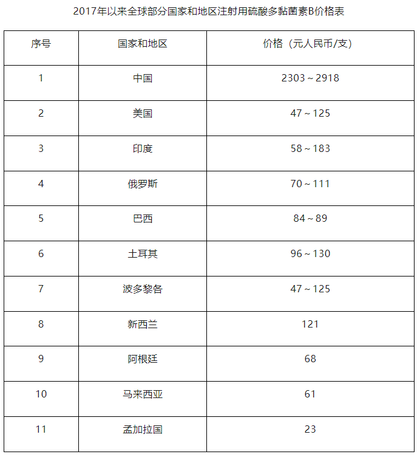

# 4家药企合谋超高价卖药：价格是国外几十倍 遭罚没逾12亿元

根据第三方统计数据，2017年以来，在与中国市场销售量接近的美国、印度、俄罗斯市场，注射用硫酸多黏菌素B同规格或者相近规格的制剂销售价格折合人民币为47元/支～183元/支，中国市场2303元/支～2918元/支的价格是该价格的12倍～62倍。

一款国内药物的价格，是海外价格的35倍～44倍。

从海外73元/克～94元/克采购的原料药，逐步推高至1.8万元/克～3.5万元/克。这背后原来是4家公司的合谋，今日上海市市场监管局对4家药企下发的《
行政处罚决定书》，揭露了其中内幕。

这四家药企是上海上药第一生化药业有限公司（ 简称上药生化）、武汉汇海医药有限公司、武汉科德医药有限公司、湖北民康制药有限公司。

上药生化是上海医药（601607）子公司，18日上海医药已发布被处罚公告。上海市市场监管局对4家药企下发的《 行政处罚决定书》，对4家企业处罚超过12亿元。

**汇海方**

注射用硫酸多黏菌素B于20世纪50年代上市，主要用于耐药铜绿假单胞菌感染的治疗，后因肾毒性与神经毒性明显，逐渐淡出临床。

近年来，随着碳青霉烯类耐药革兰阴性菌检出率的增加，尤其是碳青霉烯类耐药肠杆菌目细菌等感染的出现及流行，临床上经常陷入无抗菌药物可用的困境。有疗效的注射用硫酸多黏菌素B重新回归临床并用于一线治疗。

这个药物长期被三家公司控制。根据上海市监管局查证，武汉汇海、武汉科德、民康制药（统称汇海方）为李美林、曾艺实际控制的公司。

李美林同时为武汉汇海的法定代表人和控股股东、武汉科德的实际控股股东、民康制药的法定代表人；曾艺系李美林之子，为民康制药的控股股东；杨三明同时为三家公司的股东或者实际股东。此外，三家公司存在人员、办公地点混同情况。

汇海方从事硫酸多黏菌素B原料药和注射用硫酸多黏菌素B的业务，其中武汉汇海主要负责与丹麦Xellia Pharmaceuticals
ApS.（以下简称丹麦雅赛利）以及上药生化签订合作协议、从丹麦雅赛利进口硫酸多黏菌素B原料药并向下游销售、与省级代理商签订制剂推广协议、进行制剂推广等；民康制药根据指示，从丹麦雅赛利等公司采购硫酸多黏菌素B原料药，并向下游销售；武汉科德根据指示，协助武汉汇海，安排硫酸多黏菌素B原料药经38家医药公司层层流转，再通过武汉科德等公司将原料药销售至当事人。

改：硫酸多黏菌素B原料药是生产注射用硫酸多黏菌素B的必需原材料，中国没有企业生产该原料药，只能从境外进口。

《
行政处罚决定书》显示，为引进硫酸多黏菌素B原料药，2010年4月，武汉汇海与丹麦雅赛利签订了《原料药供货协议》，成为丹麦雅赛利中国市场代理商。2013年11月，丹麦雅赛利获得原料药《进口药品注册证》。2016年开始，汇海方给予丹麦雅赛利中国区销售负责人“好处费”，要求其利用职权不向其他企业销售硫酸多黏菌素B原料药。

经统计，2015年以来，丹麦雅赛利将向中国出口的硫酸多黏菌素B原料药总量的98%销售给了汇海方或者汇海方指定的企业；其余2%销售给了医疗器械研发公司，未用于生产注射用硫酸多黏菌素B。

**上药生化**

上药生化1986年获得注射用硫酸多黏菌素B生产批文，但于80年代末停产。由于长时间未生产，当事人批件过期后再注册一直未获批准。

2015年左右，汇海方与上药生化沟通注射用硫酸多黏菌素B再上市合作事宜。2015年6月，汇海方与上药生化签订《合作协议》，约定由汇海方向上药生化供应硫酸多黏菌素B原料药，
上药生化负责注射用硫酸多黏菌素B《药品再注册批件》申报和生产，并授予汇海方制剂独家经销权，
上药生化从中收取加工费；同时约定，在进行制剂招投标时，双方就投标价格、配送商等事项进行协商沟通，共同商定招投标事宜。

2017年1月， 上药生化获得注射用硫酸多黏菌素B再注册批件，规格为每支50万国际单位。涉案期间， 上药生化是中国唯一一家注射用硫酸多黏菌素B生产企业。

**联合**

上药生化与汇海方配合共同高价销售注射用硫酸多黏菌素B。其中汇海方位于幕后，通过合作的省级代理商在全国范围内进行学术推广和医院开发，统筹开展注射用硫酸多黏菌素B的销售。

具体而言，汇海方与各省级代理商签订《市场服务协议》，建立省级代理商团队，制定并下达各省销售指标，考核省级代理商销售任务完成情况并根据销售数量支付推广费用。

上药生化位于台前，作为注射用硫酸多黏菌素B的生产企业，是该产品的上市许可持有人、投标主体和直接销售主体。在产品销售过程中，
上药生化与各省药品招采部门对接，进行挂网报价，并根据汇海方的指示开票销售给流通企业，获得制剂销售收入。

在这个过程中，汇海方全盘统筹，上药生化负责生产环节，赚取加工费，并配合汇海方完成衔接。

**操作**

2016年，国家开始实行“两票制”，推行药品从生产企业到流通企业开一次发票、从流通企业到医疗机构开一次发票，目的是减少药品流通环节，降低药品价格。

本案涉案行为发生在“两票制”实行后。受“两票制”限制，汇海方不能直接通过制剂低买高卖获取制剂销售的垄断利润。为此，汇海方在上药生化的配合下，通过虚高原料药销售价格，从原料药环节获取垄断利润。

汇海方将从丹麦雅赛利处73元/克～94元/克采购的原料药，逐步推高至1.8万～3.5万元/克销售给上药生化用以生产制剂，造成注射用硫酸多黏菌素B价格高是因为原料药价格高导致的假象。

具体而言， 上药生化收到制剂销售收入后，扣除约定的加工费，计算出应返还给汇海方的金额，并制作《结算备忘录》；汇海方核对上述《结算备忘录》，确认无误后，
上药生化再根据汇海方的指示，通过高价采购原料药等方式将相应的款项支付给汇海方。由于原料药货款金额较大，汇海方安排了湖北、江西、山东、广东、湖南等地38家医药公司“左右倒手”、层层加价，获取利润。

上药生化通过收取加工费方式分享垄断利润。根据双方约定，
上药生化收取制剂加工费，其余制剂销售收入归汇海方。上药生化作为唯一一家注射用硫酸多黏菌素B生产企业，与汇海方合作过程中，具有一定议价能力，多次要求提高加工费，分享了垄断利润。

例如，2019年，
上药生化要求将加工费从140.4元/支（含税）提高至200元/支。2023年1月，当事人再次要求将加工费从200元/支提高至230元/支。

**高价**

与全球其他国家和地区具有一定规模的销售市场相比，中国注射用硫酸多黏菌素B的销售价格显著畸高。

根据第三方统计数据，2017年以来，在与中国市场销售量接近的美国、印度、俄罗斯市场，同规格或者相近规格的制剂销售价格折合人民币为47元/支～183元/支，中国市场2303元/支～2918元/支的价格是该价格的12倍～62倍。

在销售量相对较小的巴西、土耳其、波多黎各、新西兰等市场，同规格或者相近规格的制剂销售价格折合人民币也不超过130元/支，最低为23元/支。

根据第三方统计数据，2022年注射用硫酸多黏菌素B在其他国家和地区的加权平均价格为65元/支，中国市场挂网价格是该价格的35倍～44倍。

上海市市场监管局认定，四家药企联合，利用垄断优势控制原料进口和产品销售，
滥用市场支配地位，以不公平的高价销售商品，违反《反垄断法》第五十七条、第五十九条规定，考虑上海生化对违法行为负次要责任，积极配合调查，主动提供相关证据材料，决定责令上海生化停止违法行为，没收违法所得人民币3.38亿元，并处2022年销售额3%的罚款，计1.24亿元。对4家企业罚没款总额12.19亿元。

上海医药是抗生素注射用硫酸多黏菌素B目前唯一生产商，上年度该款药物在中国公立医疗机构销售额接近18亿元，同比增长35.88%。

根据2022年报显示，该药生产量和销售量同比分别增长18.86%和22.95%，药品中标价格为2303元/瓶，实际采购量为71.6万瓶。

今年6月，广西、四川、浙江等多地下发通知，按国家医保局要求，经企业申请，调低了硫酸多黏菌素B挂网单价，由2303元/瓶调整至270元/瓶，降幅近九成。

责编：彭勃

校对：祝甜婷

