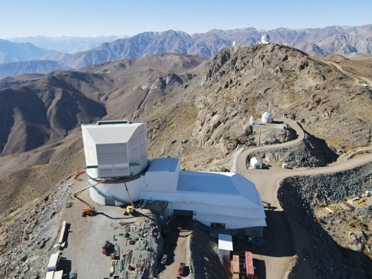
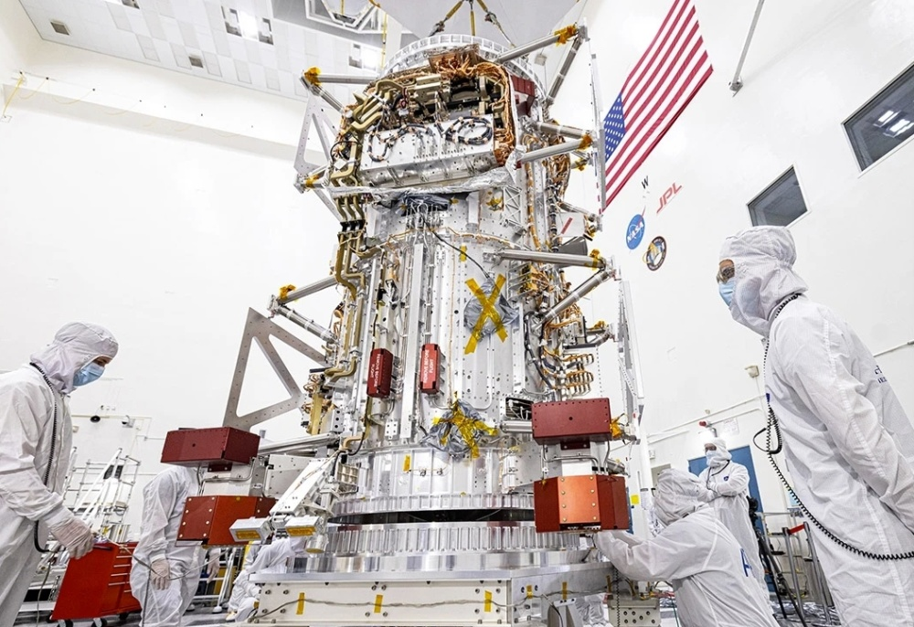

# 《自然》预测2024年8大科学事件：GPT-5、载人绕月飞行、抗病蚊子量产

**划重点**

  * _1_ 预测OpenAI有望于2024年年底发布下一代AI模型GPT-5，它可能具有比GPT-4更先进的功能。
  * _2_ 非营利组织 “世界蚊子计划”（WMP）将于明年在巴西的工厂开始量产抗病蚊子，随后每年生产50亿只。
  * _3_ NASA阿尔忒弥斯2号任务最早将于明年11月发射，搭载四名宇航员乘坐猎户座飞船绕月飞行十天。
  * _4_ 明年年初，研究人员将启动欧洲首台百亿亿次超级计算机“木星”，它每秒可以执行100亿亿次计算。

腾讯科技讯
在即将过去的2023年，科学领域见证了无数的突破与发现，从微观的基因编辑到宏观的宇宙探索，人类对世界的理解在不断深化。而2024年，我们有理由期待更多的科学奇迹。《自然》杂志网站近日盘点了2024年最值得关注的八大科学事件，从发布更先进的人工智能模型到量产抗病蚊子，从执行载人绕月任务到部署超高速的超算，这些重大事件将塑造科学研究的未来。

**1.GPT-5有望亮相**

聊天机器人ChatGPT的崛起对今年的科学领域产生了深远的影响，预测其开发者、位于加州旧金山人工智能初创公司OpenAI，可能在明年年底发布下一代人工智能
(AI) 模型GPT-5，这些模型是支撑聊天机器人的底层技术。GPT-5可能会比其前身GPT-4拥有更先进的功能。科学家们也在关注OpenAI
GPT-4的竞争对手谷歌Gemini的进展。大语言模型（LLM）可以处理多种类型的输入，包括文本、计算机代码、图像、音频和视频。

谷歌DeepMind的人工智能工具AlphaFold的新版本也将于明年发布，研究人员已经用它来从高精度层面预测蛋白质的3D形状。人工智能将能够以原子精度模拟蛋白质、核酸和其他分子之间的相互作用，这可能为药物设计和发现开辟新的路径。

与此同时，针对人工智能进行监管已经迫在眉睫。联合国人工智能高级别咨询机构将于2024年中期公布其最终报告，为人工智能的国际监管制定指导方针。

**新天文台瞄准星空**

智利的维拉·鲁宾天文台（Vera C. Rubin
Observatory）计划在2024年底之前开始运行部分仪器，然后计划对整个南半球天空进行为期十年的观测。借助该天文台的8.4米望远镜和巨大的32亿像素相机，科学家们希望发现更多新的瞬态现象和近地小行星。

_图1：维拉·鲁宾天文台将对南半球的天空进行为期十年的观测_

同样在智利，位于阿塔卡马沙漠的西蒙斯天文台（Simons
Observatory）将于2024年中期完工。这项新一代宇宙学实验将在宇宙微波背景下寻找原始引力波的特征，即大爆炸的余辉。这里的望远镜将配备多达5万个聚光探测器，比目前正在运行的类似项目多十倍。

不过，天文学家们担心，由于越来越多的明亮卫星正在用光污染夜空，新的地基望远镜获得数据可能更难使用。

**3.量产抗病蚊子**

非营利组织
“世界蚊子计划”（WMP）将于明年在巴西的一家工厂开始生产抗病蚊子。这些蚊子被一种细菌感染，这种细菌可以防止它们传播致病性病毒，可以保护多达7000万人免受登革热和寨卡病毒等疾病的侵害。“世界蚊子计划”将在未来十年每年生产多达50亿只抗病蚊子。

_图2：世界蚊子计划工厂生产的蚊子感染了细菌，可以防止它们传播登革热等病毒_

随着世界逐渐摆脱新冠肺炎疫情的困扰，美国政府正在资助三种下一代疫苗的试验，其中两种是鼻内疫苗，旨在通过在呼吸道组织中产生免疫力来预防感染。第三种是mRNA疫苗，可以增强抗体和T细胞反应，有望提供针对多种新冠病毒变种的持久免疫力。

与此同时，世界卫生组织将在2024年5月举行的第77届世界卫生大会上公布其流行病条约的最终草案。该协议旨在帮助世界各国政府更好地预防和管理未来的流行病。世界卫生组织的194个成员国将决定该协议的条款，包括其中的条款是否具有法律约束力。谈判的核心是确保公平获得预防大流行病所需的工具，包括疫苗、数据和专业知识。

**4.载人绕月飞行**

自20世纪70年代以来，NASA再次启动了载人登月任务。阿尔忒弥斯2号（Artemis
II）最早将于明年11月发射，它将搭载四名宇航员（三男一女）乘坐猎户座飞船绕月飞行十天。阿尔忒弥斯2号将为随后的阿尔忒弥斯3号（Artemis
III）任务做好准备，该任务将使第一位女性和下一位男性登上月球表面。

中国也准备在2024年进行嫦娥六号月球样本返回任务。如果成功，这次任务将是第一次从月球背面采集样本并送回。

_图3：在南加州喷气推进实验室的无尘室中，工程师们正在研究NASA的飞船Europa Clipper，它将于明年前往木星的卫星木卫二_

日本计划于2024年进行火星卫星探测(MMX)任务，将访问火星的卫星火卫一和火卫二。它将降落在火卫一上，收集表面样本，并于2029年返回地球。

除此之外，NASA的Europa Clipper将于明年10月前往木星的卫星木卫二，其目标是确定这颗卫星的地下海洋是否可能孕育生命。

**5.照亮暗物质**

一项探测被称为“轴子”的暗物质粒子的实验，有望在2024年看到曙光。轴子被认为是由太阳发射并转化为光的，但由于缺乏灵敏的探测工具和极强的磁场，这种微小的粒子至今还没有被实验观察到。在汉堡的德国电子同步加速器进行的BabyIAXO实验，使用了一个由10米长的磁铁和超灵敏无噪声X射线探测器组成的太阳望远镜，每天12小时跟踪太阳的中心，以捕捉轴子转化为光子的过程。

此外，科学家们可能在2024年确定中微子的质量，中微子是粒子物理学标准模型中最神秘的粒子。2022年卡尔斯鲁厄氚中微子实验（KATRIN,
Karlsruhe Tritium Neutrino
Experiment）的结果表明，中微子的最大质量为0.8电子伏特。研究人员将在2024年完成数据收集，并有望对这些微小粒子进行精确测量。

**6.“意识之争”第二轮实验结果**

在2024年，科学家可能会对意识的神经基础有新的认识。一个大型项目正在通过一系列对抗性实验来测试两种意识理论，预计将在2024年底前公布其第二轮实验的结果。在第一轮中，两种理论都未能与观察到的脑成像数据完全一致，这使得25年来的赌注落在了哲学而非神经科学上。第二轮研究可能会让神经科学更接近于破解主观体验的奥秘。

**7.拯救地球**

2024年下半年，位于海牙的国际法院可能会就各国应对气候变化的法律义务发表意见，并就那些被认为破坏气候的国家必须承担的后果做出裁决。虽然这项裁决不具有法律约束力，但法院的影响力可以推动各国加快实现其气候目标，并可以在国内法律案件中引用。

 _图4：2021年4月19日，在巴拿马城埃斯特海岸的海滩上，可以看到许多包括塑料在内的垃圾_

联合国塑料条约的谈判将于明年结束，该条约旨在建立一项具有约束力的国际协议，以消除塑料污染。自20世纪50年代以来，全世界已经生产了100亿吨塑料，其中超过70亿吨已经成为废品，很大一部分污染了海洋并伤害了野生动物。但研究人员越来越担心，去年开始的联合国谈判进展太慢，无法实现预期目标。

**8.速度超快的超算**

明年年初，研究人员将启动欧洲首台百亿亿次超级计算机“木星”（Jupiter）。这台巨大的机器每秒可以执行100亿亿次计算。研究人员将利用这台机器创建基于医学目的的人类心脏和大脑的“数字双胞胎”模型，并对地球气候进行高分辨率模拟。

美国研究人员将在2024年安装两台百亿亿次计算机，它们分别是位于伊利诺伊州莱蒙特阿贡国家实验室的Aurora，以及位于加州劳伦斯利弗莫尔国家实验室的El
Capitan。科学家们将利用Aurora来绘制大脑神经回路图，利用El Capitan来模拟核武器爆炸的影响。（编译/金鹿）

