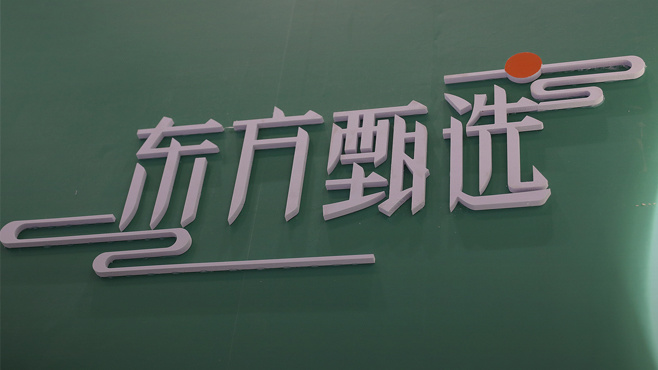
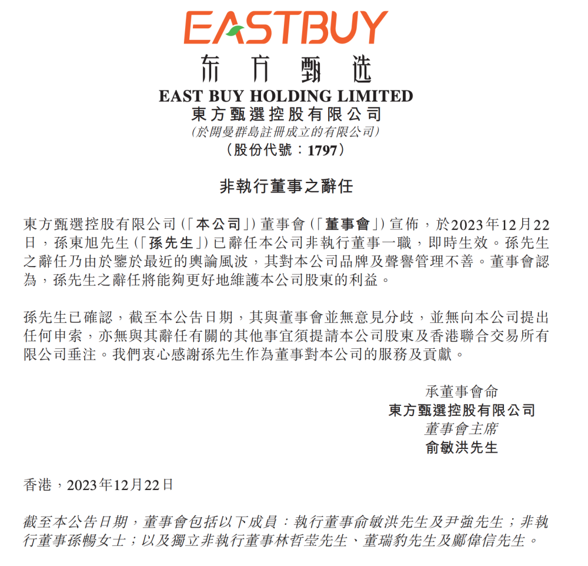

# 东方甄选：孙东旭已辞任本公司非执行董事一职

腾讯科技讯
12月22日消息，东方甄选发布公告称，孙东旭先生已辞任本公司非执行董事一职，即时生效。孙先生之辞任乃由于鉴于最近的舆论风波，其对本公司品牌及声誉管理不善。董事会认为，孙先生之辞任将能够更好地维护本公司股东的利益。

**此前报道：**

[东方甄选：因管理不善解除孙东旭总裁一职，留任非执行董事](https://news.qq.com/rain/a/20231217A05MRK00)（12月17日）

[东方甄选：俞敏洪兼任东方甄选CEO，免去孙东旭CEO职务](https://news.qq.com/rain/a/20231216A038CC00)（12月16日）

