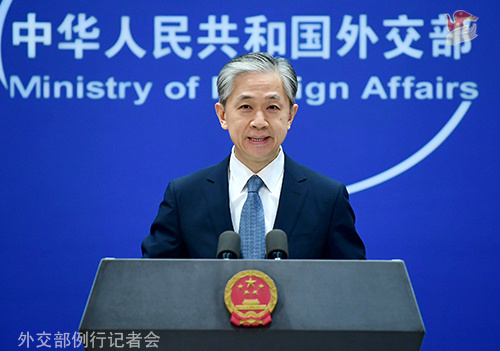

# 中国在台湾问题上的决心发生变化？外交部：我们的立场一以贯之

12月22日，外交部发言人汪文斌主持例行记者会。

美国全国广播公司记者提问，有报道称，中美领导人旧金山会晤期间，中方领导人表示将统一台湾。尽管中方这一政策立场是一贯的，但在最高层级直接地向美方表示将统一台湾，是否意味着中国在台湾问题上的态度或决心发生了变化，特别是在台湾地区的选举之前？

_汪文斌 资料图。图源：外交部网站_

汪文斌介绍，今年11月，习近平主席同美国总统拜登旧金山会晤期间，深入阐述了中方在台湾问题上的原则立场，有关的新闻稿已经及时发布了，大家可以查阅。

习近平主席指出，台湾问题始终是中美关系中最重要、最敏感的问题。中方重视美方在巴厘岛会晤中作出的有关积极表态，美方应该将不支持“台独”的表态体现在具体行动上，停止武装台湾，支持中国和平统一。

汪文斌指出，解决台湾问题、实现祖国完全统一，是全体中华儿女的共同愿望。我们推进祖国统一大业的立场一以贯之、坚如磐石、不可撼动，中国终将统一，也必然统一。

来源 北京日报客户端 | 记者 周经纬

**发布会其他要点**

[美商务部将追踪美公司对中国技术的依赖程度，外交部回应 ](https://news.qq.com/rain/a/20231222A06BQ400)

[外交部：中美正就成立禁毒合作工作组保持密切沟通 ](https://news.qq.com/rain/a/20231222A069J800)

[美驻华大使称太空领域将成为中美的竞技场，外交部回应 ](https://news.qq.com/rain/a/20231222A06D2S00)

