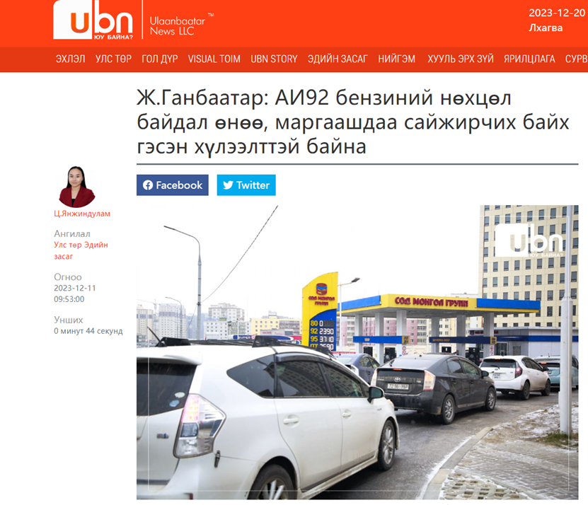
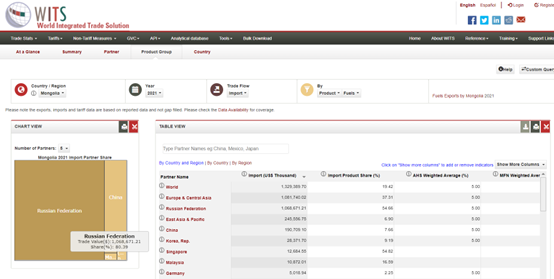

# 俄罗斯停止对蒙古国供油，致蒙古发生“油荒”？真相并非如此

**速览**

\- 没有证据表明俄罗斯对蒙古国切断了能源供应。

\- 近日蒙古确实经历了新一轮“用油荒”。蒙古官方认为，短缺与蒙古境内的交通拥堵、石油产品仓库没有充分发挥其能力、部分公司囤积柴油人为制造短缺等因素有关。

**事件背景**

近日，社交平台上有说法称：“这几天俄罗斯跟蒙古国闹僵了，俄一气之下停止了对蒙古汽油、柴油供应，据说下周还会断电，这导致蒙古发生‘油荒’”。

 _网传说法相关截图_

**明查**

**蒙古国发生“油荒”？**

关键词检索发现，蒙古国近日确实经历了一轮“用油荒”。12月11日，蒙古媒体ubn.news在报道中提到，“因燃料短缺，周末人们在加油站外排了3-4个小时的队。”

_ubn.news报道标题截图_

与短缺相关的讨论主要围绕92号汽油和柴油展开，这是在蒙古能源市场应用最为广泛的两种汽车燃料。东亚与东盟经济研究所在2021年1月发布的一份报告显示，蒙古的公路运输车辆使用的主要燃料中，92号汽油和柴油的市场份额占比最高，分别达到了31.86%和27.36%。

 _东亚与东盟经济研究所发布的《蒙古能源效率指标2019》报告截图。_

针对“用油荒”的情况，12月18日，蒙古国家通讯社Montsame报道称，蒙古矿业和重工业部长钢巴特尔（J.
Ganbaatar）对媒体表示，蒙古境内的92号汽油和柴油供应是正常的，造成短缺的原因在于国内分配。具体来说，由于天气越来越冷，蒙古首都乌兰巴托交通拥堵，运输燃料的车辆流通速度减慢，过去可以补油4-5次的油罐车现在只能返回1次。

_Montsame报道标题截图_

钢巴特尔同时表示，蒙古首都、各省和各地的燃料供应在一定程度上存在缺陷，一些石油产品仓库没有充分发挥其人力和能力。

在12月14日举行的蒙古国国家大呼拉尔（议会）秋季例会上，大呼拉尔主席贡布扎布·赞丹沙塔尔还指出，部分公司囤积柴油，人为制造了短缺。

_蒙古“时代”新闻网文章标题截图。_

需要指出的是，这并不是蒙古国第一次面临燃料短缺的情况。例如，2021年9月，蒙古媒体A24新闻社也曾报道过“燃料短缺造成蒙古加油站门口排长队”的现象，并称造成短缺的原因是燃料供应商没有按计划供应蒙古订购的燃料。

_2021年9月，A24新闻社报道“燃料短缺造成蒙古加油站门口排长队”的现象。_

**俄罗斯停止对蒙古国供油？**

作为燃料进口国，蒙古在石油等能源资源上高度依赖俄罗斯。联合国环境项目与气候和清洁空气联盟在2018年3月联合举办的一场边会报告中提到，蒙古在2017年进口的石油类产品中，约97%来自俄罗斯；世界银行（WB）旗下信息平台WITS的最新数据显示，2021年，蒙古国从俄罗斯进口的燃料贸易额占到了其全年燃料进口量的80.39%。

 _WITS的数据显示，2021年，蒙古国从俄罗斯进口的燃料贸易额占到了其全年燃料进口量的80.39%。_

从数据上看，俄罗斯确实有能力对蒙古国的燃料市场造成影响。今年12月，路透社报道称，俄罗斯作为全球最大的石油出口国之一，在12月与沙特阿拉伯一道，呼吁所有“欧佩克+”成员国（包括石油输出国组织OPEC成员、俄罗斯和其它盟国）加入减产协议以支撑全球油价。为此，俄罗斯表示，将在12月深化石油出口减产，减产幅度可能达到每天5万桶或更多。

_路透社报道标题截图。_

减产确实有可能影响蒙古国内的汽油市场，但没有证据表明此举系针对蒙古而为。更没有可靠消息表明俄罗斯已停止对蒙古供应燃料。

2022年11月，据俄国家通讯社塔斯社报道，俄罗斯石油公司（Rosneft）计划从 2023
年起，以折扣价向蒙古国供应柴油。钢巴特尔部长当时表示，“已经与俄罗斯石油公司就供应和价格问题进行了谈判。从 2023
年初开始，柴油供应价格将比国际市场价格优惠 10%。我们同意将92号汽油的价格定为每吨815美元，为期五年。”

 _塔斯社报道截图。_

Montsame的报道中提到，在今年12月1日至17日期间，蒙古国共计进口了7.122万吨柴油，其中的6.114万吨来自俄罗斯。12月17日当天，有
320个车皮、1.92万吨柴油通过俄罗斯铁路运抵蒙古，今年12月蒙古预计能够供应的柴油总量将达到13.35万吨。

因此，网传“俄罗斯对蒙古国切断能源供应”的说法并不可信。但在蒙古国内，担忧的声音确实存在：蒙古国会议员D.
Unerbolor在秋季例会上表示，在世界各国都在实施能源转型的今天，蒙古国也迫切需要这么做，成为一个有降低风险管理计划的国家。特别是如今，寒冷季节日益加剧，如果燃料、燃油、电力和热能的供应出现故障，会给社会、经济和人民生活带来很多问题。

综上所述，没有证据表明俄罗斯对蒙古国切断了能源供应。近日蒙古国确实经历了新一轮的“用油荒”。蒙古国官方认为，短缺与蒙古境内的交通拥堵、石油产品仓库没有充分发挥其能力、部分公司囤积柴油人为制造短缺等因素有关。

