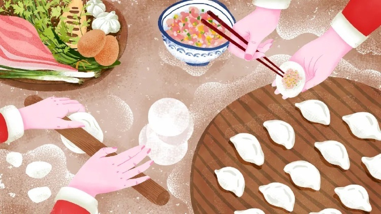

# 冬至吃饺子是为了纪念谁

今天的11时27分，我们将迎来二十四节气中的第22个节气：冬至。在我国古代，冬至被视为一个重要的节日，又称亚岁、冬节、长至节等。

那么，冬至到底是如何测定的？为什么又被称为“亚岁”？习俗有哪些？冬至吃饺子又是为了纪念谁？

**冬至是如何定测的？**

根据古籍记载，早在春秋时代，中国古人已经使用土圭观测太阳的方式，测定出冬至。

冬至日最重要的仪式性活动是祭天祀祖。民间一般有祭祀祖先的风俗，如一些地方文献中就记载了冬至的祭祖节俗。

**冬至为何被称为“亚岁”？**

冬至的重要性主要体现在其时间节点上，人们认为这是“日行南至，往北复返”的转折点，此后太阳高度回升、北半球各地白昼逐日增长。

古人认为冬至是个吉祥的日子，是阴阳二气的自然转换，预示否极泰来，值得庆贺。因此，冬至的重要程度并不亚于新年，于是冬至又称为“亚岁”。

据记载，周人以冬十一月为正月，冬十一月一日为岁首。周人的岁首与冬至日期同在阴历十一月，因此有说从周时期起周人就有在冬至(十一月)祭祀的活动。

**“数九”日期如何计算？**

冬至这天，太阳直射地面的位置到达一年的最南端，几乎直射南回归线。这一天北半球得到的阳光最少，白昼达到最短，且越往北白昼越短。

所谓“数九”，一般指从冬至算起，九天为一个单位，每九天算一“九”，依此类推，一直数到“九九”八十一天，即为“出九”或“完九”，此时，天气转暖，全国大部分地区已入春，又叫“九九艳阳天”。

民间“数九”的习俗主要与“数九”歌谣、九九消寒图有关。

**冬至习俗有哪些？**

作为一个延续许久的节日，冬至自然会有许多有趣的习俗。

俗话说，“冬至到，吃水饺”。在中国北方有冬至吃饺子的风俗，南方则多半是吃汤圆，当然也有例外，如在山东滕州等地，流行冬至当天喝羊肉汤，寓意驱除寒冷。

另外，在江南水乡，讲究冬至之夜全家欢聚，共吃赤豆糯米饭。相传，共工氏有个儿子作恶多端，在冬至死去了，死后变成疫鬼残害百姓。但疫鬼特别怕赤豆，于是，人们就在冬至煮吃赤豆饭，希望防灾祛病。

有趣的是，苏州还有饮用“冬酿酒”习俗。冬酿酒是一种米酒，加入桂花酿造。冬至夜，老百姓们一边畅饮美味的冬酿酒，一边品尝卤牛肉等各种卤菜，家里充满欢声笑语。

冬季，是冬藏的时节，北风呼啸，大地冰封。民俗学专家萧放在《二十四节气与民俗》中提到，冬至是重要的时令节点，人们围绕冬至举行一系列季节仪式。

**冬至吃饺子是为了纪念谁？**

每年农历冬至这天，不论贫富，饺子是必不可少的节日饭。谚云：“十月一，冬至到，家家户户吃水饺。”那么冬至为何吃饺子呢？

据说这种习俗，是因纪念“医圣”张仲景冬至舍药留下的。

张仲景是南阳涅阳人，他著《伤寒杂病论》，集医家之大成，祛寒娇耳汤被历代医者奉为经典。张仲景有名言：“进则救世，退则救民；不能为良相，亦当为良医。”

东汉时他曾任长沙太守，访病施药，大堂行医。后毅然辞官回乡，为乡邻治病。其返乡之时，正是冬季。

他看到白河两岸乡亲面黄肌瘦，饥寒交迫，不少人的耳朵都冻烂了。便让其弟子在南阳东关搭起医棚，支起大锅，在冬至那天舍“娇耳”医治冻疮。

他把羊肉和一些驱寒药材放在锅里熬煮，然后将羊肉、药物捞出来切碎，用面包成耳朵样的“娇耳”，煮熟后，分给来求药的人每人两只“娇耳”，一大碗肉汤。

人们吃了“娇耳”，喝了“祛寒汤”，浑身暖和，两耳发热，冻伤的耳朵都治好了。后人学着“娇耳”的样子，包成食物，也叫“饺子”或“扁食”。

原来冬至吃饺子，是不忘“医圣”张仲景“祛寒娇耳汤”之恩。至今南阳仍有“冬至不端饺子碗，冻掉耳朵没人管”的民谣。

综合来源：中国新闻网、央视新闻、国学文化、诗词天地

