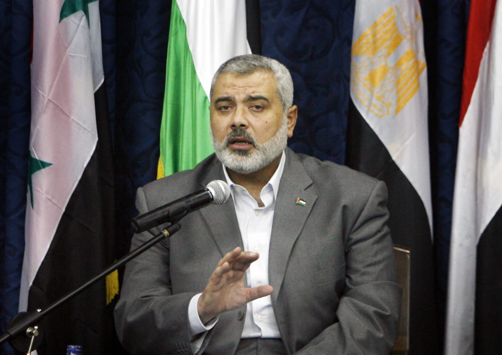

# 加沙战后由巴勒斯坦权力机构接管？以色列松口：但要先进行根本性改革

（观察者网讯）据《华尔街日报》当地时间21日报道，当地时间周四，以色列国家安全委员会主席哈内格比（Tzachi
Hanegbi）公开表示，以色列可以接受一个由美国制定的战后计划，同意由巴勒斯坦权力机构在战后管理加沙，但前提是巴当局现任领导层进行“根本性改革”。

报道称，这一信号显示出以色列领导人对于由巴权力机构最终接管加沙的反对态度“有所缓和”。早前有美媒曾披露称，以总理内塔尼亚胡坚决抵制这一方案，并一再强调“巴权力机构不应接管加沙地带”。

_当地时间1月19日，耶路撒冷，美国国家安全顾问沙利文会见以色列国家安全委员会主席哈内格比（右） 图自视觉中国_

据《华尔街日报》报道，哈内格比是在周四发表在阿拉伯语新闻网站“Elaph”上的一篇评论文章中，表达了这一态度。

报道引述其文章内容称：“以色列意识到国际社会和该地区各国希望在哈马斯倒台后的第二天整合巴勒斯坦权力机构，我们明确表示，这件事需要对巴勒斯坦权力机构进行根本性的改革。”哈内格比补充道，以色列“已经为这一努力做好了准备”。

报道称，文章发表的当天，哈内格比很快遭到了来自内塔尼亚胡政府极右翼成员的批评。

极右翼政党领导人、以财政部长斯莫特里奇在社媒平台X（原推特）抨击称：“这一立场不代表以色列政府的官方立场，总理应该叫他遵守规则。”

另一名高级官员也表示，以色列仍然反对巴勒斯坦权力机构“以当前方式”在加沙发挥作用，巴权力机构还需要国际援助来实现加沙的“非军事化”和“去激进化”，其认为这一目标更有可能由“地方领导”在阿联酋和沙特阿拉伯等阿拉伯国家、联合国、美国和欧洲国家的帮助下实现。

据报道，现治理约旦河西岸的巴勒斯坦权力机构巴勒斯坦民族解放运动（法塔赫）暂未对哈内格比的做出回应。早些时候巴勒斯坦官员和一些阿拉伯国家当局曾表示，必须在加沙实现持久停火，他们才会同意认真讨论战后安排，包括美国呼吁巴权力机构所采取的措施。

《华尔街日报》指出，哈内格比强调巴勒斯坦权力机构需要“彻底改革”，与美国之前提出对约旦河西岸实体进行“全面改革”的战后治理计划不谋而合。拜登政府认为，经过所谓“改造和重振”后的巴权力机构应在战后加沙的管理中发挥作用，并有可能成为未来政府的核心。

报道还提到，美国官员已敦促巴勒斯坦权力机构清理其“老化”领导层，制定选举时间表，并对其安全部队进行全面整顿，由美国进行培训训练。

白宫国家安全委员会战略沟通协调员约翰·柯比周三当天对此回应表示：“他们（巴权力机构）必须解决一些问题，使自己在这一领域具有可信度和真实性。”

自本轮巴以冲突爆发以来，美国曾多次提议让巴勒斯坦权力机构在冲突结束后回归加沙地带，但被内塔尼亚胡拒绝，他表示以色列将在加沙地带保留“开放式的安全存在”，暗示以色列或将扩大对巴勒斯坦领土的占领。

以色列国防部长加兰特11日则表示，以军无意永久驻扎在加沙地带，以方愿意讨论由谁控制该地区，“关键条件是这个组织不会对以色列采取敌对行动。在我看来，其余一切都可以讨论，但肯定不会是哈马斯，也不会是以色列。”

但巴勒斯坦总理阿什提耶8日接受美国彭博社采访时称，约旦河西岸的巴勒斯坦民族权力机构正在与美国官员合作制定一项战后管理加沙地带的计划，希望哈马斯作为巴勒斯坦解放组织的伙伴，参与建立一个包括约旦河西岸、加沙地带和东耶路撒冷的独立国家。

阿什提耶说：“如果他们（哈马斯）准备达成协议并接受巴解组织的政治纲领，那么就会有谈判的空间。巴勒斯坦人不应该被分裂。”

一周不到的时间（13日），哈马斯政治局领导人伊斯梅尔·哈尼亚也发表电视讲话表态称，他愿意就结束冲突以及解决加沙地带和约旦河西岸问题进行谈判。但他强调，任何没有哈马斯参与的加沙战后计划都是“幻想”。

_巴勒斯坦伊斯兰抵抗运动政治局领导人哈尼亚 资料图 图自澎湃影像_

另据《华尔街日报》20日报道，哈马斯政治局成员胡萨姆·
巴德兰日前在卡塔尔接受采访时更透露，哈马斯的政治领导人一直在与他们的巴勒斯坦政治对手就战争结束后如何治理加沙和约旦河西岸举行会谈，并表示他们希望加入巴解组织的政治组织网络，但哈马斯不打算“去军事化”，也不打算改变“拒绝承认以色列”的立场。

报道称，这种谈判是哈马斯政治派别开始为战后局面做安排的“最明显迹象”。然而当被问及哈马斯加入巴民族权力机构并在战后的加沙发挥作用的可能性时，一名以色列官员称这一想法“不现实”，因为以色列希望“彻底摧毁哈马斯”。

**本文系观察者网独家稿件，未经授权，不得转载。**

