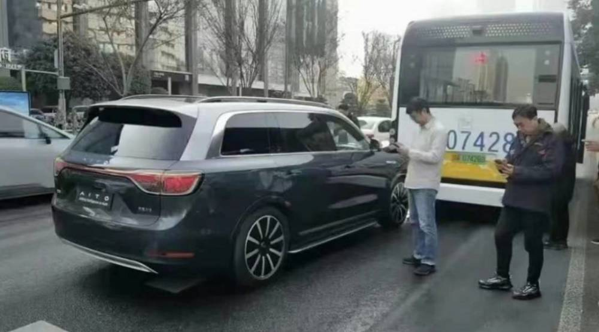
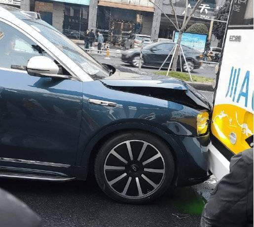
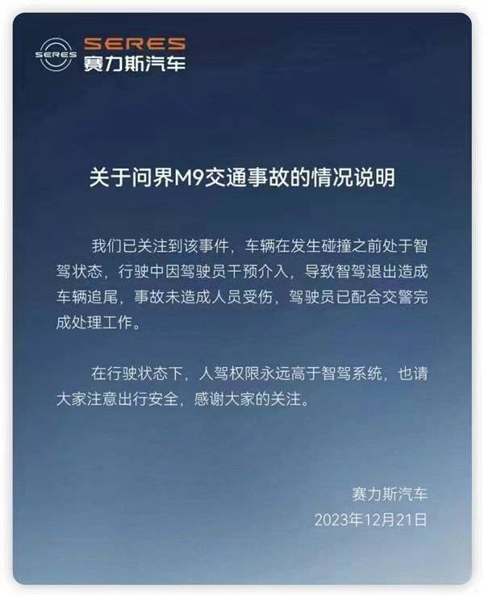

# 啥情况？“1000万以内最好的SUV”在成都追尾了

9月25日，在华为举行秋季全场景新品发布会上余承东宣布，“1000万以内最好的SUV，马路上能看到的最强大的
SUV，AITO问界M9将于今年12月发布。”最新消息显示，新车将于12月26日正式上市。而在上市前的12月19日，AITO问界M9却在成都出现了一个“小插曲”。

**还未上市，全国首撞！**

有网友爆料，12月19日上午10点55分左右，一辆AITO问界M9在成都市锦江区一环路东五段追尾了一辆公交车。虽然据图片显示，事故中AITO问界M9引擎盖轻微翘起并无大碍，但该事件却引起不少业内人士的关注。

 _（图片来源网络）_

据了解，通常汽车在追尾前AEB（自动紧急刹车系统）通常会介入，来阻止事故发生。而关于AEB，前不久小鹏汽车创始人何小鹏和AITO问界余承东在网络上的各自表态，让AEB在网络上开启了一波波隔空Battle。

_（图片来源网络）_

资料显示，AITO问界M9搭载了HUAWEI ADS
2.0高阶智能驾驶系统，该系统的搭载让AITO问界M9拥有了“全向防碰撞系统”，该系统包括前向、侧向和后向主动安全功能。其中，该车的侧向主动安全功能可以主动纠偏避险，避免与变道车辆发生碰撞。正因如此，这次常规的交通事故才引起不少人的关注。

**为何追尾？网友发声！**

记者注意到，一位网名为“电车小飞”的知情博主发文称，“事发这辆问界M9是厂家提供给媒体用的试驾车，这2天问界M9正在成都搞媒体动态品鉴活动。”

_（新浪微博电车小飞博主发文）_

该博主还侧面打听到消息称，“当时这辆车处于人驾状态，这辆车在碰撞之前已经启动了AEB减速和转向躲避。可能由于路况复杂，司机也不熟悉问界的主动安全功能，司机最终还是主动介入了，并且慌乱之际发生了一些误操作，导致发生了追尾。人驾状态下，司机介入权限优于智驾系统。那些质疑AEB未启动的可以退下了，就是普普通通的一起追尾事故”。

当检测到即将发生碰撞时，AEB介入后如果人为再次介入干预驾驶是否有效？一位业内人士透露，“一般来说人的优先级肯定大于一切，但具体情况也具体来看，因为AEB的主要作用本来就包含了在人为制动不足情况下施加制动力，所以也得看人为介入后的刹车力度”。

记者也注意到，12月21日，赛力斯官方针对该事件也发表声明，“在发生碰撞之前处于智驾状态，行驶中因驾驶员干预介入，导致智驾退出造成车辆追尾，事故未造成人员受伤，驾驶员已配合交警完成处理工作。”其中还提到“在行驶状态下，人驾权限永远高于智驾系统，也请大家注意出行安全，感谢大家的关注。”

封面新闻记者 李继龙

