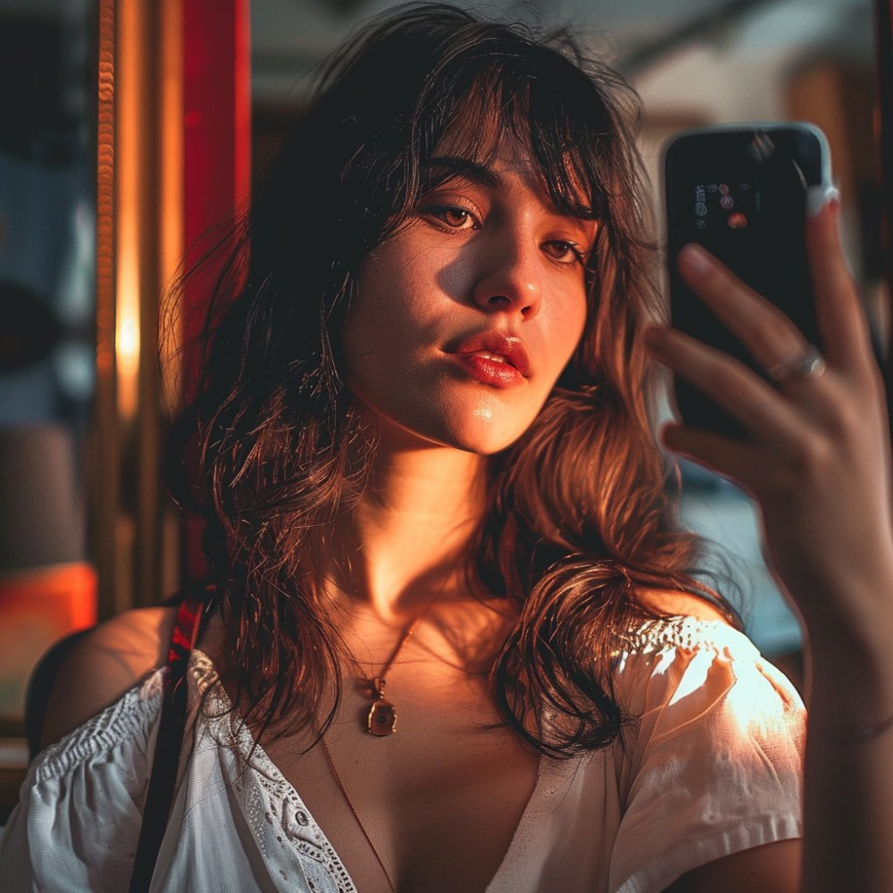

# 摄影师危险了！Midjourney v6公测，相片级真实细节

文/腾讯科技 郝博阳

12月21日，Midjourney
在Discord上宣布其最新版本v6的测试版发布。该模型经过了9个月的训练，虽然缺乏明确的benchmark比较，就目前网友测试展现出来的能力来看，它可以被称为当下最先进的文生图模型。这次发布出的模型水平不光卷翻设计圈，也直接卷倒了摄影圈。

_（先来点真实性震撼)_

Midjourney 历代全家福：

从官方Discord介绍上看，这一次Midjourney的模型提升主要在以下几个方面：

**1）更准确的提示遵循以及更长的提示词上下文长度。**

据已参与测试的用户通过实测后表示v6现在支持的提示词长度超过350个字符；当前版本在提示里可以指定多个主题/颜色和其他细节。

在准确遵循提示这点上，从网友测试来看提升也很明显。

比如当用法语测试时，v6模型生成的图像明显更符合提示词的具体语义：有拳击手套，面带一点微笑。

下面这个例子更明显，v5.2数不到1000。

动作理解的提升：v5.2理解不了躺着，想再爬起来卷。v6就彻底躺平了。

**2）改进的连贯性和模型知识**

在公告中，Midjourney表示

● v6 对提示现在更敏感。别再用像 “令人印象深刻的，逼真的，4k，8k”这样的无用词汇了。

● 明确表达你想要的。虽然它可能没那么有意思，但当你明确表达时，它就能在理解你的意图这方面做得更好。

据用户测试，v6甚至能够理解标点和语法的细微差别。这一升级其实会对整个用户体验产生较大的影响。过去偏向于炼丹式的提示词可能将被更细致的描述取代。这到底是提高还是降低了新手门槛，还真不好说。

针对这个改变，一名设计师给出了当前最适合Midjourney的新提示技巧：核心就是一个清晰不炫技，结构化表达。

在模型知识方面v6的进化有一个小细节非常有代表性。下面例子里的提示词是日本女性。v6能分清颇为微妙的不同亚洲族裔之间的相貌区别。比起v5.2，图像中女子的外形确实更有日本特征。这种欧洲人根本理解不了的亚洲长相差异也被AI拿捏了。

_（左v5.2，右v6）_

**3）改进的图像提示和混合**

在这里，改进的图像提示其实更多是指按提升生成图像能力的提升，即能够根据文本提示创建更精细和逼真的图像。而改善的图像混合是指v6能使得不同元素和风格的结合更加和谐自然。

从网友的测试来看，v6的图像生成能力确实有明显的提升。相较于v5.2，v6的图像确实更偏向于丰富和细腻逼真。v5.2其实从细节度上来讲已经可以到“乱真”的程度了，但v6的感觉是“真”，而非“仿真”。提示词对的话，结果甚至有一种相机直出的真实质感。

比如这两盘土豆炖牛肉，明显右侧v6版本的会更让人有食欲。

 _（左：v5.2 右 v6）_

环境还原能力上看，差异也非常明显：v6版本的罗马帝国市场，不说你会以为是《罗马》剧组的场景。而v5.2就略显平面，房子也略有些奇怪。

_（上v6，下v5.2）_

这两组图的对比差异就更明显了。提示词都是纪录片风格，上面真的很纪录，而下面那组细看问题还是很多，缺乏真实的光影和细节深度。

人像方面，其实v5已经做到相当还原了。但在v6中，脸上的小疙瘩，帽檐上的褶皱与污迹，鼻子上紧贴弧线充满变化的光影让v5.2的照片看起来更像是美颜过的，太平面了。就算同样是雀斑，v6的表现也更让人信服，充满符合人体呈现的集中性，而非平铺感。

_v5.2_

_v6_

_v5.2_

_v6_

**4）文本绘制能力提升**

简单来说，v6现在可以在图像中更明确地绘制文本，甚至可以规定其风格。为了获得最佳效果，文本应该用引号标出。这样做可以帮助模型区分哪些是描述性的提示，哪些是实际要在图像中呈现的文本。例如，如果用户想要生成一张图像，上面写着用马克笔在便利贴上写的“Hello
World!”，他们可以使用类似于以下的提示：“imagine a photo of the text 'Hello World!' written
with a marker on a sticky note --ar 16:9 --v 6”

这一点在测试中也非常清晰的展示出来了。现在v6对文字的处理正确率大幅提高，而且嵌入感也更好。

然而悲报是英文之外还是鬼画符。但它已经能够完全进行复核画面的风格化文字创作了。

另一个例子中，可口可乐的字体被完全完美还原。

再来个标志设计图——文字完美贴合画面风格。设计师最后的阵地有点守不住了。

Midjourney
v6展现出的强大能力看起来对摄影师和设计团队形成了更加真实的威胁——目前它展现出的审美，和谐的氛围能力已经直追高端摄影师。最可怕还不是它展现出的实力，而是它进化的速度——在Midjourney的公告中，他们还表示：v6的速度、图像质量、连贯性、提示遵循和文本准确性在未来几周内应该会提高。而v6
beta在发布半个小时之后宣布了第一次更新，生成速度提升了2.7倍。

随着Midjourney v6的发布，新一轮图像生成模型的军备竞赛又要开始了。

