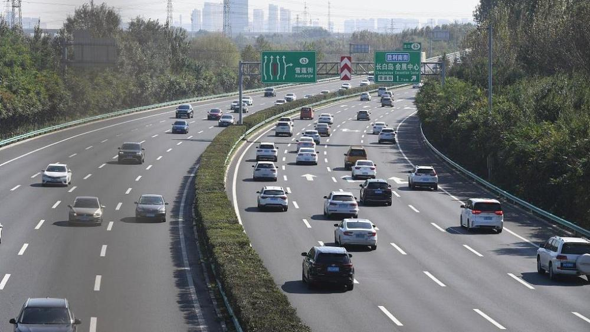

# 网友建议节假日高速免费改为每辆车每年固定免费里程，交通部回应

针对网友提出的优化重大节假日免收小型客车通行费政策相关建议，交通运输部近日给出了官方回复。

9月13日，有网友在人民网领导留言板留言：“随着人民出行方式的日益改善，现在基本家家都有私家车，尤其是过年过节，国家开放节假日高速免费通行，造成高速车流量很大，车辆容易堵塞等安全隐患，建议改为每辆车每年有固定的免费通行里程，这样能改善高速公路的通行质量，避免造成拥堵，更好的安排错峰出行。”

对此，交通运输部12月14日回复称，我国出台实施重大节假日免收小型客车通行费政策的目的，主要为缓解节假日期间公路收费站交通拥堵，方便公众出行。之所以选定春节、清明节、劳动节、国庆节等四个重大节假日，主要是考虑到这四个节假日期间公众出行需求和高速公路交通量增长最为明显，收费站拥堵缓行情况较为突出。该政策实施后，有效缓解了重大节假日期间公路收费站拥堵问题，提高了收费公路通行效率，同时也缓解了其他交通运输方式的运力紧张问题，带动了旅游、汽车租赁等服务业发展，取得了良好的社会效果。从目前掌握的情况看，造成拥堵缓行的原因是多方面的，需要坚持系统观念，多措并举、综合施策。

交通运输部表示，下一步，我部将会同有关部门督促指导各地继续严格落实有关政策，同时针对重大节假日大流量出行研究采取系列务实举措，提升路网通行效率，并通过信息化手段优化提升公路出行服务品质，不断增强人民群众的获得感、幸福感和安全感。

澎湃新闻记者注意到，近年来，呼吁调整节假日高速免费通行政策的声音时有出现，比如今年全国两会期间，全国人大代表、浙江省湖州市安吉县余村村党支部书记汪玉成就建议研究“高速免费通行里程制”。

“重大节假日期间免收小型车辆高速公路通行费政策实施以来，在促进旅游业发展、刺激消费、提升群众获得感的同时，也带来了一些问题。”汪玉成建议，应不仅限于节假日作为固定的免费时段，建议以自然人为单位，通过数据分析和系统调研，在法定机动车驾驶年龄内科学设定
“年度免费里程总数”，实行“一人一小型车辆高速公路通行里程制”，车主可根据自身需求和高速路况，在一个年度内不限时段、不限地域灵活使用，达到“错峰免费”的目的，避免节假日“趋利性”的扎堆出行。

