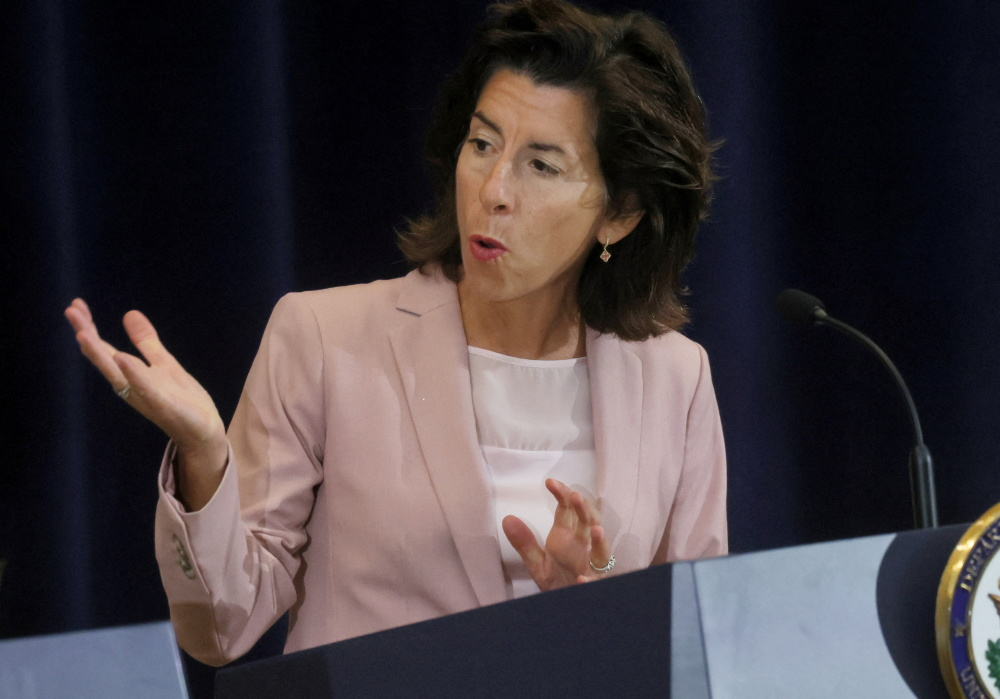
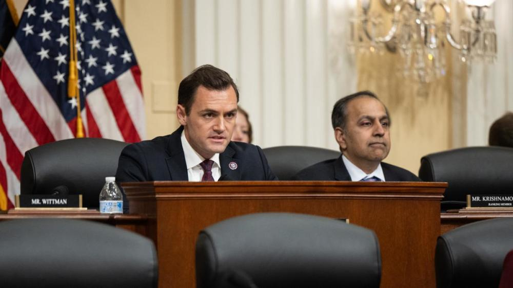

# 美国商务部：将对美国企业以何种方式采购中国制造的半导体展开审查

【文/观察者网 熊超然】不仅限制向中国出售，还限制从中国采购，美国又以所谓“国家安全”为理由，在芯片供应链领域对华大搞审查。

据法新社当地时间12月21日报道，美国政府当天宣布，将对美国企业以何种方式采购中国制造的半导体展开审查，声称此举旨在减少中国构成的所谓“国家安全风险”。

美国商务部在一份声明中称，这项审查评估将于明年1月启动，重点将放在传统芯片上，即“并不尖端，但仍对产业至关重要的半导体”。美国商务部长雷蒙多声称：“在过去几年里，我们已经看到了中国扩大其企业传统芯片生产的潜在迹象，这让美国公司更难参与竞争。”她补充说，电信、汽车产业和国防工业基地等行业都需要这种半导体。

考虑到这些“担忧”，美国商务部将通过收集美国企业的数据来评估其半导体供应链，以衡量其对中国制造芯片的依赖程度。雷蒙多称，这些信息“将为我们下一步建立强大、多样化和有弹性的半导体供应链提供信息”。

 _美国商务部长雷蒙多资料图 图自IC Photo_

路透社也报道称，美方发起的这项审查，旨在确定美国企业是如何从中国采购传统芯片的。美国商务部称，总部设在美国的公司约占全球半导体营收的一半，但面临外国补贴支持的激烈竞争。

美国商务部当天在一份报告中声称，中国在过去十年中为本国半导体产业提供了约1500亿美元的补贴，给美国和其他外国竞争者创造了一个“不公平的全球竞争环境”。

“解决外国政府威胁美国传统芯片供应链的非市场行为事关国家安全。”雷蒙多这样声称道。美方宣称，这项审查将有助于促进传统芯片生产的“公平竞争”。

当地时间12月11日，雷蒙多接受了多家媒体采访。在面对路透社时，她表示，拜登政府正在与美国芯片制造商英伟达进行讨论，[允许英伟达有限度地向中国出售人工智能（AI）芯片](https://news.qq.com/rain/a/20231212A039FR00)。日前，英伟达CEO黄仁勋透露，正与美国政府就对华出售芯片事宜展开合作。

而在接受彭博社采访时，当被问及美国商务部将如何回应中国最近取得的芯片制造突破，雷蒙多声称，[事情发展“令人深感担忧”](https://news.qq.com/rain/a/20231212A05MLD00)，但美国“都会积极调查”，并扬言将“采取尽可能最强有力的”限制行动以保护美国。

法新社提到，当地时间12月12日，美国国会众议院“美中战略竞争特别委员会”（下称“中国委员会”）发布了一份报告，[提出包括拟议的立法改革等数十项建议](https://news.qq.com/rain/a/20231213A02F6B00)，旨在“提高美国经济竞争力”，“以应对中国的崛起”。

_美国国会众议院“中国委员会”主席加拉格尔（左）和民主党籍高级成员克里希纳莫西 图自美媒_

其中，“中国委员会”还敦促施压美国商务部对来自中国的传统芯片征收进口关税。该委员会声称：“需要采取紧急行动，防止中国主导传统芯片，这将使中国对现代全球经济产生过度影响。”

对于“中国委员会”的这份报告，中国外交部发言人毛宁表示，这个“委员会”以攻击抹黑中国为己任，充满偏见和敌意，毫无理性可言。他们的言论也充分暴露了美国国内一些人企图把中美经贸和科技问题政治化、工具化、武器化，我们对此坚决反对。

对于雷蒙多宣称“中国对美国国家安全构成重大威胁”，并呼吁采取措施以限制中国获取半导体和尖端技术，中国商务部新闻发言人何亚东日前也表示，中方多次指出，美方泛化国家安全概念，对华滥用出口管制，限制双向投资等措施，破坏市场规则和国际经贸秩序，威胁全球产业链、供应链稳定。中方对此坚决反对。这些措施阻挡不了中国的发展壮大，只会让美国企业失去中国市场，损害自身的利益。中方将密切关注美方相关措施的动向和影响，坚决维护自身权益。

**本文系观察者网独家稿件，未经授权，不得转载。**

