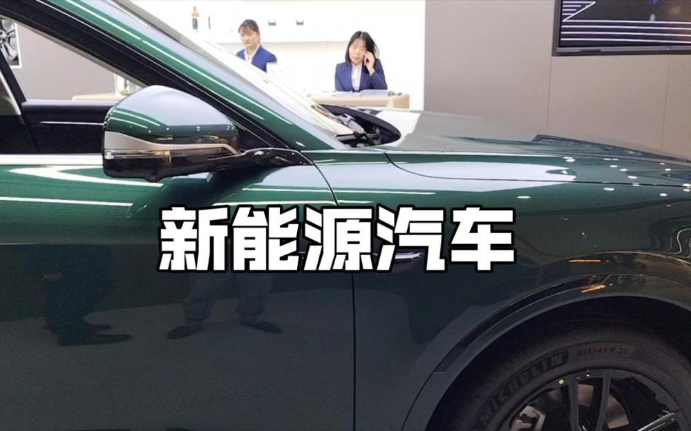

# 车企年初吹的牛实现了吗？理想拔头筹 蔚来小鹏还差得远

编者按：2023年，是极不平凡的一年。无数的企业家披荆斩棘，重塑行业格局。各大行业经历了怎样的变迁？雷达财经特推出年终策划：盘点2023，以飨读者。本文为该系列第一篇。

**雷达财经出品 文|肖洒 编|深海**

新能源汽车这一年，价格战从年初打到年尾。时至年底，新能源车企吹的牛都实现了吗？

从11月份的成绩单来看，理想汽车当月交付新车4.1万辆，1-11月份累计交付32.57万，提前达成2023年30万辆的销量目标。除了理想汽车提前完成销量目标，截至11月份，最接近完成年度目标的是比亚迪，该品牌还差11%。

除此之外，从目前销量推测，大部分新能源车企均难以实现年度销量目标。比如，小鹏汽车1-11月份累计交付量达12.15万辆，超去年全年累计交付量，但距离20万辆的年度销量目标只完成了60.75%，全年目标或已无法实现。

蔚来截止11月，累计交付14.2万辆汽车，而蔚来的年度目标为25万辆；零跑汽车截至11月累计交付12.55万辆，也离全年交付20万辆的目标有所差距；去年拿下新势力销冠的哪吒汽车，今年累计交付为12.15万辆，年度KPI完成度不足五成。

另外，年末收官之际，一些车企打起了价格战，希望以价换量的方式冲刺KPI。对此，海南科技职业大学客座教授张翔告诉雷达财经，价格战的核心原因是产能过剩，预计明年价格战还会延续，一些小型车企可能面临着被洗牌出局。

**理想拨得头筹，比亚迪接近目标**

2020
年初时，美团王兴曾经谈到中国车企格局，他表示接下来中国车企基本是呈现“3+3+3+3”的格局，其中最后一个“3”代表了“蔚小理”会成为造车新势力前三。

如今从销量来看，这一预测和现实差距并不大。据理想汽车官网，2023年11月，理想汽车交付新车4.1万辆，同比增长172.9%。截至2023年11月30日，理想汽车全年累计交付32.57万辆，提前达成2023年30万辆销量目标。

这也是理想汽车连续两个月交付量超过四万辆，12月份，理想将挑战交付5万辆的目标。12月14日，理想汽车官微宣布，理想汽车累计交付突破60万辆，用时48个月。

理想的销量主力为三款L系列车型，目前理想L9、理想L8、理想L7三个车型累计交付量均已突破10万辆。

根据最新的财报数据，三季度理想汽车营收为 346.8 亿元，同比增长 271.2%，环比增长 21.0%。其中，第三季度营收346.8亿元。

目前，理想在市值、营收和交付量等层面和蔚来、小鹏汽车已经产生了数量级上的差距。这背后，离不开理想对增程式技术路线的坚持。

据悉，在打造出理想One之前，理想汽车也曾尝试过低速低续航的纯电动小车项目，但最终“难产”。但是面对已经丢失的时间窗口，创始人李想选择了在成本、产品设计、整车布置等方面难度相对更低的增程电动技术路线。

但市场上关于增程的争议始终存在。即便到了今天，“增程好还是纯电好”、“增程电动算不算新能源”的讨论声还不绝于耳。

对此，今年2月7日，李想发布微博：“如果汽车销量前三的比亚迪、吉利、长安都开始使用增程电动，某企业关于增程落后的营销规划可以停止了，省点钱干正事吧。”

在张翔看来，理想领先的原因，在于它找准了增程式大型SUV这一领域，这是一片蓝海，以前都是BBA的领域。理想在这一细分赛道杀出了一条血路，目前还没有第二家车企能跟理想抗衡，问界、阿维塔也在做增程，但和理想的差距还比较远。

截至目前，在众多新能源车企中，仅理想一家达成了年度目标。除此之外，比亚迪也接近年度目标，但难度较大。

产销数据显示，比亚迪2023年11月新能源汽车销量为30.19万辆，同比增长31.02%。截至11月底，比亚迪今年前11个月累计批发销量为267.27万辆，完成全年目标的89.07%。

算下来，比亚迪需要在12月完成32.73万辆的交付量，也就是每天至少卖出1.06万辆车，才能完成300万辆年销目标。虽然已是行业销冠，但这样的记录比亚迪还未有过，压力可谓不小。

**大多数车企完成年度目标无望**

头部造车新势力之中，理想之外其他品牌2023年的销量目标完成率普遍不佳。

同为“蔚小理”之一的蔚来，相比理想和小鹏汽车处于销量垫底转态。数据显示，蔚来11月交付新车15959辆，同比增长12.6%，相比10月略减少约100辆。

在今年6月蔚来2023年第一季度业绩报告发布之后的财报电话会上，蔚来董事长、CEO李斌曾表示：“蔚来非常有信心完成下半年平均月销超过2万辆的目标。”

随后在7月份，蔚来交付量升至2.05万辆，同比增长103.6%。然而，8月销量未达到2万辆，9–11月销量稳定在1.6万辆左右。

蔚来在年初设定了年销量同比翻番的2023年度目标。而截至11月末，蔚来累计交付14.2万辆，同比增长33.1%，但仅完成24.5万辆全年目标的57.95%。

2021年新势力销冠的小鹏汽车，在经历了G9上市时的“翻车”之后，也已被竞争对手逐渐甩开。销量上，小鹏汽车直到今年7月份，在时隔6个月之后重回万辆交付水平。

目前，小鹏汽车已回复了一些“元气”，11月份交付约2万辆，同比增长245%，连续两个月交付量突破2万辆。

不过，由于前期“欠账”太大，年初至今的累计交付量方面，小鹏汽车在“蔚小理”中垫底。数据显示，2023年前11月，小鹏汽车交付量达12.15万辆，同比仅增长约10.9%，仅完成20万辆全年目标的60.7%，全年目标预计无法实现。

新势力中，超越2022年全年交付量的还有零跑汽车。11月份，零跑汽车共交付1.85万辆，同比增长130%，环比增长1.68%，创历史新高。

2022年全年，零跑汽车总交付量为11.12万辆，同比增加154.1%。不过进入2023年，由于车型迭代等原因，零跑汽车销量急剧下跌，1月和2月共计交付了4337辆。最终1-11月，该品牌累计交付12.55万辆，完成了20万辆的年度目标完成的62.75%。

11月17日，零跑首款全球化车型C10在广州车展正式亮相，新车定位中型新能源SUV，预计售价区间为14万元-17万元，零跑汽车希望借助这款新车进一步提振销量。

而在2022年登顶新势力榜首的哪吒汽车，却在今年又跌回了低谷。1-11月，哪吒汽车交付12.24万辆，同比下降15.19%，这对于年初所立下的25万辆的全年销售目标，完成率仅为48.94%。

有分析指出，哪吒汽车去年拿下销冠，主要是当时售价在15万元以下的两款车型哪吒V所处的A0级市场，与哪吒U所在的紧凑级SUV市场正处于高速增长期。

然而，进入2023年，哪吒汽车在中低端纯电市场的优势，被五菱、比亚迪等对手蚕食；而冲击高端方面成绩也不理想，消息称哪吒S的单月销量维持在两三千辆左右。

红星资本局据公开信息统计，其他新能源车企中，极氪、塞力斯、广汽埃安、深蓝汽车和岚图汽车，前11月累计销量分别为10.51万辆、10.97万辆、43.41万辆、12.22万辆和4.04万辆，分别占全年目标销量的75%、36.57%、72.35%、61%和81%。

张翔认为，大部分车企年初目标会提的比较高，一是对外界和消费者形成广告的作用；二是对内，老板提出较高的目标，调动公司的积极性，就是通常所说的“踮着脚去摘苹果”。

**预计价格战还会延续**

“金九银十”过后，距离年度目标还有差距的车企，开始加大促销力度，寄希望于通过降价来冲击销量，年末的最后一轮“价格战”也正式打响。

首当其冲的，便是全力冲刺300万辆目标的比亚迪。据公开信息，11月初，比亚迪五款车型开始降价，降价幅度自5000元至18000元不等；11月24日，比亚迪王朝网旗下秦、汉、唐、宋等多款车型的现金优惠幅度扩大到3000元至1万元。

不过，一个月内两次促销下来，11月份比亚迪的销量环比增长并不明显。另外，比亚迪股价近期跌势明显，年内累计跌幅已超26%。

面对市值的日益缩水，比亚迪管理层也坐不住了。12月6日，比亚迪公告称，比亚迪实际控制人、董事长兼总裁王传福提议以2亿元回购公司A股股份。

促销的并不是比亚迪一家。12月1日，零跑汽车宣布，用户在2023年12月1日至2023年12月31日期间通过零跑官方渠道支付5000元定金且最终实现交付，可享受5000-1.7万元的现金优惠。

进入12月份后，小鹏汽车旗下的G9、P7i、G9也相继加入降价潮。据集微网消息，12月18日，小鹏汽车发文称，小鹏G6全系限时减免10000元，最低19.99万元起享智驾自由。

综合市场消息，12月先后参与降价促销活动的车企还包括荣威、领克、智己汽车、长安汽车、哪吒汽车等多家车企。

在张翔看来，“价格战”主要的原因是中国汽车行业严重的产能过剩，目前整个行业的产能利用率低于50%，新能源的产能利用率大概只有13%。大量的车企为了消化库存，维持一定市场占有率，就要大幅度降价来刺激销量。

“目前中国乘用车企业大概有77家，品牌有上百个，相比之下，发达国家欧美日韩的车企数量不到10家。所以我们要优胜劣汰，只能通过‘价格战’的方式让一些小车企出局。”张翔称。

展望未来，张翔认为降价还会是主旋律，且至少在2025年之前还会“内卷”。而“价格战”的结果就是，一线车企利润出现下滑，二三线车企达不到规模经济，亏损更加严重，很可能导致资金链断裂。

总之，随着销量上的比拼早进入白热化，新能源汽车行业正加速迈入新的竞争周期，激烈竞争之下哪些车企能从这场生死时速的淘汰赛中跑出来，还有待继续观察。

