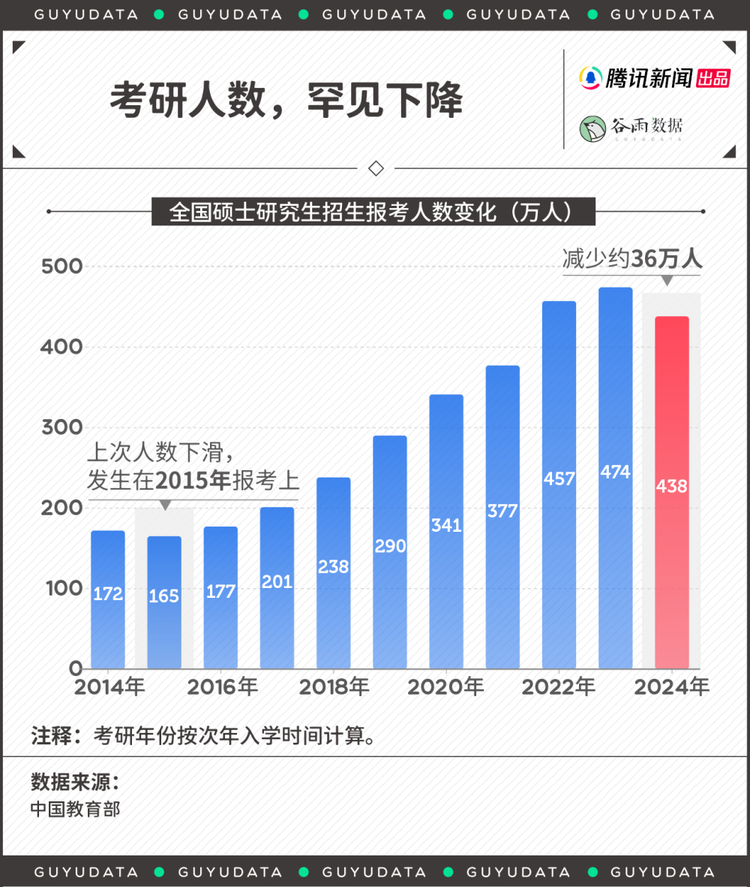
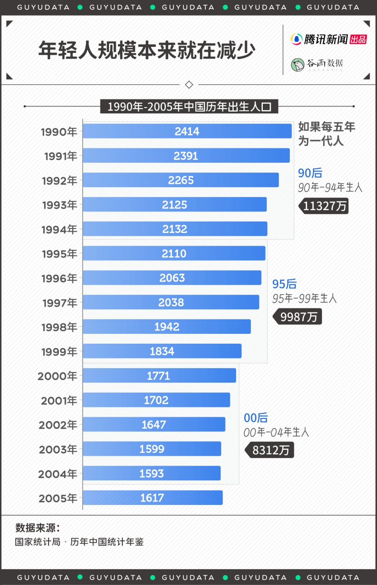
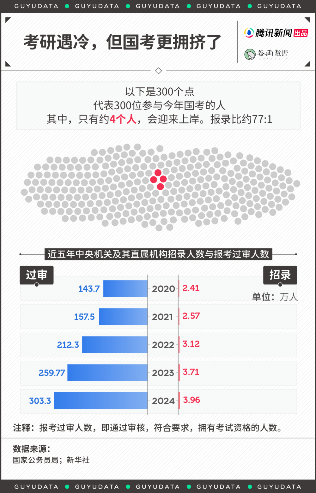
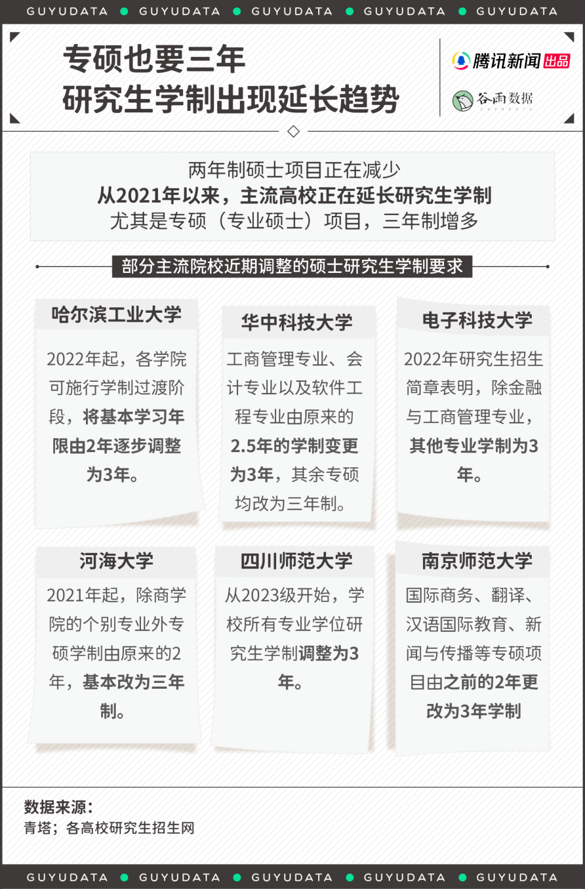
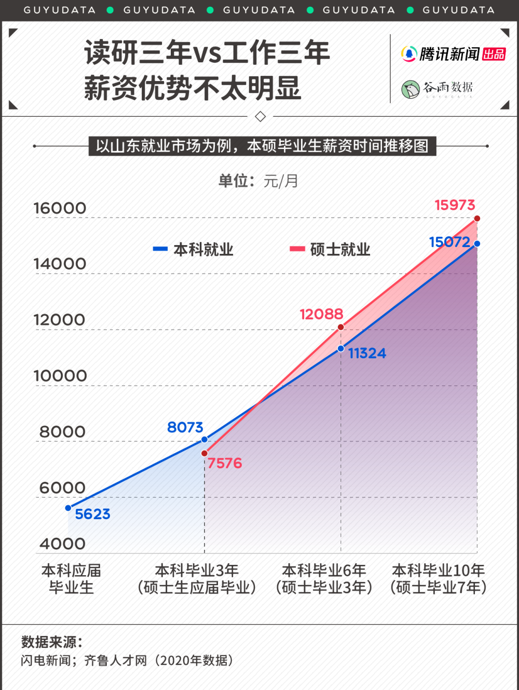
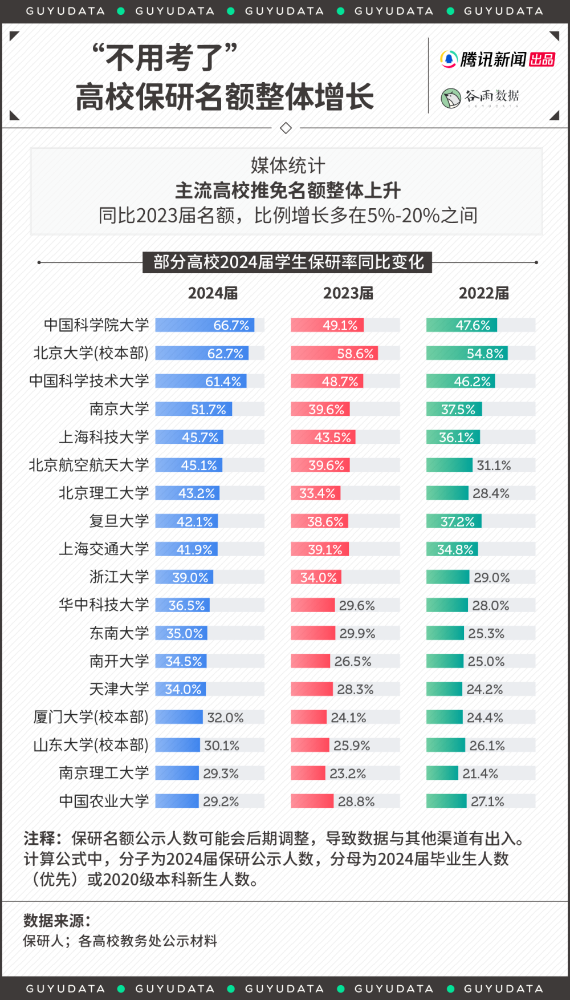
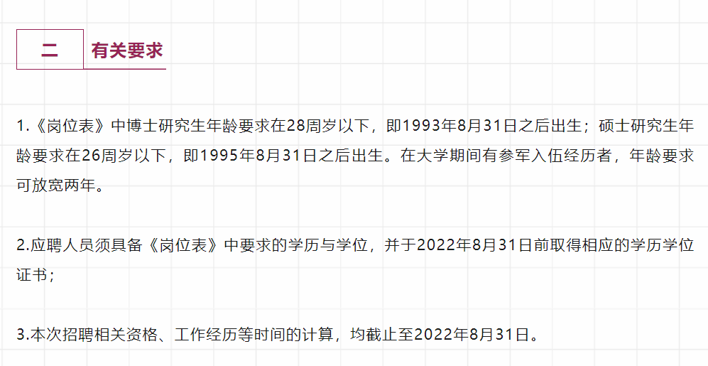
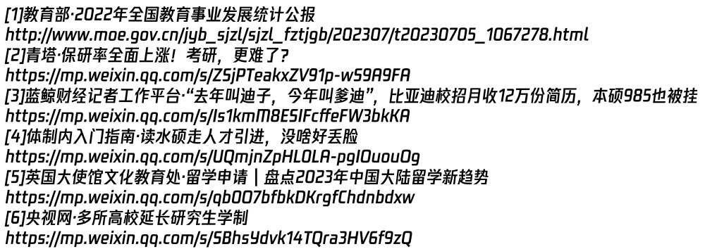

# 近10年首次！今年考研人数暴跌36万，考研考公的苦吃一个就够了？

硕士研究生招生考试明日开考。400余万人将赴考场。

这并不是人数最多的一年。今年考研降温，好多人始料未及。

11月22日，教育部官网发布信息，2024年全国硕士研究生考试报名人数为438万人，是近十年来，最低的考研报名人数。相比2023年考研报名人数474万，减少36万人。

对于考生而言，忐忑。竞争者少了，如果招录名额差不多，当然不是坏消息。但如果人们的报考热情降低，读研本身的价值，自然要打一个问号。

不考研的年轻人，他们去了哪儿？

考研热潮，迟早降温

要知道，这是考研人数近十年来的罕见下降，且降幅不小。

回顾十年前，2014年（即2013年底报考，2014年入学）的考研报名人数不过为172万人，不足今天的一半。2015年，甚至出现了小幅度的下滑。往后，考研人数一路狂飙，成为社会热潮。

曾几何时，在缺乏“985”“211”“双一流”身份加持的“双非”院校，学子们关心的，并不是考研与否的问题，而是如何备考、冲刺哪所学校的问题。这也催生了山东、河南等“考研大省”，曲阜师范大学等“考研神校”的称号也在江湖流传。

然而，人数骤减，总有原因。 **首先，一个可能被忽视的缘由是，年轻人群体的规模本就在缩减。**

硕士研究生招考是个自由的社会化考试，并不限制应届生身份。在校大学生，或是工作多年的中青年，本科毕业或是持有同等学力，皆有资格。

根据教育部每年发布的教育统计公报，近五年我国的本科招生人数稳定在四百余万人，与每年的考研报考人数相差不大。但是去除保研、工作、出国、不就业的学生，考研的应届毕业生比例没那么高。

因此，一直以来，考研主力之一其实是毕业后的社会人士，其中也包括了“二战”“三战”甚至“四战”的考生。

假设21-25岁为考研者年龄的主要区间。随着世代更替，这一区间的人口规模下降不少。

1996年，出生人口2067万人，到了2002年，只有1647万人，六年间，减少人数约20%。往后十年，每年出生人数暂时稳定在1500万左右。

这意味着，以五年为划分， **00后（00年-04年出生）人数规模为8312万，相比95后（95-99年出生）的9987万，本就少了1675万人。**

在这期间，尽管高等教育招生规模在扩大，让更多00后有机会进入大学，但无论求学热情多高，考研人数减少是迟早的事——基数不够多了。而今年，或许是基数减少带来的转折点。

2022年，我国出生人口956万人。20年后的他们，只会有不到今天一半的年轻人，在竞争的池子里。

考研、考公的苦，吃一个就够了

考研虽然降温，但隔壁国考火热依然。

2024年中央机关及其直属机构录用公务员考试（国考）公布数据，共有303.3万人通过了用人单位的资格审查，具有考试资格。

而今年投放的招录岗位数量为3.96万。过审人数与招录计划数之比约为77:1。即每300个人中，约4个人可最终“上岸”。

尽管招录岗位数量明显提升，但仍追不上人们的热情。同比去年，国考报名人数激增了近五十万人，2021到2024年，三年间翻倍。

**这几年，年轻人格外想去体制内就业。**

通过梳理智联招聘历年完成的“应届毕业生就业力调研报告”，我们发现，以民营、三资与外资企业为代表的体制外就业方向正迅速失去热度，毕业生的青睐比例从2019届的48.9%，滑落至2023届的28.5%。

相对应的，人们对国企、党政机关与事业单位的青睐比例来到了今年的71.5%。

考研、考公，能不能两个都考呢？有人这么打算，但成功者极少。

由于国考笔试时间（通常为11月底）与考研时间（通常为12月底）为前后脚关系，且两个考试的知识体系悬殊，备考工作量又都很大。想要两个都考，极有可能导致两场皆输。

面对最好二选一的考试， **年轻人开始盘算：考公和考研的苦，吃一个就够了。**

如果读研也是为了步入体制内，那么与其在硕士阶段折腾考公“上岸”，不如本科一步到位，早早做到这一点。为此，考公成为优先项，在应届生中广受欢迎。

考研这场投资，性价比变低了

这两年，一些学子也在抱怨，读研的性价比似乎没那么高。

首先体现在学制的延长上。

长期以来，学硕（学术硕士，学术导向）三年，专硕（专业硕士，就业导向）两年是诸多高校的普遍设置。但两年制硕士项目延长至三年的现象，如今颇为普遍。

为此，院校通常给出的解释是：两年毕业过于紧促。算上上课、实习、写毕业论文，三年毕业更为宽裕。

也有道理。象牙塔里多待一年，一些学子心甘情愿。 **但很多人顾虑于成本问题。**

首先，大学扩招研究生的趋势，在于增加专硕名额、减少学硕名额、增加直博名额（直接攻读博士），即让学生要么专攻就业，要么专攻学术。但问题是，作为院校创收手段，
**专硕学费并不便宜。**

根据各高校公布的2024年研究生收费标准，电子信息、翻译、新闻与传播、应用统计等热门专硕的学费普遍在3-5万元/年，经管类专业的报价可能在10万元/年，已不同于本科时普遍低廉的价格。

学费之外，北京大学、北京师范大学、复旦大学、南京大学等院校已经表明，原则上不再为专硕学生提供宿舍。一线城市的房租昂贵，采取这一政策的院校却在逐年增加。

以北京大学的国际中文教育硕士为例。学费为6.6万元，分三年缴清。算上在北京住宿与生活的费用，全部成本在15万-20万元左右。

如果毕业后，可以快速“回本”也罢。但问题就在于，无论名校与否，除了信息类与金融类等少数硕士项目，大部分硕士项目的“回本”能力现在都不太好。

事实上，算一下读书三年和直接就业的薪资对比，会发现硕士起薪不一定超过毕业就工作三年的人们。

以“考研大省”山东的数据为例。根据齐鲁人才网2020年统计，山东省应届研究生薪酬为7576元，未赶上毕业3年的本科生薪酬8073元。研究生毕业3年后（即本科毕业6年后），薪酬才会超过同龄本科生，但差距不大。

深造三年美美入职，才发现本科同学职级更高，当上了你的Team Leader。

薪资都是其次。关键的问题是，外部就业环境的突变，让每年的形势都不一样。例如，年轻人爱去的互联网企业，在2021年前的招录情况良好，岗位丰富，井然有序。但情况在2022年前后直转急下，竞争难度陡增。

市场化机构，愈发强调第一学历。学子以为自己“逆天改命”，却发现雇主对本科背景更为挑剔—— **既然本科无力改变，那还读研干什么？**

换句话讲，人们在读研中面临的风险是，由于求职市场的不确定性， **本科毕业时能去的公司，读完研后反倒可能去不了了。**

王沛非常庆幸他的选择。

2019年，他从重庆某邮电院校本科毕业，曾在大四辗转实习一年，如愿拿到了某头部互联网“大厂”的offer。四年间，他跳槽两次，摇身一变，成为行业资深。

但如果选择读研，2022年再毕业，情况很难这么好。他打听到，母校的学弟学妹们，如今本科能去往“大厂”的人数，已经屈指可数。

情况总是瞬息万变。一些车企在今年名校秋招季广受热捧，与去年沦为学子们的保底offer，也形成了鲜明对比。

**这都成为部分年轻人对考研犹豫，转寻他路的缘由——抢占坑位，比什么都重要。**

换个方式深造

当然，随着一些岗位竞争门槛水涨船高，本科学历“不太够”已成事实。除非直接“上岸”就业。年轻人的深造选择难免，只不过换了考研外的方式。

推免制度分流了部分压力。俗称“保研”，全称是“推荐优秀应届本科毕业生免试攻读研究生”，是与考研制度平行的国内读研途径。

截至今年，全国共有366所推免资格高校。当获得保研资格，学生只需要在推免系统中获得院校接收，即可免试进入后者攻读硕博学位。

而今年的趋势是，保研名额普遍上涨5%-20%。本来要考研的“保研边缘人”突然拿到了资格，自然就放弃了报名。

以及，出国留学陆续恢复。今年以来，“留学”相关关键词在微信、百度、抖音上的搜索热度持续上扬。港澳院校，以及英国、新加坡等海外院校，凭借通常仅一年的硕士短学制，成为人们出国留学的重要理由。

“水”不“水”先不管了，企业管培、政府选调……只要依然有市场认可就好。 **时间似乎比什么都重要。**

近两年，全国多地的事业单位招录中，陆续出现了25岁/26岁的应届硕士生要求，30岁的应届博士要求，甚至有高校在招聘辅导员时，提出了28岁的博士应届毕业生要求。

考研人数少了，但年轻人没在闲着。 **无论下一步去哪，东亚学子总是不能停歇的。因为容错率在下降。**

一路顺利，恰好满足年龄与学历要求、抢占坑位的人，志得意满，这是分享在社交媒体点赞数百的小确幸。可遗憾的是，对一个群体而言，这样的小确幸，不过是幸运故事里的切片，是眼泪与焦虑的间歇，而不是一代人可持续的福祉。

归根结底，是时代的红利少了。辛苦读书，以为自己突破了父母辈的阶层瓶颈，却发现研究生也只是中转站，是上岸前的临时岛屿。

那何处是岸？年轻人抓紧了第一株橄榄枝，不敢等待更好的机会，也没有做足万全选择的勇气和底气。

巨大的考场内外，都是一个容器，里面装满了年轻人的压力与困惑。潮水流向在变，有人紧跟大潮，他们并不知道潮水的变动何时停止。

**他们只知道，需要立即出发。休息会迎来惩罚，思考也是奢侈。**

而在这样的奔波与思忖里，青春注定是在时代的音节转向里，不复来了。

作者丨鹿鸣 设计丨鹿鸣 编辑丨赤耳 出品丨腾讯新闻 谷雨工作室

腾讯新闻出品内容，未经授权，不得复制和转载，否则将追究法律责任。

