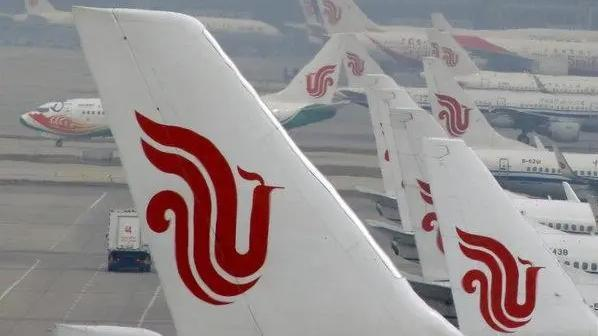
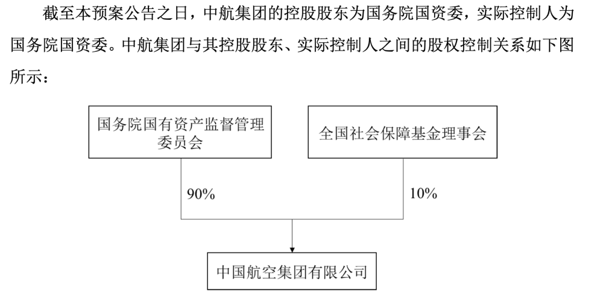

# 中国国航拟A股定增募资60亿元：用于6架C919及11架ARJ21等

12月22日晚间，中国国际航空股份有限公司（中国国航，601111.SH、0753.HK）发布2023年度向特定对象发行A股股票预案。公司拟向特定对象中航集团发行A股股票募集资金总额不超过60亿元，用于引进17架飞机项目及补充流动资金，控股股东中航集团拟以现金方式认购公司本次发行的全部A股股票。

本次向特定对象发行A股股票的募集资金总额用途

发行价格和数量方面，本次向特定对象发行A股股票的价格为7.02元/股，数量不超过8.55亿股，不超过发行前公司总股本的30%。

资金来源方面，本次向特定对象发行A股股票认购资金为发行对象自有或自筹资金，不会直接或间接以任何形式来源于上市公司及其董事、监事、高级管理人员提供的财务资助或者补偿，不存在代持、对外募集资金等情形，不存在分级收益等结构化安排，不存在杠杆结构化融资的情形。

根据公告， **17架飞机机型包括6架C919及11架ARJ21**
，按照生产商中国商飞提供的目录单价计算，上述17架飞机的投资总额共计10.66亿美元，约折合人民币75.71亿元，公司拟以本次向特定对象发行A股股票募集资金支付人民币42亿元。本次引进的17架飞机预计于2024-2025年交付。

此外，
**本次中国国航还向特定对象发行H股股票，发行对象为中航集团全资子公司中国航空（集团）有限公司（以下简称“中航有限”），募集资金总额不超过20亿港元（含本数）**
，扣除发行费用后将全部用于补充公司一般运营资金。中航有限拟以现金方式认购本次发行的全部H股股票。发行价格为5.09港元/股，股票的数量不超过3.93亿股。

根据发行方案计算，本次向特定对象发行A股和H股的数量共计不超过12.48亿股（含本数）。本次向特定对象发行A股及H股不互为条件，如任何一项未能获得其应适用法律法规所要求的全部审批，或因其他原因而未能成功发行，均不影响另一项实施。

截至本预案出具日，中航集团直接持有公司40.53%的股份，通过其全资子公司中航有限间接持有公司9.61%的股份，合计持有公司共计50.14%的股份，为公司的控股股东；国务院国资委为公司的实际控制人。本次向特定对象发行A股股票及H股股票完成后，中航集团及其下属全资子公司最终持有公司的股份比例将由约50.14%提升至约53.71%，公司的控股股东与实际控制人不变，不会导致公司的控制权发生变化。

股权关系及控制关系

中航集团以航空客运、航空货运和物流两大核心产业为主，涉及飞机维修、航空配餐、航空传媒、航空投资、工程建设等航空相关业务的航空运输产业集团。据公告介绍，今年上半年中航集团实现营收644.61亿元，去年全年为652.22亿元。今年上半年归母净利润为-14.33亿元，去年全年为-194.18亿元。

受今年客座率和价格水平双升的带动，中国国航今年第三季度营收创历史新高。据第三季度报告显示，今年第三季度实现营收458.64亿元，同比增长152.89%；归母净利润为42.42亿元，去年同期为-86.68亿元，实现同比扭亏。今年前三季度实现营收1054.77亿元，同比增长150.61%，归母净利润为7.91亿元，去年同期为-281.03亿元，实现同比扭亏。

据大智慧VIP，中国国航今年第三季度和前三季度整体营收均创历史新高，其中第三季度营收和疫情前相比高出约80亿元，前三季度的营收继2018、2019年后再破千亿元。

对于本次向特定对象发行A股股票的目的，中国国航在公告中指出，首先为了强化机队实力，巩固竞争优势，加速实现公司战略规划；其次，为了补充营运资金，落实安全生产责任，满足公司业务发展的资金需求；此外，还为了改善资本结构，增强财务稳健性，提升公司综合抗风险能力；最后一方面，
**控股股东全额认购，将提振市场信心，助力公司高质量发展** 。

具体对公司盈利能力的影响方面，中国国航称，本次向特定对象发行A股股票发行募集资金将用于引进17架飞机项目及补充流动资金，将有效扩大公司业务规模、提升市场竞争力，为公司的业务持续增长提供坚实保障；由于募集资金投资项目短期内不会产生效益，短期内公司的每股收益可能会被摊薄，净资产收益率可能会有所下降。但从长远来看，本次募集资金投资项目的实施将有效扩大公司业务规模、提升市场竞争力，为公司未来业务的持续增长提供坚实保障。

截至12月22日收盘，中国国航报7.17元/股，跌0.69%，年初至今跌32.37%。

