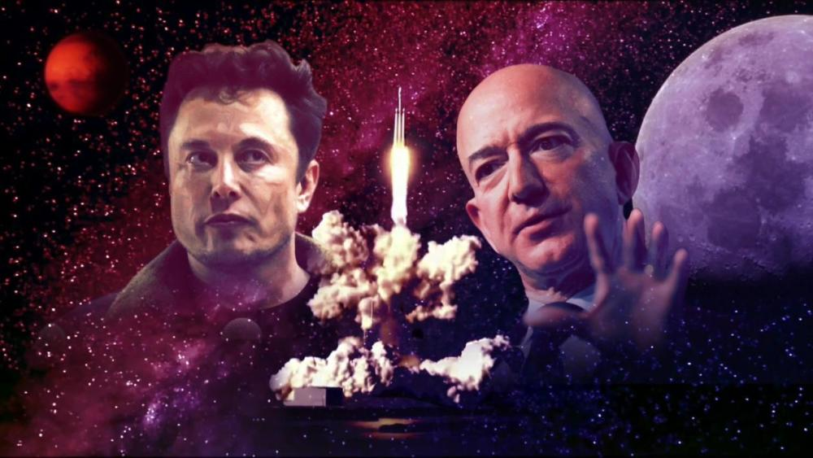
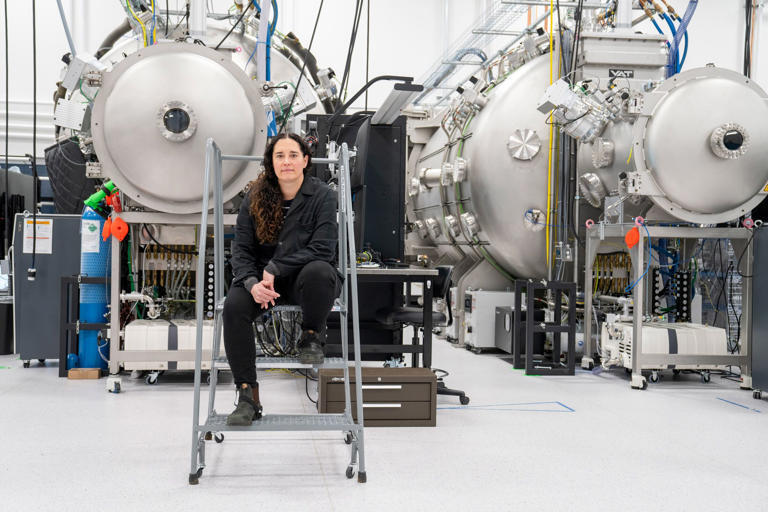
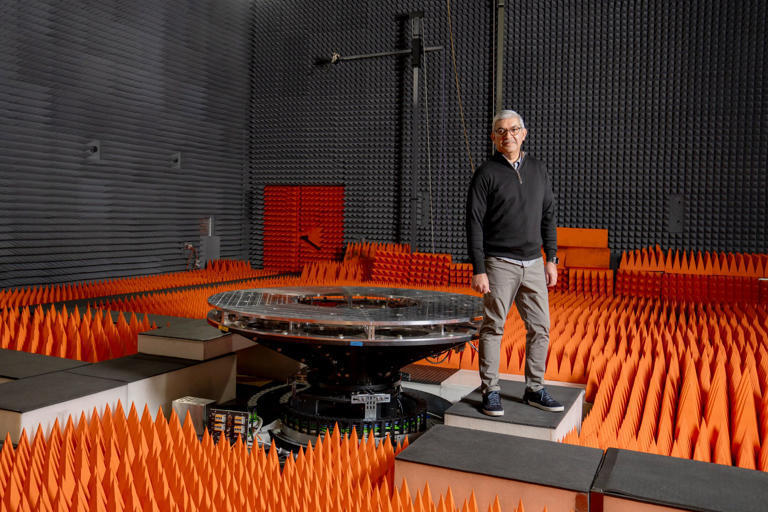
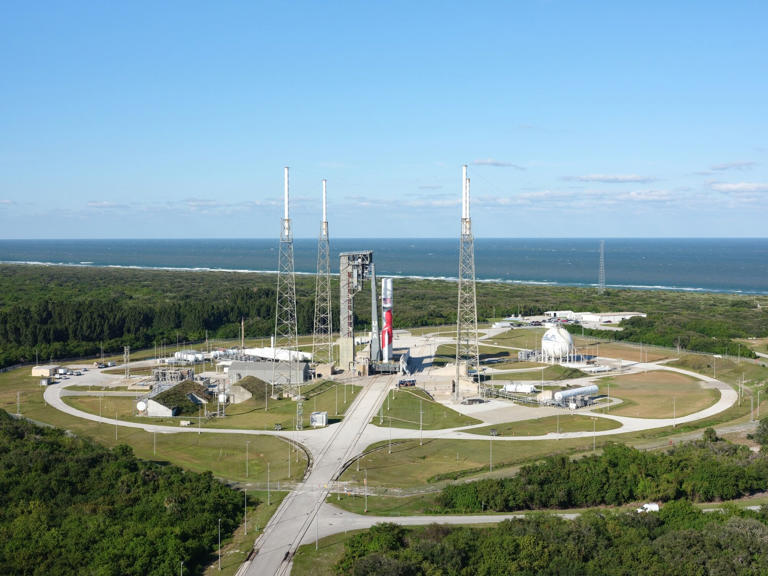

# 贝索斯要单挑马斯克星链？先花100亿美元将3000多颗卫星送上天再说

**划重点**

  * _1_ 柯伊伯计划最初源自亚马逊高管的思维实验，希望通过卫星网络打破可能制约公司发展的瓶颈。
  * _2_ 亚马逊需要在2026年7月之前发射1600多颗柯伊伯卫星，并在之后三年内将剩余卫星部署完毕。
  * _3_ 为了满足监管机构要求，亚马逊需要在卫星量产后，确保每天至少生产两颗卫星。
  * _4_ 柯伊伯计划拥有1600多名员工，他们正设计尺寸更大、功率更高、有别于星链的卫星网络。

腾讯科技讯 据外媒报道，“柯伊伯计划”（Project Kuiper）是亚马逊最大的赌注之一，也是亚马逊创始人杰夫·贝索斯（Jeff
Bezos）与埃隆·马斯克（Elon
Musk）之间竞争的另一条战线。然而，马斯克旗下SpaceX运营的星链卫星网络已经拥有5000多颗在轨卫星，并开始向越来越多用户提供接入服务。而柯伊伯计划却刚刚发射了两颗原型卫星（Prototype
satellite，也称试验卫星），完全部署完毕可能还要五六年。差距如此明显，贝索斯凭什么挑战马斯克？

亚马逊高管倾向于用慈善性质的语言来描述柯伊伯计划，强调其将为偏远或贫困地区的人们提供教育等资源。此外，亚马逊希望这个投资100多亿美元打造的项目能让它成为全球电信巨头。该公司计划从2025年开始，向个人互联网用户销售天线，向企业销售云计算和数据恢复服务，并向无线公司提供连接，将远程手机信号塔与它们的卫星网络连接起来。

亚马逊押注自己的卫星网络系统能推动最先进的技术发展，其容量和网速不仅能与星链相媲美，还能与地面电信公司竞争。至少，在政府和企业都在寻找方法减少对反复无常、充满争议的马斯克星链服务的依赖之际，亚马逊正在打造可靠的替代品。

在过去的两个月里，亚马逊的工程师们对他们的原型卫星进行了一系列测试。他们进行了视频通话，从亚马逊网站购买玩具火箭，并测试了旨在扩大每颗卫星覆盖范围的激光系统。现在，真正的困难来了。为了满足监管机构的许可，亚马逊必须在2026年7月之前每天生产两颗卫星，并找到太空便车将它们发射出去。项目负责人拉吉夫·巴迪亚尔（Rajeev
Badyal）：“生产两颗卫星已经非常困难，生产3000多颗的难度要大得多。”

长期担任亚马逊消费电子产品主管的戴夫·林普（Dave
Limp）表示，柯伊伯计划以海王星轨道外侧的小行星带命名，它诞生于一个思维实验。贝索斯曾定期要求高管们考虑可能会拖累公司发展的制约因素，很多人开始关注宽带互联网。亚马的零售网站、电影工作室和商业软件等业务，都依赖于网络接入。林普表示：“如果你想发展，就必须找到数亿目前还不是亚马逊客户的人。”

消费类电子产品的快速技术进步使得航空航天工业以外的公司也能制造卫星。马斯克于2002年创立了SpaceX，并找到合适的方式快速而廉价地生产新一代卫星，每天可以生产六颗。2018年，SpaceX利用自家火箭发射了两颗原型卫星。2019年5月23日，SpaceX成功将首批60颗星链卫星送入轨道。截至2023年10月1日，SpaceX累计发射了5200颗卫星，在轨4849颗，正式运营4199颗。

相对而言，柯伊伯计划进展的较慢。但贝索斯信奉的是，亚马逊只有在拥有专业知识或能够迅速获得专业知识的情况下才会进入新领域。当林普听说星链的创始团队正在寻找工作时，亚马逊的卫星计划只有两页的大纲。他在2018年8月给巴迪亚尔打了电话，邀请后者和其他五名星链员工加盟亚马逊。

按照设计，亚马逊计划将3236颗卫星发射到590至630公里的地球上空。亚马逊的工程师们设计了一种终端设备，客户可以用它来接收来自卫星的数据。在贝索斯要求尽可能便宜的情况下，这种设备如今的制造成本已降至400美元以下。但其提供的互联网速度高达每秒400Mbps，大约是美国家庭宽带平均速度的两倍。

柯伊伯计划雇佣了1600多名员工，其中既有消费电子领域的资深人士，也有职业航空航天专家。巴迪亚尔说，与传统的太空制造相比，“你必须以快得多的速度进行创新”。

亚马逊的卫星匹配技术推动了尖端技术的发展，包括光学卫星连接，也被称为太空激光。与SpaceX的第一代卫星相比，柯伊伯的工程师正在设计卫星数量更少、尺寸更大、功率更高的卫星网络，两者在设计理念上存在很大差异。

据两位知情人士透露，亚马逊曾计划以每颗50万美元的价格生产这些卫星，并将它们的重量控制在500公斤以下。亚马逊即将推出的量产型卫星尺寸和重量尚不清楚。但根据亚马逊使用的运载火箭计算，估计这些卫星的重量应该在600到800公斤之间。

亚马逊高管表示，该公司将直接向个人互联网用户销售终端，也将通过无线和宽带服务提供商，具体视国家而定。亚马逊宣布与美国电信公司Verizon、欧洲和非洲的沃达丰集团以及日本的NTT建立合作关系。服务测试将于明年下半年开始，亚马逊最终预计将有数千万客户。亚马逊尚未披露其卫星网络服务的定价。

亚马逊将通过其AWS部门为企业和政府提供网络接入，并提供SpaceX尚未提供的服务质量保证。未来几年，作为最大的租用计算能力和数据存储销售商，AWS将能够提供包括互联网接入在内的一揽子产品和服务，这是亚马逊的云计算竞争对手无法比拟的优势。

柯伊伯计划的员工往往不会提起星链，但分析人士表示，亚马逊有机会通过运营卫星业务，摆脱马斯克引发的个人和商业纠葛，使自己脱颖而出。其他公司也在建造大型卫星互联网，但星链的确是迄今为止规模最大、能力最强的。不过，SpaceX避免与企业客户签署长期合同和排他性协议，“他们并不被视为业内最好的合作伙伴”。

亚马逊高管们坚称柯伊伯计划正在按计划推进，但卫星量产和发射似乎带来了新的挑战。亚马逊已经向联合发射联盟公司（ULA）、蓝色起源以及阿丽亚娜集团预定发射卫星服务，但这些公司的运载火箭开发计划都已经延迟。本月早些时候，亚马逊与SpaceX预订了三次发射服务，这是一项尴尬的交易，因为柯伊伯卫星的发射时间表很紧，而且缺乏替代方案。

无论亚马逊的卫星如何进入太空，监管机构都要求其1618颗卫星在2026年7月之前发射到太空，另一半卫星也要在之后的三年内部署完成。亚马逊计划在华盛顿州柯克兰专门的制造基地生产它们，那里的工作人员仍在安装机器。因此，亚马逊的首批卫星将在柯伊伯总部组装。（编译/金鹿）

