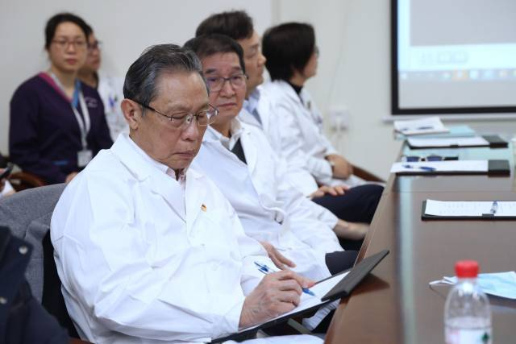

# 钟南山深圳查房：除非出现病毒大流行，否则不是特别主张长期佩戴口罩

12月22日下午，共和国勋章获得者、中国工程院院士钟南山到深圳市人民医院进行院士查房活动，并与该医院联合开展呼吸与危重症医学科疑难病例讨论。

据悉，早在2015年，深圳市呼吸疾病研究所通过深圳市医疗卫生“三名工程”项目，引入了广州呼吸健康研究院钟南山院士团队。每年，钟南山都数次来深圳指导工作，“院士查房”成为深圳市人民医院的一个品牌项目。2021年7月，钟南山受聘为深圳呼吸疾病研究所的荣誉所长。

在此次院士查房活动中，钟南山对患者黄女士进行了问诊和检查，并就疑难病例与深圳医生团队进行讨论和交流，提高深圳呼吸疾病研究所疑难病例诊断和治疗水平。

会后，钟南山还就市民关心的问题接受了南方日报、南方+记者采访。针对检查出肺结节要如何分情况处理的问题，钟南山分享了自己最新的一项研究——肺结节人工智能诊断系统。“在检查人群中，约有30%的人CT显示有结节。然而，并非所有肺结节都具有典型的影像学表现，所以存在被误诊的风险。我们通过调查发现，普通医院的肺结节误切率接近20%。如今，我们通过肺结节人工智能诊断系统，能将误切率降到8%。”钟南山说。

据悉，肺结节人工智能诊断系统具有病灶智能识别、病灶良恶性判断、基因突变预测、自动报告等功能，助力肺结节和肺部肿瘤的精准诊疗，降低误诊、漏诊的概率。

“此外，我们还有血液DNA检测技术，通过提取血液的肿瘤DNA，进行甲基化检测。目前这项技术还在反复验证，预计明年会有最新的结果出来。”钟南山介绍，通过肺结节人工智能诊断系统和血液DNA检测技术，可以进一步提高判断的准确性，其特异性和灵敏性可达到93%以上。

对于近期呼吸道疾病患者明显增多的情况，钟南山认为，呼吸道疾病进入高发期的原因主要有两方面，一是常规原因，即天气燥骤冷后，鼻黏膜的免疫功能降低，所以病毒容易进入呼吸道。二是因为长期戴口罩也会使得自身免疫系统无法正常发挥作用，削弱了抵御疾病的能力。

“除非出现病毒大流行的时期，或者前往人群聚集的地方，否则不是特别主张长期佩戴口罩。”钟南山说。

（来源：南方+）

