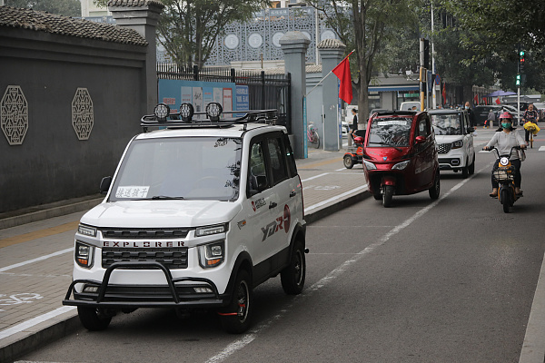

# 锐评|又酿死亡悲剧！让“老头乐”在今年顺利退场

“70多岁了，晚上开车也不开大灯，撞到人之后也没停车。”近日，河南一年轻女性被一辆“老头乐”撞倒并拖行，最终身亡的事故，再度引发了舆论对于“老头乐”的讨论。

透过这一案例，我们看到了“马路杀手”对公共安全的威胁，也呼吁相关部门依法依规继续推进清退行动。毋庸讳言，一提及“老头乐”，舆论场中总有两种声音。在使用者看来，自己不过是利用这一代步工具买菜接娃；但在机动车驾驶员和行人来看，这些“四不像”质量堪忧、谁都能开，有空就钻、随意变道，着实是个移动的风险源。使用需求与安全诉求都需要正视，但二者相权，我们必须将公共安全置于首位。

上述案例绝非个案。2017年工信部公布的一项统计数据显示，当时全国五年内发生低速电动车交通事故83万起，造成1.8万人死亡，18.6万人受伤。具体到北京，2022年共发生违规电动三、四轮车交通事故131起，死亡逾百人；今年电动三四轮车引起的亡人交通事故中，驾驶人自身死亡率为71%，70%的驾驶人年龄在60岁以上。在血淋淋的事实面前，“老头乐”让人乐不起来。也正是着眼于此，包括北京在内的多地开始对“老头乐”严加管控。按照计划，自2024年1月1日起，违规电动三轮、四轮车将被全面禁止。

一段时日以来，为推动“老头乐”退场，相关部门没少想辙。从张贴宣传海报到组织现场宣讲，从协调企业参与到开发治理小程序，从增设线下回收点到推出预约上门收，尽可能地给大家提供方便。可以说，相关举措兼顾了政策的力度与温度。既然要参与公共生活，每个人都不可能随心所欲。很多时候，小道理服从大道理，我们才能实现利益的最大化，整座城市的运转才能平稳有序。

对“老头乐”退场，大多数市民都表示理解并积极配合，但可以想见，在清退收尾阶段和新政落地初期，总会有这样那样的矛盾。我们呼吁还在观望的市民尽快行动，也希望相关部门保持力度，以动真碰硬的姿态维护新规的严肃性、夯实城市的安全感。

当然，车主们的出行刚需也不能忽视。根据规划，通学车2024年春季覆盖8个区，将在一定程度上缓解家长们的接送压力。继续做好新的“加法”，回应市民的出行所需，治理行动一定会收获更多支持，城市的治理能力也会再上新台阶。

来源 北京日报客户端 | 评论员 夏天

编辑 崔文佳

流程编辑 马晓双

