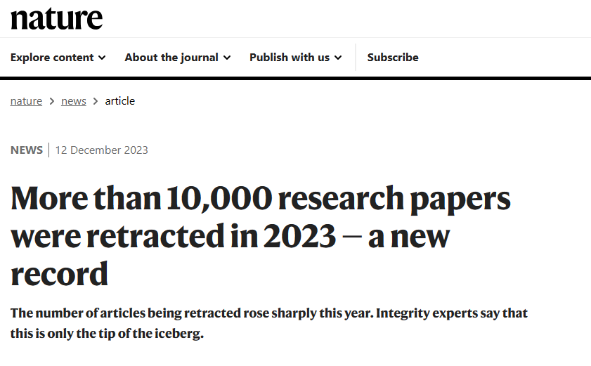
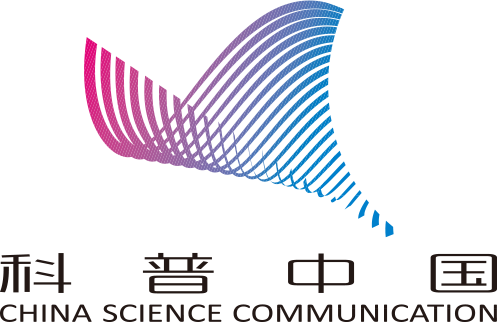

# 2023年论文撤稿超1万篇背后发生了什么？“至少一半由学术侦探推动”

**导读**

伴随着2023年的终结，一场撤稿风暴悄然降临。在过去一年里，国际期刊有超过10000篇论文被撤稿，规模是去年的两倍。其中有8000多篇撤稿来自Hindawi旗下期刊——这家本已声名不佳的OA出版机构，再度被推上舆论的风口浪尖。

破纪录的撤稿背后究竟发生了什么？这么多的撤稿论文都出自哪里、又是怎样被撤回的？学术期刊的出版流程，以及各国的科研生态，到底出了什么问题？

一群活跃在幕后的无名英雄或许知道这些问题的答案
。平日里，他们是各个领域的科学家和工程师，来自全球的高校、医院和研究所；而在网络上，他们有另外一重身份——从图像、表格、论文的边边角角追查蛛丝马迹，揪出学术不端的劣行。他们是学术侦探，是论文造假的吹哨人，科学共同体的捍卫者。

就这次撤稿话题相关的系列问题，两位在美国从事医学相关研究的学术侦探接受了《返朴》专访，为读者厘清此次撤稿风暴的来龙去脉。

**Huanzi Zhang、罗敏奕 | 嘉宾**

**问：据Nature报道，2023年全球学术期刊撤稿数量超过了1万篇，该如何评价这一数字？其中大约有多少与你们团队的工作有直接或间接的关系？**

**Huanzi Zhang：** 2023年撤稿数量超过1万篇，直接来看，应该是表明期刊和出版商比过去更在意有问题的论文对他们声誉的影响。

然而，考虑到近年来各期刊发表的论文数量十分庞大，仅SCI数据库2022年就收录了九千多种期刊出版的研究和综述论文212万篇，今年撤稿数量即使剧增也只占极少数。打个比方，今年某地的卫生行政部门比前些年吊销了更多游泳馆的《公共场所卫生许可证》，这仅仅显示卫生行政部门在加强执法，而他们加强执法很可能与当地发生多起水质不合格引发的负面事件引起了媒体和公众关注有关。被吊销许可证的只占当地游泳馆的一小部分，无法反映当地游泳馆的卫生状况是否整体在改善。所以我们并不认为今年论文撤稿量剧增能反映科学出版界尤其是期刊论文整体质量在改进。

**Huanzi Zhang和罗敏奕：**
在此需要解释一下我们的所谓“团队”，其实我们不很认同这个说法，因为不仅我们几个来自中国的同学从来没有加入什么团队，而且这一帮来自全球各地的学术侦探也就是很松散地在几个聊天群里交流而已。现今和曾经非常活跃的一些学术侦探比如Elisabeth
Bik、Smut Clyde、Cheshire、Alexander Magazinov、Parashorea tomentella、Clare
Francis、Aneurus、Huanzi Zhang、TigerBB8、Leonid Schneider等都在群里。

有一些人在公开场合并不是很活跃，但是在群里积极参与交流看法；也有在公开场合很活跃，私下交流中却比较闷的侦探们。这些学术侦探绝大部分是各个领域的科学家和工程师，来自全球很多高校、医院和研究所，生物学背景的居多，但是也有物理学、数学、医学、心理学、行为科学等方面的专家，所以群里的讨论经常是非常有营养的。

大家兴趣广泛各有专注的领域，有时会因为某个关注的方向和兴趣对象而组建临时的“项目组”，比如甲在检视A国植物学某实验室的文章时发现大量的衍生论文（由毕业生另外做独立PI的多个实验室发表的相关论文），就在群里邀请有兴趣有时间的侦探们组队共同完成这个工作量很大的项目。再比如，TigerBB8发现多篇中国数学论文似乎是论文工厂的产品，而且有幽灵般的外国共同作者，就在群里邀请数学水平更高的Smut
Clyde加入，一举揭开一个数学论文工厂[1]，并向有关方面举报，多名作者已经受到应有的处置。

**Huanzi Zhang：**
我们相信在2023年的1万篇撤稿中，至少一半曾经由学术侦探们参与推动。但与此同时，还有大量被学术侦探们发现有问题并举报给期刊的论文尚未被撤稿，有的甚至历经多年仍然未撤稿，或者以发布更正来搪塞。我个人参与的、在PubPeer“挂出”的Hindawi（欣达维）期刊的论文超过80%已经被撤回，但我在其它期刊发现的问题论文大多数没有被撤回。罗敏奕亲自挂PubPeer的论文也是多年来绝大部分仍然没有撤稿。

除了学术侦探们，另外还有两种人物可以推动论文撤稿，一是出版系统内的学术诚信专家，他们除了发现和验证论文的问题，还需要评估这些问题对期刊与出版商声誉的影响；另外还有一些关注学术诚信的学者，他们不一定会去检查特定的论文，而是对学术不端的现象和学术侦探、学术诚信专家的工作进行分析。一些学术侦探与学术诚信专家可以身兼两种角色。在大多数情况下，要推动一篇论文被撤回，出版系统内学术诚信专家的作用至关重要。

**问：2023年撤稿量激增，最主要的因素都有哪些？近年来论文撤稿篇数快速攀升，如何评价这一趋势？有哪些新变化？**

**Huanzi Zhang：** 与以往撤稿不同，大多数在2023年被撤回的论文，撤稿的主要原因是出版流程被操纵，也即“论文工厂”。

**罗敏奕：**
我个人之前一直管papermill叫做“论文作坊”，就是突出一个“攒”的性质。而2023年撤稿论文的生产厂家已经突破了“攒”的层次，除了在做代写代投代修论文之外，还操纵出版流程，可以说是作坊的进阶版，成为了真正的工厂了。

**Huanzi Zhang：**
COPE（出版伦理委员会）对论文工厂的定义是操纵出版流程的人和组织，论文工厂不一定做代写，但一定需要勾结期刊编辑，或者利用期刊编辑的严重失职。Wiley（威立）旗下的Hindawi期刊撤回八千多篇论文的原因都是出版流程被操纵，Springer
Nature（施普林格-自然）、Elsevier（爱思唯尔）、Sage（世哲，旗下期刊例如International Journal of
Electrical Engineering Education）
等出版商2023年也因同样的原因撤回了不少论文。通过被操纵的流程出版的论文，可能存在剽窃、伪造、篡改、不当署名等问题，也可能不存在任何其它问题，而仅仅是出版流程被操纵就可以构成撤稿的理由。一般认为，存在严重而明显问题的论文只能通过被操纵的流程在SCI期刊出版；论文工厂不会无偿操纵出版流程帮助作者出版论文。

我认为撤稿数量快速增加的原因，是论文工厂的生意快速扩张，使那些之前没有积极应对、甚至纵容论文工厂的期刊与出版商的声誉严重承压。在学术出版行业，声誉是重要的无形资产，声誉严重受损会使期刊或出版商从学术出版市场出局。出版商为了维持他们的生意，不得不相应地撤回更多通过被操纵的流程出版的论文。

**问：大部分撤稿来自Hindawi旗下期刊，据你分析，这家出版商出了什么问题？如此大规模的撤稿，对出版商、论文作者和科研领域有哪些影响？**

**Huanzi Zhang：**
Hindawi出的问题，简而言之就是期刊编辑对由客座编辑主导的特刊疏于监管，导致了“破窗效应”。论文工厂可能在实践中发现，即便一些手稿存在明显的问题，只要客座编辑接收，就可以顺利出版，期刊不会阻拦。这导致论文工厂失去了完善手稿（可能是他们代写的，也可能是真正的作者写的）的动力，使得更多存在更明显、更严重问题的论文被出版。

这些有问题的论文被学术侦探曝光，使得Hindawi的声誉受到质疑。最广为人知的一篇问题论文就是“大写字母T”[2]，这篇论文被发现在一张柱状图中用大写字母T表示error
bar。这个发现在社交媒体Twitter上被曝光后，其夸张而敷衍的伪造/篡改行径非常吸睛。其实一开始我们群里的Parashorea只是发现这篇论文的数据可用性声明有问题，作者称“数据共享不适用于本文，因为在当前研究期间没有生成或分析数据集”，然而事实上论文中包含新的数据。Parashorea把他的评论挂在了PubPeer，群里另一位学术侦探检视之后发现了之前被忽略的那张荒唐图片。之后，群内外的学术侦探们又陆续发现了更多问题，例如Elisabeth
Bik发现表6的内容与正文无关。这篇论文很快被撤稿。

此外还有一些荒唐至极的论文。例如一篇挂羊头卖狗肉号称高校思政方面的论文[3]。可以说这篇论文和高校思政唯一的关系就是论文的买家是一所高校的思政老师，而内容则与思政完全无关。合理的推测是，这家论文工厂图省事，往一篇已经写好的手稿里加了一些与思政有关的内容，就投了出去。然而，更让人咋舌的问题是：这篇主题为高校思政的论文是发表在一本名为《数学生物学中的建模、分析和模拟》的特刊上的，而且这篇发表在SCI期刊上的论文其引言、方法和结果都不对应、不连贯。这就好像你走访一个地区的室内游泳馆，发现好几家取得了《公共场所卫生许可证》，但居然压根没有池水循环净化处理设备。那可以推断，是卫生行政部门，而不仅仅是游泳馆在胡作非为，这样整个地区的游泳馆卫生状况都是可疑的。

**问：在撤稿过程中，出版商和学术期刊应该扮演怎样的角色？他们在把控论文质量方面应该承担哪些责任？在这方面，这些年有进步吗？**

**Huanzi Zhang：**
2022年9月，Wiley宣布要撤回511篇论文。2023年3月，19种Hindawi期刊被SCI数据库剔除，随后Wiley宣布将再撤回1200篇论文，我在一篇客座博客文章中介绍了这个过程[4]。除了被SCI数据库剔除，一些国家，包括挪威和马来西亚，通过调整评级和发布通知来阻止他们国家的作者向Hindawi期刊投稿。相比之下，中国多数相关部门的反应都太慢且不够力度。

我通过私人关系了解到，在SCI数据库剔除19种Hindawi期刊（2023年3月下旬）之后，负责审查和撤回Hindawi期刊论文的主管发生了变化。这导致在撤回了1200篇之后，他们继续撤回了数千篇论文，但是一直没有向公众解释他们为什么撤回了更多的论文，直到Hindawi最近发布了一份白皮书[6]，才披露了一些信息。我和几位学术侦探在白皮书中被致谢，对此我感到欣慰。然而，这份白皮书没有以任何方式承认Wiley雇员的失职（或者与论文工厂勾结），因此我认为Wiley仍然缺乏解决论文工厂问题的诚意。

多年来，一直有一些撤稿的原因是“个案”，例如作者主动提出申请，或者被剽窃的人联系出版商要求撤回剽窃者的论文。在处理这些案子时，出版商需要考虑各种平衡。编辑不是法官，但是必须要决定是否撤稿。与论文工厂相关的撤稿，则是出版商检讨和/或撇清自己的过程。COPE在今年发布了一个大规模撤稿的指南[7]，其实就是在指导出版商如何承认和纠正他们的错误，错误可能包括期刊编辑严重失职、期刊编辑勾结论文工厂、内部监督部门/研究诚信团队失察。在大规模撤稿中，期刊和出版商首先应该收集和固定各种证据，包括投稿系统的记录、涉事期刊编辑使用出版商的电子邮件地址收发的电子邮件、外部的举报与评论等；其次是组织学术诚信专家总结论文工厂的产品特征，识别其它来自论文工厂的论文，并联系作者，尽可能地要求作者解释；最后是公布处理的结果。

**问：有调查指出，近年来同行评审制度已经遭到了系统性操纵和破坏，你认为这暴露了现行出版模式的哪些问题？**

**Huanzi Zhang：**
关于同行评议制度遭到系统性破坏这个话题，我想指出一个重要的背景，就是“经典的”同行评议制度尽管只存在了几十年，但已被验证可以有效阻止有明显问题的论文被出版，不过这也严重制约了出版商扩张的步伐。

一个典型的投稿过程是，作者提交稿件之后，需要一个期刊编辑对论文的形式和内容进行初审，初审通过后，编辑邀请审稿人无偿审稿，并限时提交审稿报告。当出版商大规模扩张一个学科的学术出版规模时，愿意免费、及时审稿、并且有资格的审稿人很快会被耗尽。很多手稿找不到审稿人，使投稿流程被大幅延长。过长的投稿流程既不利于期刊扩刊，也会令作者不满。

期刊不愿意向审稿人付费，甚至哪怕作者愿意支付额外的费用，出版商也不愿意把这笔钱给审稿人，这可能是为了避免学者们意识到他们应该普遍地要求有偿审稿。一个例子是，一位朋友向我介绍了施普林格-
自然的Adis系列期刊[8]，作者向这个系列的期刊投稿，必须在版面费之外额外支付一笔€5500（欧元）/ $6850（美元）/
£4700（英镑）的“快速出版服务费”，这笔钱购买的服务之一，是期刊编辑会去为手稿优先邀请他们知道的、愿意及时进行审稿、并能提交高质量的审稿报告的审稿人，但没有任何信息显示审稿人会得到报酬。

出版商也提出了改善现有出版流程的方案：用AI进行审稿，并且论据之一是同行评议制度遭到系统性破坏。当然，他们不会提到系统性破坏同行评议制度的正是一些商业出版商，通过纵容甚至勾结论文工厂，使大量论文绕过同行评议、或者经过有问题的同行评议流程被出版。如果AI可以作为审稿人，并且为一篇手稿找的2-4个审稿人至少有一个换成AI，那么出版商对真人审稿的需求预计会下降至少25%，同样多的真人审稿人可以支撑的手稿数量将上升至少33%。但我认为开放AI审稿不仅无法阻止有问题的论文被发表，还会刺激出版商为了商业利润加大力度扩刊，为论文工厂制造更多可乘之机。
此外，真人审稿是必须的，一定数量的真人期刊编辑也就是必须的。如果一家报纸不靠记者，而是完全靠AI机器人邀请社会上的专业人士接受专访，可以想见，可能没有任何一次邀请会成功。只要真人审稿人是必须的，出版商就没办法压缩雇佣真人期刊编辑的费用。很多期刊不希望审稿人在审稿的过程中寻求其他人的帮助，主要是基于保密的考虑。而审稿人利用ChatGPT等AI工具就像寻求一位不会泄密的朋友的帮助，我认为期刊不应该反对。

改善现有出版流程的另一种方案是推广免费的预印本，并推动学术界和科研评价机构认可预印本，让学者可以不必在期刊“出版”论文。预印本是作者公开的手稿，未经过同行评议。预印本不被认为“已出版”，暂时也不被大多数科研评价机构认可为科研成果。现在大多数医学期刊欢迎作者发布预印本，因为作者如果在预印本发布之后篡改研究结果，外界可以通过对比预印本和当前版本的论文发现问题。作者会希望他们在学术界已经被认可的预印本论文再得到权威期刊的认可，这样只有声誉良好的期刊才可能收到投稿，由此可以想见一些支持推广和认可预印本的人实际上是想借此把商业出版商赶出学术出版行业。支持这种方案的人的很多主张严重挑战了学术出版行业的既得利益，对此商业出版商要么忽视，要么趁机尝试推出由他们经营的“付费发表的预印本”，妄想可以不用组织同行评议就能向作者收取版面费。

**问：有数据统计发现，过去二十年里，在发表论文超过十万篇的国家中，沙特阿拉伯、巴基斯坦、俄罗斯和中国的论文撤稿率最高，这里面的原因是什么？请谈谈你对当下科研环境的看法。**

**Huanzi Zhang：**
沙特近年确实投入了很多科研经费，但是直到现在还没有取得科研大国的地位，在我们很多人的研究领域，也从未听闻近年有任何值得关注的来自沙特或者巴基斯坦的科研成果。

**罗敏奕：**
恰恰相反，我们在日常工作中（并非做学术侦探的时候）往往对来自沙特、巴基斯坦以及中国的论文另眼看待，要么完全忽视，要么多加审视。因为如果没有一定数量过硬的、值得信任的科研成果，论文产出越多，越让人怀疑其水分过高。

**Huanzi Zhang：**
我认为在有能力发表许多论文的国家里，沙特阿拉伯、巴基斯坦、俄罗斯和中国被撤回的论文占同期或当期出版的论文的比例比较高，不代表这些国家发表的“应该被撤回的”论文的比例更高，也即“不一定能比出来谁更烂”。然而，我们确实看到了学术不端行为在亚洲国家多发。

**罗敏奕：** 这点，我倒是有不同看法，我确实认为沙特、巴基斯坦、印度和中国所发表的论文中，应该被撤回的论文比例更高。

**Huanzi Zhang：** 想特别讲的是，在调查Hindawi特刊的过程中，我看到的一些中国作者与客座编辑的言论，加深了我对中国学术环境的担忧。

在2023年3月，我从一位在Hindawi特刊发表了论文的作者了解到，因为期刊被SCI剔除，他在2023年初发表的论文没有被SCI数据库收录，两位与他有类似遭遇的作者——罗某与杨某呼吁作者们采取一致行动，向SCI数据库和Hindawi施压，要求SCI数据库补录他们的论文。二人合作撰写的《给Hindawi出版社的信》和《向Clarivate申述模板》认为Hindawi期刊在收取版面费之后有义务让论文被SCI数据库收录，如果“收钱不办事”，将损害Hindawi的“声誉”；他们不反对（或者说无力反对）SCI数据库剔除19种Hindawi期刊，但要求SCI数据库将他们的论文作为例外补录；甚至威胁如果他们的论文不被SCI数据库补录，这些论文的作者中会有人自杀。

尽管他们的诉求可以理解，但其实很难接受他们以无辜的受害者自居。通过群聊和论坛截图我还得知，一些作者强烈谴责揭露Hindawi特刊问题的学术侦探们，指控学术侦探们的目的是敲诈作者。其中网名为WOrange的王某在这些指控中表现最积极。他不仅造谣学术侦探敲诈作者，而且明确指控参与调查的Hoya
camphorifolia和其他几位学术侦探与南京某公司联手敲诈。王某是国内某医学论坛论文写作投稿版的版主，同时在一家Hindawi期刊担任编委，在两家Hindawi期刊的特刊担任客座编辑。浏览其帖子发现，王某主张论文的主题超出特刊的范围是正常的[9]，不应该成为学术侦探质疑甚至期刊撤稿的理由；他指控学术侦探在PubPeer揭露论文中的问题是不道德的，鼓励作者去质疑学术侦探的动机[10]；甚至主张“重复性实验只需要后来的研究者去验证即可”，认为作者不需要为论文中报道的实验的可重复性负责[11]。一些网友在回帖中表达了对王某观点的支持，令我们深为不安。

学术侦探们在调查Hindawi特刊时，发现了一些客座编辑为了给自己增加引用，在他们的特刊操纵引用的线索。但这些问题通常仅发生在单种特刊，或者一位客座编辑领导的特刊，难以反映存在于Hindawi特刊的系统性问题，所以不是调查的优先事项。巧合的是，我偶然发现有十几篇由刘某编辑的论文存在可疑的引用操纵，不同的作者用类似的句子、很勉强地引用与刘某隶属于同一家医院的任某的论文，类似的论文也出现在由前文所述的王某主持编辑的特刊，而王某也曾隶属于这家医院。深入的调查发现王某还可能参与了出现在其它期刊的引用操纵，这些发现由Parashorea总结于一篇2023年10月的博客文章中[12]。在一个由我提供、最后被作者删去的段落里，我表达了对王某有机会在多家期刊担任编委、却在中文互联网宣扬对学术出版与出版后同行评议的错误观点的失望。

我们认为王某代表着一部分年轻学者，他们受到学术研究功利化倾向的深刻影响，对学术出版的认识是扭曲的，不接受甚至不理解国际同行对学术出版的道德要求，但却已经做了SCI期刊的编辑、客座编辑和审稿人。

我在查资料的过程中发现中国政府希望在中国建设一批“一流期刊”。我听到有人担心，大规模撤稿事件可能会影响中国学者和科研机构的形象，降低外国学者向中国的国际期刊、特别是在“行动计划”
发布后新创立的期刊投稿、或担任期刊编委的意愿。

此外，我也担心中国的期刊难以应对论文工厂，甚至为了找投稿与引用，或者编辑个人为了攫取不当经济利益而主动勾结论文工厂。

**问：研究人员们普遍面临着“不发表就灭亡”的压力，论文工厂源源不断地输出大量假论文。这两者在撤稿大潮中扮演了怎样的角色？**

**Huanzi Zhang：** 关于“不发表就灭亡”（publish or
perish），高校教师和专职研究员是产出科研成果较多的群体，他们的出版压力很大程度源于竞争。而对于其它系列的专业技术人员，出版压力常来自人社部门制定的职称晋升条件。我知道各部门都在破“五唯”，近期各地人社部门发布的文件也显示，各系列专业技术人员的晋级要求中，论文都不再是必选项，但不包含论文的选项往往比有论文的选项更加艰难。在对各系列专业技术人员晋升要求的科研成果方面，破“五唯”政策没有显示降低要求的意愿，甚至通过多维度科研成效评价在事实上还提高了要求。

在生育率下行和教育“普职协调发展”的背景下，未来高校的招生规模将持续下降，大学教师的岗位与高级职称的数量都会下降。高校教师为了得到岗位与晋升，可能需要更多的科研成果，对于大多数人而言，这等同于需要发表更多论文。因此我认为近年中国作者的出版压力有增无减。

Hindawi期刊目前撤回的论文，与此前2020年的“400篇”造假论文相比，有一个明显的不同，就是前者涉事作者所属单位的数量极多。截至12月中旬，由学术侦探们合作维护的电子表格[16]显示，Hindawi撤稿的通讯作者来自中国超过2500个单位，这些单位包括行政事业单位、名牌大学、地方高校、科研机构、职业技术学院、医院、基层医疗卫生机构、国有企业、民营企业，等等。有那么多单位的作者被卷入，一方面显示了那些论文工厂成功地开拓了广大的中国市场，另一方面也反映了各系列的专业技术人员普遍面临过重的出版压力。

有网友告诉我，最近在广东省珠海市举办的
“促进科研诚信：形势、数据、工具和实践”国际研讨会上，一位与会专家在回答提问时指出，他认为是先有作者面临过大的出版论文的压力，才有论文工厂去满足他们的需求，而不是先有论文工厂，后有买家（大意如此，我不知道那位专家发言的原文是什么）。我赞同这个看法。

较大的出版压力让许多中国作者对待作者身份（
Authorship）极不严肃。因为一方面，有许多急需论文的人有足够的动机去“要”别人的论文的署名；另一方面，许多工作在科研一线的硕博研究生，特别是被联合培养的研究生，在出版压力之下，经常在未与导师和项目组成员充分沟通的情况下鲁莽地投稿，等到手稿被接收之后，才确定谁应该被署名，以及谁应该是通讯作者。而即便在投稿时确定过作者列表，在手稿真的被特定的SCI期刊接收之后，导师对谁该署名的想法也可能会发生变化。

一段时间之前有人向我分享，有作者在网上求问，如何在手稿被接收之后加作者和更换通讯作者，有网友以自己的经验指导楼主可以给编辑发邮件，并且成功了。我后来就特别留意这方面的讨论。一般来说，论文被接收之后，是没有理由增加作者的。特别是现在很多期刊要求作者提供作者贡献说明，如果通讯作者在手稿被接收之后告诉编辑他遗漏了应该署名的人，相当于告诉编辑他之前提交的作者贡献说明是有问题的。至于更换通讯作者就更离谱，通讯作者是对论文负责的人，也是名义上的投稿人，除非原本的通讯作者在投稿的过程中失能或逝世，不可能有其它正当理由换通讯作者。

但中文互联网上相关的讨论都显得不以为意，有些人甚至认为编辑应该配合在接收手稿之后帮忙变更作者。这使得一些真正的作者已经呈现出类似论文工厂的行为，因为论文工厂出售作者身份的常见方式就是在手稿被接收之后加作者，这样能确保在买家付费之后，文章很快可以在确定的期刊上出版。

顺便一提，论文工厂在手稿被接收、等待校对和加工的环节还有其它玩法，例如替换手稿。最近Elsevier旗下的Resources
Policy就报道了一个这样的案例，作者在手稿被接受之后，用另一篇论文替换了之前用于审稿的手稿，然而不巧的是新版本的论文与同一时间投稿到该期刊的另一篇论文一模一样，并且两篇论文没有共同的作者[14]。一般认为论文工厂替换手稿的目的是回收足以通过同行评议的“优质”手稿，将较差的手稿用于出版，只是在这个案例中，论文工厂的工作似乎出现了失误。我看到有少数中国作者在网上求问如何在手稿被接收之后更换实验结果图片，这有时也难以与可能存在的、论文工厂希望回收部分“优质”实验结果的行为区分。

瞄准SCI期刊的论文工厂在中国能够做大生意还有一个背景，就是中国国内的中文期刊在缩刊，中文核心期刊正在将他们的版面打造为稀缺资源。有分析指出，北大核心期刊在2012到2021年的十年间每年发文量下降了20%[15]。

我还听到有人讲，在某个专业领域，和中文核心期刊相比，一些SCI期刊不但发文量大、投稿周期短、对手稿的质量与创新性要求并不高，甚至作者需要为出版论文花的钱都比中文核心期刊少（一些中文核心期刊收取数千元人民币的版面费，作者还可能需要为人情付费），中国作者用英文出版论文比用中文出版论文更方便、省钱，形成了一种奇特的“倒挂”。

参考来源

[1]https://forbetterscience.com/2020/06/15/beggers-test-for-schrodingerean-
predator-prey-system/

[2] https://www.hindawi.com/journals/amse/2022/3802603/

[3] https://www.hindawi.com/journals/cmmm/2022/9585760/

[4]https://deevybee.blogspot.com/2023/07/is-hindawi-well-positioned-for.html

[5]https://scholarlykitchen.sspnet.org/2023/11/15/guest-post-mind-the-gap-
understanding-chinas-perspective-on-research-integrity-and-open-access/

[6]https://www.hindawi.com/post/publication-fraud-research-integrity-
whitepaper/

[7] https://publicationethics.org/node/56188

[8] https://www.springer.com/gp/adis/resources/for-authors

[12]https://forbetterscience.com/2023/10/18/up-and-coming-stars-in-nanjing-
medical-university/

[13]https://www.cast.org.cn/xs/TZGG/art/2019/art_d03c25b4abf648aaae102e4cd0c8baaa.html

[14] https://www.sciencedirect.com/science/article/pii/S0301420723002933

[15] https://mp.weixin.qq.com/s/6-3tBq3fKytsWHAex9VGzw

[16]https://docs.google.com/spreadsheets/d/1CWG84ncHW7-7mgzq9EZBoPC6Sw5n9mS6pInStNs78gA/edit?usp=sharing

出品：科普中国

**Deep Science预印本**

