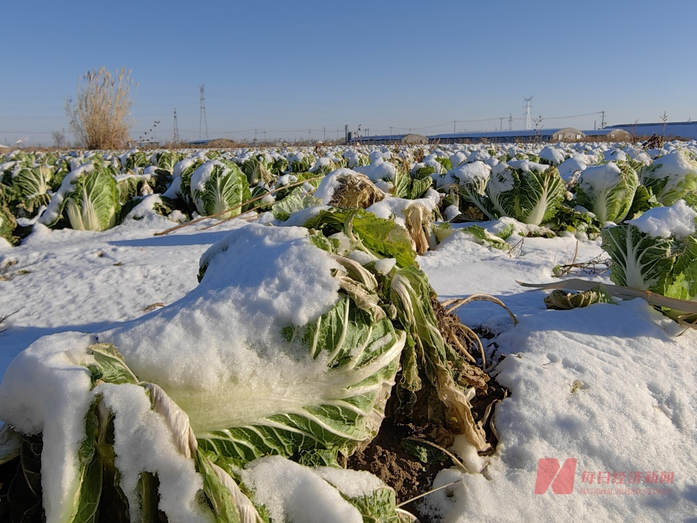
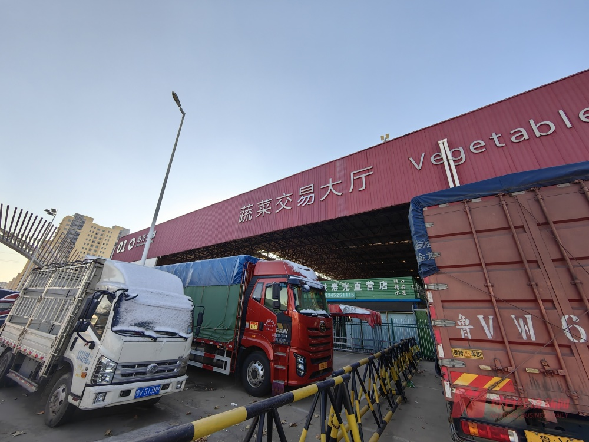
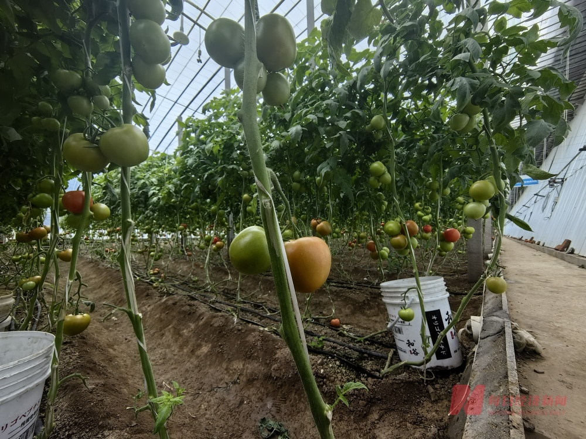
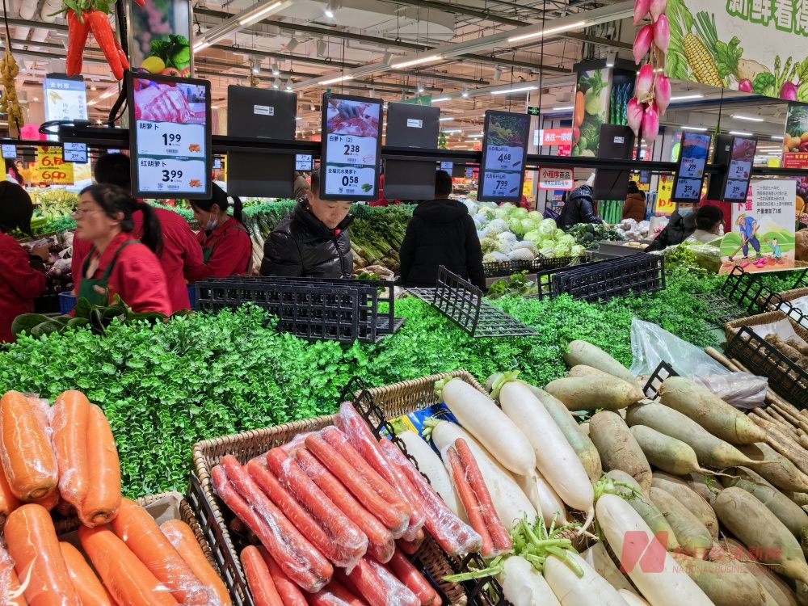

# “菜篮子”山东寿光 ：寒潮吹散“白菜价” 有的蔬菜地头价10天涨3倍

每经记者：彭斐 每经编辑：董兴生

种了十几年菜，今年冬天的白菜价格走势，算是让鲍志伟开了眼。

家住山东寿光市化龙镇的他，今年种了10多亩大白菜。一个多月前，这些亩产上万斤的白菜，即便10块钱30棵、50棵都卖不出去，如果算上肥料、人工费用，根本无法回本。

在国家统计局解释11月CPI（居民消费价格指数）走势时，鲜菜等鲜货食品价格的下降，甚至成为11月份全国CPI下降的重要因素。

菜价的下降，缘于被打破的供需平衡。近日，《每日经济新闻》记者在有全国“菜篮子”之称的山东寿光实地调研时，多位种植户、蔬菜批发商以及地方政府农业部门人士认为，今年10月、11月全国大部分地区平均气温较往年同期偏高，造成露天、拱棚、南菜北运等多个渠道蔬菜供应重叠期延长，打乱了以往的蔬菜供应结构。

不过，在气温偏高导致多种蔬菜卖出“白菜价”后，随着北方气温下降以及寒潮的到来，多数蔬菜价格重新步入上涨通道。

12月中下旬，李伟（化名）之前没舍得扔的白菜，从一个多月前的几分钱一斤，到如今在寿光当地批发均价已经超过了每斤一块钱，而寿光大棚里的茄果类蔬菜价格，也普遍恢复、甚至超过了去年。

_前期低价难卖的白菜，在寒潮过后开始涨价 图片来源：每经记者 彭斐 摄_

一位当地农业农村局人士在与记者交流时甚至调侃说，西红柿现在已经涨到4元（一斤），“西红柿炒鸡蛋这道菜，西红柿可能要暂时少放了”。

白菜价创8年新低，亩产万斤却不够水费

和鲍志伟类似，同在化龙镇的李伟也种了10多亩白菜。

“一亩地收一万来斤，即使全卖了，水钱都不够。”谈到10月底白菜刚上市时的价格，李伟的内心可谓五味杂陈。

按照多年的种植经验，李伟的白菜地，从白露前后种苗到收获，总共浇10次水，这样会给每亩地增加800元的成本。加上土地承包、肥料、种苗等费用，每亩白菜地的成本要在1500元左右。

在李伟近20年的种菜经历中，作为大路菜的白菜，价格虽然比不上大棚蔬菜，但最好的年景，地头价能达到六七毛钱一斤，“大部分能卖到两三毛钱，就已经很好了”。

鲍志伟则给记者算了一笔账：种植小麦等粮食作物虽然稳定，但并不挣钱，大白菜的产量高，一亩地最高能收1.3—1.4万斤，种植成本也低，每斤能卖到1毛钱左右就能保本。

不过，在今年11月份这些白菜要上市时，鲍志伟和一众白菜种植户傻了眼。按照11月份的价格，在化龙镇的地头，一亩地白菜的最终交易价可能只有三四百块钱。

“雇人的话，每个工都得两三百块钱，还不如直接‘放坡’。”在寿光当地和临近的区县，“放坡”指的是农民不再采收地里的作物，任由他人采摘，收不完的就只能烂在地里。

11月份，当白菜上市时，鲍志伟将自己每亩产量能达一万多斤的白菜，选择了“放坡”处理。

与鲍志伟类似，因为卖不出去，再加上冬小麦的种植已到跟前，通过“放坡”清理白菜，成为当地一些种植户的普遍选择。

在与《每日经济新闻》记者交流时，多位寿光当地政府人士表示，寿光蔬菜之所以全国闻名，主要是因以大棚为代表的设施蔬菜，这类蔬菜的种植面积有60万亩，而以白菜、萝卜等为代表的大田菜、露天蔬菜实际种植面积有2万亩，真正“放坡”处理的，只占很小的比例，可能只有几百亩。

_因为前期价格过低且无人收购，在寿光化龙镇某地，仍有未收的白菜 图片来源：每经记者 彭斐 摄_

即便如此，因为寿光的“菜篮子”名号，11月前后，“放坡”这个寿光土话，还是成了居民间交流、短视频平台上热传的一个词汇。

“其实真正‘放坡’的比例并不大，通过短视频传播吸引老百姓过去，更像是一种营销方式。但与超市、菜市场比，当时地里的蔬菜价格确实很低。”一位曾到现场了解情况的寿光当地政府人士表示。

据中国蔬菜价格指数平台统计，今年11月，大白菜的平均交易价格已到8年最低点。即便价格如此便宜，今年的大白菜仍然少有人问津。

最初，鲍志伟和村里的种植户也尝试过联系往外卖，“能联系的都联系了，但那时菜多，没有收购商，（白菜）生长也到了极限了”。

“能卖出去的话，谁愿意放坡？”12月17日上午，在与《每日经济新闻》记者电话交流时，鲍志伟说，去年价格最低时也就几分钱一斤，今年甚至到了一两分钱，有的十块钱30棵、50棵也在卖。

几乎同时，在济南家家悦超市丁豪广场店的蔬菜柜台，一位工作人士表示，今年冬天蔬菜价格普遍偏低，11月份白菜最低时每斤只有9分钱，但持续时间并不长。

同样的情况，也发生在其他白菜产区。从地域来看，我国的白菜产区在南北方都有分布，其中，北方主要集中在河北、山东、河南、辽宁等省份，南方则在江苏、湖北、湖南、四川、贵州、云南等省份。

据农业农村部公布的统计数据，11月份，蔬菜批发均价为3.58元/公斤，环比下降5.1%，同比下降3.9%。其中，大白菜的价格环比降幅更是达到了26.4%。

据中国蔬菜协会，河北省玉田县大白菜11月上旬地头价为0.10元/公斤左右。仅相当于采收的人工成本，部分农户直接弃收。

多因素影响菜价走势，已连续两月下拉CPI

在寿光市农业农村局蔬菜技术推广科工作人员刘春香看来，今年以白菜为代表的露天蔬菜价格的走低，与天气造成的产量提升、多渠道重叠供应有关。

“因为高温天气延长，今年10月底、11月初，陆地蔬菜、拱棚蔬菜和这种日光温室蔬菜，以及南菜北运的时间，有一个阶段是重叠了，造成了多个渠道的蔬菜同时上市。”刘春香向《每日经济新闻》记者表示，原本只在9月底、10月初出现的重叠期，今年却延长至11月份，这直接打破了原本的市场平衡，造成部分种类菜价走低。

此外，居民消费习惯的改变，也被看作是大白菜等价格走低的原因之一。在寿光众旺果蔬合作社理事长崔玉禄看来，老百姓生活习惯改变，或许是另一个原因。以往，北方地区居民过冬时都会囤大白菜，但随着生活水平提高，很少有人再大量囤菜，毕竟新鲜度才是蔬菜的优势所在。

不过，类似的情况不只发生在大白菜一个品种。在与记者交流时，一位山东蔬菜种植合作社徐姓负责人表示，往年只是白菜、萝卜等个别品种出现量大价低，但今年包括香菜、菠菜、甘蓝、菜花、芹菜等品类，均出现过低价销售难的情况。

 _被大雪覆盖的大白菜 图片来源：每经记者 彭斐 摄_

在徐姓负责人看来，之所以出现多品种蔬菜价格走低，一方面与天气原因造成的供应量增加有关；但另一方面，近年来进入农业生产领域的资金增加，进而造成种植面积扩大也是其中一个因素。

值得注意的是，据《北京日报》10月底报道，新发地农产品批发市场董事长张玉玺分析，北京市每天对大白菜的需求量在1000吨左右，价格下降的原因主要是白菜种植面积大、产量大增，而且，较暖的气候让北方大白菜退市时间推后，与南方大白菜上市时间叠加，出现了明显的供大于求现象。

Mysteel农产品调研了解到，近几年，国内蔬菜尤其是设施蔬菜的种植面积及规模基本呈现逐年上升趋势。以全国蔬菜大省山东为例，山东省统计局数据显示，2023年前三季度，山东全省蔬菜面积约1662.1万亩，同比增幅参考2.2%；总产量6271.8万吨，同比增幅参考3.4%。

另据农业农村部日前发布的最新数据，全国蔬菜面积连续4年超过3亿亩，2022年产量达8.0亿吨，总量上产需平衡有余。今年蔬菜面积产量继续增长，截至11月底，全国蔬菜在田面积8849万亩，同比增加115万亩。

在刘春香看来，蔬菜价格是遵循市场价格规律的，供应的增加显然会让价格走低，而蔬菜价格的走高，也反映出所在品种的种植、供应出现下降。

让诸多普通蔬菜种植户没有想到的是，在全国范围内，除了猪肉，走低的菜价也成为拉低CPI的主要原因之一。

国家统计局数据显示，2023年10月、11月，全国CPI（居民消费价格指数）连续两个月出现负增长。其中，11月份，CPI同比下降0.5%，同比降幅比10月扩大0.3个百分点。

在解读11月CPI数据时，国家统计局城市司首席统计师董莉娟表示，食品中，因11月份全国大部分地区平均气温较常年同期偏高，利于农产品生产储运，鲜菜、鸡蛋和水产品等鲜活食品价格分别下降4.1%、3.1%和1.6%，降幅均超季节性水平，合计影响CPI下降约0.13个百分点。

寒潮吹散“白菜价”，菜价上涨大概率延续

作为种了近20年菜的老菜农，这一轮寒潮到来引发的白菜价格反转，着实让鲍志伟没想到。

一个多月前还无人问津的大白菜，在12月份逐渐开始有人问价。12月17日下午3时许，在寿光地利农产品物流园（以下简称“地利物流园”）内，一批来自湖北的30吨白菜正在卸货。一位货主告诉《每日经济新闻》记者，当天的交易价已经到了每斤6毛钱。

 _寿光地利农产品物流园 图片来源：每经记者 彭斐 摄_

作为亚洲最大的综合性农产品物流园，也是全国最大的蔬菜集散中心，地利物流园也是国内南北蔬菜物流中转的枢纽，其发布的蔬菜价格指数对全国、尤其北方市场来说，被看作是一个很好的蔬菜价格晴雨表。

地利物流园对12月蔬菜指数走势进行预测时称，进入12月份后冷空气活动频繁，降温、降雪天气时有发生，会对蔬菜生长、采摘、储存等环节造成不利影响，但南方蔬菜的上市量及上市品种将会继续增加，山东省内及寿光地产菜出产量逐步减少，预计下月（12月）蔬菜价格指数将呈现上扬趋势。

《每日经济新闻》记者梳理发现，进入12月以来，寿光蔬菜价格指数开始呈现出上涨态势。其中，在12月11日—12月17日当周，该指数为124.08点，较上周111.28点上涨12.8点，环比涨幅11.5%，同比涨幅2.2%。

对此，地利物流园方面给出多个原因，具体包括：“本周经历一轮寒潮天气，多数地区伴随着降温、雨雪天气，对蔬菜的生长、采收、储存等各个方面带来不利影响；加之，交通运输难度的增加，共同助推价格上涨。‘南菜北运’陆续进入交易旺季，部分南方蔬菜质量好于进场的省内尾货，如茄果类等蔬菜，拉动整体菜价上涨。进入冬季后，气温明显下降，省内多数蔬菜品种集中上市期已过，出产量进一步缩减，如大白菜等，菜价需求性上涨。”

当然，这种上涨也直接反映在蔬菜价格上。“茄子已经涨到两块多了，价格和去年已经不相上下。”12月17日，在与《每日经济新闻》记者通话时，寿光纪台镇某茄子种植户王超说。而就在10天前，他还在因茄子地头价每斤只有5毛钱，向记者抱怨种植户的难处。

在位于纪台镇的寿光市昌宽蔬菜专业合作社，从外地来运菜的大车已在门口停得满满当当，寒潮也无法降低这里的销售热度。这家合作社的产品以长茄为主，主要销往北京、粤港澳等地。

“现在物流运输很便利，从早上8点到现在，我们已经销售了7万多斤长茄。眼下是大棚菜的销售旺季，一斤茄子要卖两元多，预计接下来价格还会走高。”合作社负责人李昌宽说。

_茄子地头价近期涨到了每斤两块多 图片来源：每经记者 彭斐 摄_

商务部市场运行监测系统显示，受低温雨雪天气影响，12月11日至17日，全国36个大中城市30种蔬菜平均零售价格环比上涨3.5%。茄果类蔬菜价格上涨明显，其中西红柿、青椒和茄子平均零售价分别上涨11.1%、10.9%和10.8%。北方地区菜价涨幅居前，其中天津、石家庄、济南分别上涨11.9%、10.0%和9.7%。

谈到近期的蔬菜涨价，刘春香甚至说：现在西红柿已经到4块每斤，再做西红柿炒鸡蛋时，是不是要考虑少放点西红柿了？“如果再涨价的话，西红柿炒鸡蛋这道菜，可能就要从家里餐桌上暂时消失一段时间了。”

_种植西红柿的蔬菜大棚 图片来源：每经记者 彭斐 摄_

虽然刘春香的话是调侃，但王超、李昌宽、崔玉禄等蔬菜产业链人士均认为，按照以往经验，接下来蔬菜应该会进入涨价通道，至少也会延续到明年3月份前后。

设施农业微调供需，整体调配应对价格波动

“蔬菜销售价格出现波动在所难免，这是市场决定的，即便寿光也是如此。但总体来说波动比较小，对当地种植户、收购商影响并不是很大。”寿光多位蔬菜产业链人士所持看法保持了一致。

中国社会科学院农村发展研究所研究员李国祥表示，蔬菜价格过低或者或高的情况，在过往也曾经出现过，这是由客观市场规律决定的，具有一定的周期性。“有些蔬菜如果价格相对较高，需求大于供给，那么之后可能会引来菜农大规模种植；产量上来之后，如果供给远远大于需求，价格就会下降到一个较低的水平。”

_随着天气变化，多个品种蔬菜价格开始上涨 图片来源：每经记者 彭斐 摄_

“价格过高、价格过低都不是好事，过高反映出该类品种生长遇到问题，过低则反映出供应超出了需求。”经常与蔬菜种植户打交道的刘春香认为，近期的价格波动情况属于正常市场波动，但如果波动太大也会成为农户接下来种植的一种参考。

在崔玉禄看来，作为全国知名的蔬菜种植基地，寿光不管是从种植规模还是销售渠道来说都已经很成熟，对价格波动的承受和调节能力也比较强。比如，渠道的多样性，如果一条渠道的价格比较低，那么种植户可能会选择其他渠道进行销售。

当然，对于接下来价格走势的预判，前述多位寿光当地人士之所以能有自己的把握，源于当地数十年来的“菜篮子”底蕴，而底蕴的形成，自然离不开当地60万亩设施农业。

事实上，作为国内设施农业的发源地，寿光在种植环节发挥着重要作用。

1989年，寿光三元朱村17个农户试验冬暖式蔬菜大棚取得成功，解决了冬季蔬菜种植瓶颈，揭开了中国设施农业发展的序幕。最初，菜农弯着腰、点着蜂窝煤炉子供暖的第一代大棚，到目前已经升级至第7代。

_蔬菜大棚发源地三元朱村 图片来源：每经记者 彭斐 摄_

在寿光市农业农村局一位人士看来，农业大棚的出现和推广，解决了冬季蔬菜供应不足的难题，具有稳定市场的作用。

为保障菜农权益，寿光农户纷纷组建合作社，抱团发展，共担风险。他们以“一镇一品”“一村一特”的形式避免了跟风种植、扎堆上市，分散了无序生产的风险，并创立价格指数实时反映市场，以减少因信息不对称而误导经营的风险。

2020年9月26日，寿光107家蔬菜专业合作社联合成立了全国首家蔬菜合作社联合会，进一步提升组织能力，打造“寿光蔬菜”品牌效应。该联合会首届会长崔玉禄认为，寿光合作社整合后，再遇到菜价起伏、蔬市震荡，联合会就能形成合力，在更大范围内发挥市场配置资源、组织货源的作用，应对菜市波动。

作为中国蔬菜之乡，寿光形成了“买全国卖全国”式的分销体系；借助市场网络的延伸，近年来，寿光开始不断面向全国输出种植技术、人才以及生产模式。《每日经济新闻》记者从寿光官方获取的信息显示，目前，全市常年有8000多名技术人员，在全国各地建设大型蔬菜基地或指导蔬菜生产，全国新建大棚中一半以上有“寿光元素”。

_寿光的收菜种植技术，不仅在国内推广，甚至已经传到了非洲 图片来源：每经记者 彭斐 摄_

值得注意的是，在2023年中央一号文件中，作为重要农产品稳产保供的关键举措，“发展现代设施农业”也被赋予重要使命。

比如，在时下，设施农业在农业大省山东遍地开花。山东将发展现代设施农业作为重要农产品稳产保供的主渠道、提高土地利用效率的主方向、发展绿色生态农业的主阵地，走出一条具有山东特色的现代设施农业发展路子。

每日经济新闻

**此前报道：**

[近5年最低，白菜真卖出了“白菜价” ](https://news.qq.com/rain/a/20231217A0039W00)

