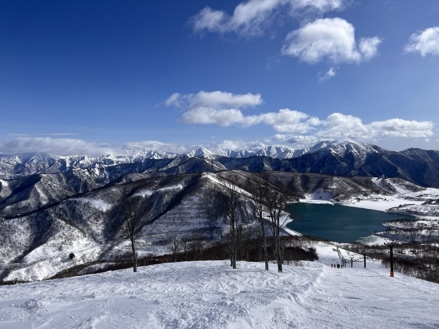

# 中国游客在日滑雪身亡 当地滑雪教练：遇难者摔倒后吸入“粉雪”窒息

潮新闻客户端 记者 李沐子

据多家媒体报道，12月23日下午2时30分左右，一名中国女游客在日本新潟县汤泽町的一个滑雪场摔倒并被积雪掩埋身亡。据悉，该女子被救出送医，随后被宣布死亡。警方表示死者为27岁的符姓中国女游客。有网友爆料称涉事滑雪场为神乐滑雪场。

24日下午，潮新闻记者联系上一位滑雪教练，同时也是新潟县汤泽町神乐滑雪场边一家旅馆的主理人陈宽（化名）。问及此事后，陈宽回复称：“昨天确实发生了，日本的新闻这两天一直在播放。”据其了解，符女士是摔倒后吸入粉雪，导致窒息，“并没有发生雪崩”。

近年来，冰雪运动热度不减，滑雪也逐渐走向大众。但不可否认，这仍是一项公认的高风险运动。

**事发前一天**

**当地下了一夜雪**

“汤泽这里就是川端康成笔下的雪国，以雪闻名。”陈宽告诉记者，汤泽靠近东京，从东京搭乘新干线1个半小时就能到达。“交通便利，雪质优良，因此吸引很多滑雪爱好者前来。”

_神乐滑雪场 受访者供图_

陈宽表示，汤泽区域内有大大小小不下10个雪场，其中神乐滑雪场以粉雪出名，是日本中部地区排名数一数二的人气滑雪场。
“其原因就在于海拔高，地势优越，气温最低也才零下10摄氏度左右，一般白天在零下5摄氏度左右。”

陈宽告诉记者，据其了解事故发生在神乐滑雪场一条未开放的高级滑雪道上，“雪中摔倒，如果姿势不对，非常有可能口鼻全脸进雪。”陈宽特别强调，很多人会以为雪伤不了人，但粉雪的可怕就在于，它像面粉一样，是会在滑手倒地的时候，灌入口鼻，被动吸入，导致窒息。“3到5分钟，人就会立马没了。”

“所以滑粉雪时，是不可以一个人滑的。”陈宽称，滑粉雪一般需要有专业或有经验的人带路，最好还需要有个技术好的断后。“这样即便有人陷入危险，也可以第一时间抢救。
”他表示，因为粉雪很深，摔倒后，很难自主爬起来，“在失去判断力，分不清上下的时候，只能是靠同伴，从外拽出来。”

陈宽说，就在事故发生的前一天，
神乐下了一夜新雪，“所以昨天山上的雪是粉雪状态，会让滑雪大神们兴奋，可以‘刷粉’。也会让新手玩得开心，因为昨天白天开晴，能见度很高、景色美，粉雪摔上去又不那么疼。”陈宽说，12月23日，确实是非常适合滑雪的天气，但也确实是令人痛惜的一天。

此外，潮新闻记者注意到，12月23日晚，中国驻新潟总领事馆发文提醒领区中国公民冬季加强安全防范。文中提到，日本自然灾害多发，该馆领区新潟、山形等县冬季天气复杂多变，雨雪偏多。如选择自由行，请随时关注当地天气预报和政府发布的灾害信息，规划好出行路线。如选择跟团游，请选择有正规资质的旅行社，合理安排行程，注意留存导游、领队、司机的手机号及酒店地址、电话等信息。

领馆特别提醒，来休闲滑雪的中国籍游客，请备好防寒等必要保障用具，量力而行，勿盲目体验新项目，尽量避免单独行动，防止发生意外伤亡、走失等危险。

**专业人士：粉雪松软**

**摔倒后较难起身**

“我们滑雪道是有道内雪和道外雪之分的，正常情况下，国内雪场开放的都是道内雪，南方道内雪一般是造雪机造的，北方道内雪是用铲雪机推雪压雪而成，最直观的感受就是道内雪会相对比较硬。”开心平方滑雪季的创始人韩杨海龙告诉记者，道外雪正和道内雪相反，“滑上去松软，摔倒也不疼的，就是道外雪，简单理解就是没有人工干预过的雪道。”

韩杨海龙表示，一般北方的雪场都会有道内雪和道外雪之分，“因为降雪量比较大，道外雪就很容易堆积而成。”韩杨海龙说，这类道外雪通常被称为“粉雪”，“相对道内雪来说，粉雪就是比较厚，比较深，会很松软，滑起来跟面粉一样。”

（↑韩杨海龙滑无痕的“浅粉雪” 受访者提供素材）

每年韩杨海龙会和三五好友相约到各地滑雪，粉雪是所有雪友们追崇的，但同时也有风险，“滑粉雪和滑道内雪是两种完全不同的感觉，粉雪有时候很深，如果滑板板头扎进去，会比较难起身。”韩杨海龙说，如果在山里滑粉雪，还有可能在滑的时候出现雪崩。“尤其大山雪被太阳照过之后，会变得更松软，更易发生（雪崩）。”

韩杨海龙提到，他们去滑粉雪的时候，都会背一个滑雪背包，这样摔倒了可以辅助起身。“在粉雪上摔倒，成年男性起得会快点，但女生可能会比较吃力，不过也看是专业滑手还是‘小白’，以及有没有粉雪经验。”

“我们一直跟所有咨询的人强调，滑雪是户外极限运动，存在着非常多的不稳定安全因素，有自身的、他人的、天气的，都是不可预估的。”陈宽说，接待每一位来滑雪的客人，他都会提醒，“一定要遵守雪场规则，尊重大自然，量力而行。”

几乎每年，陈宽都会听说雪场有意外发生，有的是因为无视天气，有的无视雪场警告，过于自信，“滑雪不仅仅要具备技术能力，也要有预测、躲避、自救和救他的能力。”

因此，接待过许多中国滑雪游客的陈宽建议，来日滑雪，一定不要进入雪场禁止滑行区域，不要进入雪场贴了警告牌的地方。“第一次来到一个雪场，在不熟悉当地山形、路况的情况下，可以找雪场认定的正规滑雪学校，进行指导，切勿盲目自大。”

“转载请注明出处”

