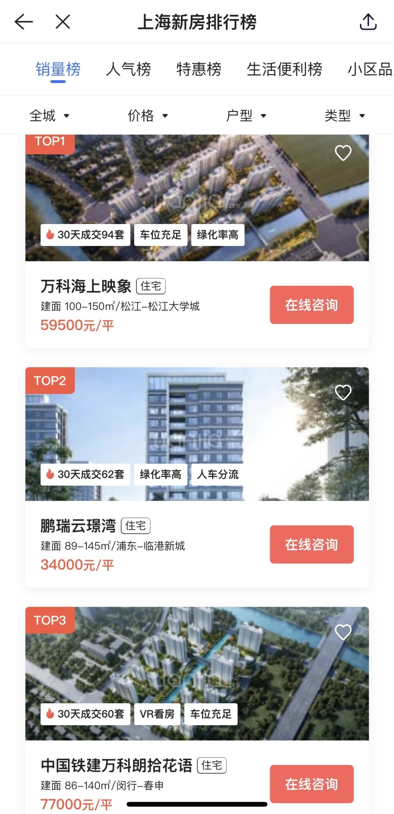

# 京沪楼市新政落地十日：有中介门店成交涨50% 售楼处周末依旧人气旺盛

12月14日晚，京沪两地同步调整多项楼市政策，内容涉及优化普通住宅认定标准、购房首付比例下调、调整房贷利率下限等。

新政落地进入第二周，市场表现如何、成交量是否上行等仍备受关注。

**有中介门店成交量上涨50%**

此次，京沪两地同步出台优化普通住宅认定标准。而在这之前，上海、北京执行的普宅标准均已从2014年沿用至今。

其中，上海对普通住宅的认定标准进行了优化，剔除了价格标准，同时提高了建筑面积标准，从140平方米提高至144平方米。

而一旦认定为普通住宅，则意味着二手房出售时税费成本可明显降低。这一政策的出台也被认为直接利好二手房市场。

据网上房地产数据，在上海宣布新政实施首日（12月15日），上海二手房网签成交662套；次日（12月16日）二手房成交738套；12月17日（周日）二手房成交639套。从网签数据看，新政落地一周，上海二手房成交4181套，日均成交597套；截至12月21日，上海二手房共成交10835套，日均成交约516套。

而据上海链家研究院的监控数据显示，11月份上海全市共成交二手房1.41万套，日均成交约470套。

业内人士指出，从网签数据来看，新政落地后首日及周末两天的数据在600套以上，工作日的数据维持在500套上下。虽较新政前数据有一些提升，但网签数据相对滞后。

从门店情况看，太平洋房屋田林东路一门店店长孙洁琼对澎湃新闻表示，“从我们门店周边范围来说，新政发布一周，二手房市场的咨询量还是在往上攀升，同时挂牌量也在攀升，主要集中在500万元至800万元的挂牌标的。这部分房源，原来属于非普通住宅，新政落地后，一些房东也存在置换的需求，因此一些之前觉得市场不太好撤牌的房东在此次‘普改’后又将房源挂牌。带看量方面，从新政落地一周与新政出台前一周对比，带看量大约提升了30%-40%。”

从成交量来看，孙洁琼介绍，其所在的门店，新政前一个月成交量在3至4套，新政落地后，本月已成交7套房源，成交量提升约50%。“我们公司一些大门店，本月的成交套数已经有达到12套至14套。”

另以世纪公园板块为例，中原地产世纪花园豪宅分行门店店长潘雪莲表示，该门店在新政落地后已成交2套房源，一套总价近1600万元，综合减免税费约60万元；另一套房源2800万元，由于面积超过144平方米，未减免税费。

潘雪莲认为，“新政落地有利于二手房加速成交。原本卖家和买家之间可能因为差价仍在博弈，税费减免后，买卖双方心理价差缩小，可加速促成交易。”

从机构统计数据来看，上海链家研究院数据显示，新政发布后的首个周末，链家成交量较上一周末环比增长33%，带看量环比增长3%。

上海链家研究院首席分析师杨雨蕾指出，成交量增加主要是受到政策利好影响，购房者无论是在交易环节的税费上、还是贷款利息上，都能享受到一定力度的优惠，前期观望犹豫的客户，也选择落袋为安。总体的带看量相对平稳，说明市场还是比较理性，此外，市场也需要一定时间对新颁布的政策进行消化。

杨雨蕾提到，新政落地后，工作日的成交和带看量未出现太大变化，因为带看和成交基本以周末为主，工作日看房签约的客户本身也比较少。

“新政落地后有一波成交小高峰，从近几日的情况看已逐步回稳。”位于上海浦东梅园板块的一中介表示。“当前挂牌量仍在高位，以梅园板块为例，单学区挂牌量在200套左右，双学区在300套左右，整个板块将近500套的挂牌量，之前市场好的时候整个板块的挂牌量在200套左右，因此新政落地后，虽然成交量时不时会有，但整体的库存仍在高位，因此对价格和市场的热度提升作用有限。一小部分业主心态会有所变化，议价空间减少；大部分房东仍相对理性，趁着利好政策出售房源或者置换。”

从北京的市场情况来看，诸葛数据研究中心监测数据显示，北京新政落地一周，短期内成交量出现积极的回升态势，挂牌房源量、涨价房源量迅速增多。其中，从成交来看，新政落地后新房成交上升相对二手房迅速，且涨势更为显著，根据诸葛数据研究中心监测数据显示，北京新政落地后的一周内北京新建商品住宅日均成交230套，高于新政前一周平均水平82%；二手住宅日均成交391套，高于新政前一周平均水平7%。挂牌房源量及涨价房源量均迅速上升后出现下滑态势，但日均量仍处于较高水平。

诸葛数据研究中心高级分析师关荣雪指出，整体来看，北京新政落地刺激了购房需求进一步释放，政策效果显现迅速但持久性仍有待观察。

**新房项目表现不一，热销楼盘成交量可观**

从新房项目销售情况而言，各项目表现不一。

“从我们代理的新房项目来看，不同板块区位的项目表现并不相同。部分项目受新政落地影响，带看量较好，比如位于曹路的涌潮府、川沙的华润观宸润府等，这两个盘距离地铁站都比较近，成交量可观。以华润观宸润府为例，仅12月23日一天，我们就成交了8套。”上海一新房代理中介说道，“相比较而言，位于郊区的部分新盘的去化速度比较一般，受新政影响有限。而且目前已接近年底，从往年的情况来看，年底购房者会相对较少，所以一些不是特别热门的盘，客户并不急于入手，也有一些客户想等等元旦售楼处是否会有活动。”

也有部分楼盘持续销售性较好。

澎湃新闻从位于自贸区临港新片区的中建玖海云天项目处了解到，上海新政落地后，该项目累计销售额已突破2亿元。

据该项目营销负责人介绍，“当前，客户比以前更专业也更理性，项目品质、房企品牌、工程进度等都是购房者会考虑的因素。在临港，现阶段我们的流速算比较快的，新政落地后的第二个周末现场的看房者依然络绎不绝，截至12月23日，项目已销售约63套。”

另据位于松江的万科·海上映象销售人员介绍，“项目于今年9月底首次开盘，11月26日二期开盘，在松江广富林板块是热门的楼盘，新政落地后，项目成交量也很不错。”

澎湃新闻从贝壳找房APP上看到，根据贝壳平台销售数据，万科·海上映象项目位于“上海30天销售榜”top1，30天成交94套房源；排名top2的项目为鹏瑞云璟湾；top3是中国铁建万科朗拾花语。

**“市场持续向好的延续性将好于九月”**

从经纪人的反馈来看，此次政策落地后成交客户主要以存量客户为主。“从目前成交的案例来看，主要还是以存量客户为主，新政对新增客户的影响有限。当前促成交易的客户基本均在新政前就已开始看房。”

上海花木板块一经纪人表示，“政策落地后，我的客户主要分为两类，一类是之前就有明确购买意向的客户，在新政落地后，加速其购房决策；另一类是相对理性的客户，因为目前也已接近年底，这部分客户想等到明年再看看市场，特别是银行存款利率已经下调，市场预期后续贷款利率大概率也会降低，所以这部分客户不太急于入市。”

上海中原地产市场分析师卢文曦认为，当前政策已经落地，今后也会有更多的人能够享受到政策带来的优惠。目前时间节点来看毕竟是到了年末，相对来说，年末其实不是一个比较活跃的交易时期。从全年来说，下半年交易活跃期可能是在九月份、十月份。现在已经是临近年末了，可能大家的交易热情会藏一藏或者说放一放。“我相信市场持续向好的延续性，可能会比九月份‘认房不认贷’来得好一点。另外，其实政策也是释放了比较明显的信号，就是政策的工具箱里面还有很多的储备性政策，储备政策肯定还会给市场交易起到稳定作用。”

