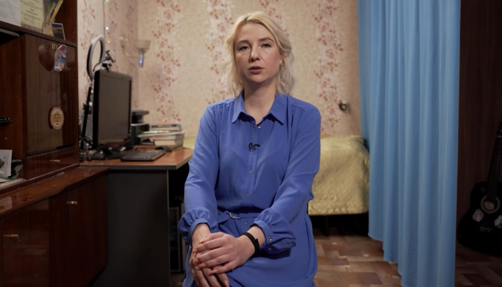

# 她被取消参选俄罗斯总统的资格，曾呼吁“结束冲突、避免与西方分裂”

（观察者网讯）根据路透社消息，当地时间12月23日，因参选材料中存在“大量违规内容”，俄罗斯总统候选人、前电视台记者叶卡捷琳娜·敦佐娃（Yekaterina
Duntsova）被取消总统候选人资格。俄罗斯定于明年3月举行总统选举，敦佐娃11月宣布参选，而普京日前已提交参选材料。

报道指出，在当天的投票中，俄罗斯中央选举委员会成员一致否决了敦佐娃的参选资格，理由是她此前提交的参选材料文件中存在“大量违规内容”。

英国广播公司（BBC）俄罗斯频道援引俄中央选举委员会成员的话称，该委员会发现，敦佐娃的参选材料看起来像是“仓促填写”，“没有遵守法律标准”。

敦佐娃则在社交媒体Telegram发文回应说，中央选举委员会的决定“不公正、不民主”，她将向最高法院发起挑战。

俄罗斯中央选举委员会主席帕姆菲洛娃（Ella
Pamfilova）则对敦佐娃表示安慰，告诉她“你是一个年轻的女人，前途无量，任何失败都可以变成胜利，任何挫败都是经验”。

 _俄罗斯总统候选人叶卡捷琳娜·敦佐娃，视频截图_

敦佐娃今年40岁，此前是一名地方电视台记者，目前处于离异状态，有3个孩子。11月，她宣布计划作为独立候选人参加2024年3月的俄罗斯大选，并表示，“恐惧是存在的，任何理智的人在迈出这一步时都会感到害怕，但是绝不能让恐惧获胜”。

敦佐娃此前接受媒体采访时表示，她认为，克里姆林宫应该结束在乌克兰的冲突，释放政治犯，并进行重大改革，以阻止俄罗斯与西方之间滑向被“铁丝网”分裂的新时代。

路透社报道称，俄罗斯一些反对派对敦佐娃被取消参选资格表示不满。不过，一直对普京和俄乌冲突持批评态度的俄罗斯反对派政治家纳杰日金（Boris
Nadezhdin）23日被提名为总统候选人，预计于12月25日向中央选举委员会登记。

经俄罗斯联邦委员会决定，俄罗斯下届总统选举的具体投票日为2024年3月15日至17日。

根据俄罗斯总统选举法，独立候选人必须获得来自40个或更多地区的至少30万个选民的签名，并获得至少500人团体的支持，在12月27日之前向中央选举委员会提交参选材料。各政党有权在代表大会上提名候选人，且必须在1月1日之前提交参选材料。

当地时间12月18日，俄罗斯总统新闻秘书佩斯科夫表示，俄罗斯总统普京向俄中央选举委员会提交了作为独立总统选举候选人所需的材料。

另据俄罗斯塔斯社报道，俄罗斯中央选举委员会主席帕姆菲洛娃23日在一次会议上表示，截至目前，已有29名俄罗斯总统候选人提交参选材料。

**本文系观察者网独家稿件，未经授权，不得转载。**

