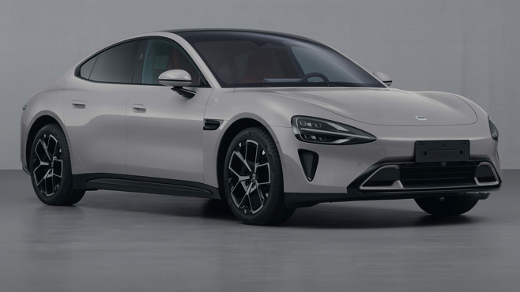
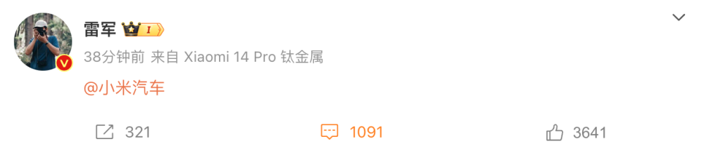
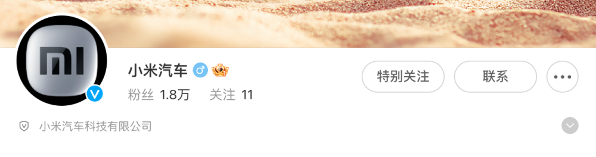
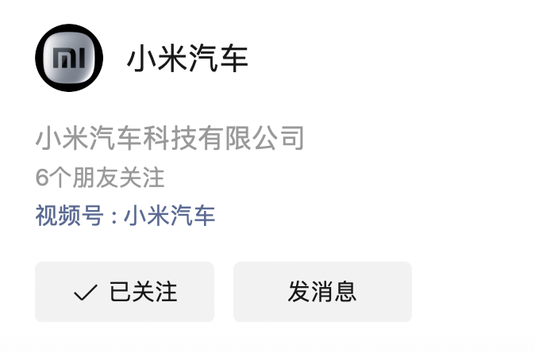
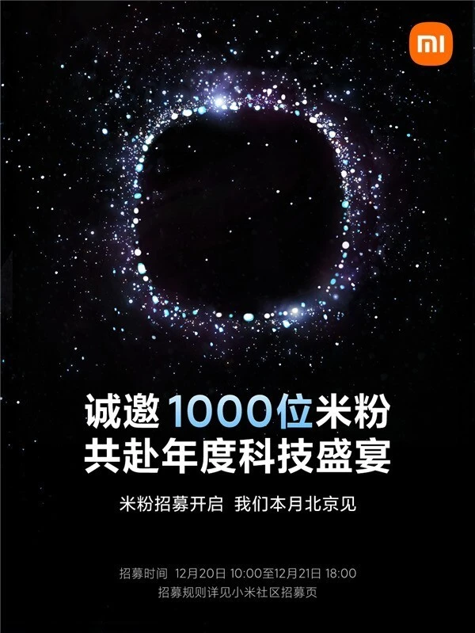

# 小米汽车12月28日见？雷军亲自下场与官方账号进行互动

腾讯汽车讯 12月24日晚间消息，小米集团创始人、董事长及首席执行官雷军在其个人微博上@
小米汽车，这似乎暗示着小米汽车发布会日益临近。另据腾讯汽车查阅，小米汽车的官方微信公众号、视频号目前也已正式上线。此前有传闻称，发布会将于12月28日举行。不过，目前小米官方尚未正式公布。

而就在几天前，小米在官方社区也开展了粉丝招募活动，共邀请1000名米粉参加小米年度科技盛宴。目前招募活动已经结束，结果将会于12月27日之前公示。

12月12日，工信部在第七十二批《免征车辆购置税的新能源汽车车型目录》中公开了小米首款车型SU7纯电续航里程、动力电池包参数及整车整备质量等信息。

资料显示，小米SU7搭载73.6kWh和101kWh两种容量电池包，纯电续航里程分别为628km/668km和750km/800km。

此前工信部公告显示，小米SU7低配版本搭载的73.6kWh电池为弗迪电池的磷酸铁锂电池；高配版本搭载的101kWh三元锂电池则由宁德时代供应；电动机供应商来自苏州汇川联合动力，电机功率分别为220千瓦及275千瓦。

公告显示，小米牌轿车由北京汽车集团越野车有限公司生产，生产基地则在小米汽车位于北京亦庄的小米汽车工厂。

