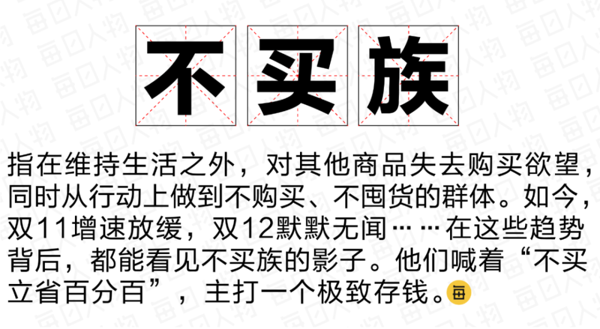
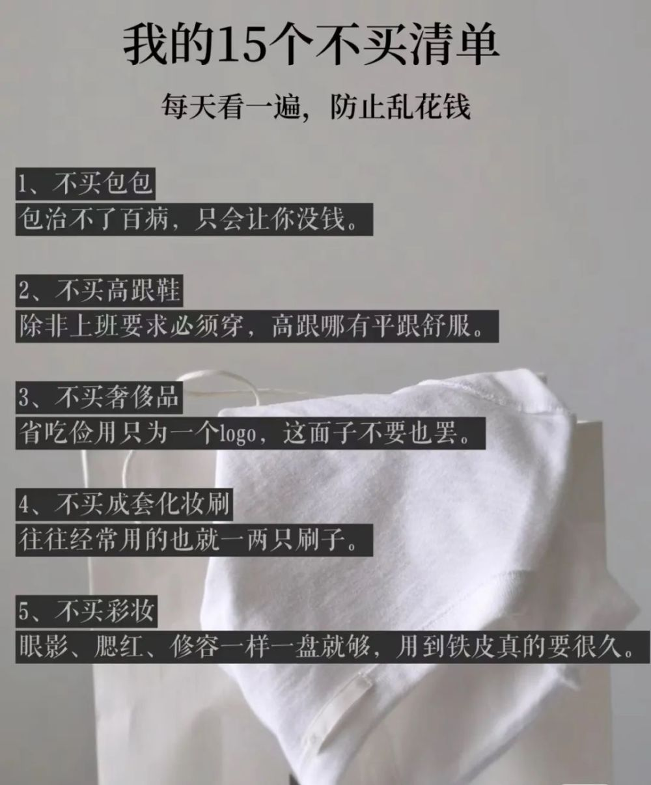

# 当“剁手党”成为“不买族”：有人发誓不买衣服，有人攒出几十万

**大家周末愉快，这里是每日新语第二十期，这次我们想聊聊消费主义的逆行者——“不买族”。**

**这个冬天，拼多多市值超过了阿里，银行又一轮降息，A股继续争夺3000点。钱袋子小了，直接反映在买买买的行动上。**

**自去年首个未公布GMV（商品交易总额）的双11出现后，今年依旧如此。多年以来，GMV的高增速，是“剁手党”数量增加的直观体现，而现在，数据的平庸，反映了另一个群体“不买族”的扩大。**

**数据背后，是消费方式乃至生活方式的变化。比如，快递数量明显增多了——高盛发布研报称，双11期间包裹数量增长23%至24%。但与此同时，总交易额的增速却远低于包裹增速，星图数据发布的《2023年双11全网销售数据解读报告》显示，2023年双11总交易额达到11385亿元，同比增长降至个位数2.1%。**

**一方面是更多的包裹，另一方面是变化不大的交易总量，这不光说明每个包裹的平均单价变低了，也说明对于大单的消费，更多人的选择是——不买，转而选择那些低价商品。而等到双12，更有不买族选择直接遗忘：“今年有双12？我怎么都没感觉到？”**

**然而，没有人天生就是不买族，每个不买族的过去，似乎都有着剁手党的身影。与此同时，也没有人永远都是不买族——就像秋天的松鼠，为了过冬会大量储存食物，他们只是想熬过这个冬天，等待春天来临。**

**文 |** 曹婷婷

**编辑 |** 易方兴

**运营 |** 橙子

**消费逆行者**

年初，在“搞钱之都”深圳，35岁的钟漫制定了一个10年前绝对不会做的计划——一年不买衣服。

她在豆瓣“不要买|消费主义逆行者”小组里开帖，记录不买的心情：

“五一要去普吉岛玩，抑制住了强烈的买‘旅游衣服’的冲动。”

“已经六个月了，很神奇，完全失去了买东西的欲望。”

“12月1日打卡，原本一年的计划，实施下来觉得很轻松，身体和思维也变得轻盈很多。”

眼下，像钟漫这样，决心不买的人正在变多。郑州的温小雨度过了第一个“什么都没买”的购物节，“完全没什么想买的”；重庆的席芮放弃了凑单，“要凑满减，就得想还需要什么，需要的东西就会越来越多。”总之，“不买立省百分百”。

在钟漫加入的“不买”小组里，已经聚集了约37万名“理智鹅”。小组创建于2020年10月，简介中直白地戳破了消费主义泡泡：“通过煽动起焦虑情绪，让每个人因为焦虑，不断去购买，以满足自己的伪需求。”成员们主打一个“理性消费，物尽其用”——各种购物种草清单，在这里反转成细致的不买清单。

_▲ 图 / 《钱断情始》_

花钱买快乐的喧哗时有出现，但他们像逆流而上的小鱼。不囤货不凑单，在降价面前也巍然不动。他们是双11的局外人、消费主义逆行者，如今也有了一个新的名字——不买族。

在选择不买的人群中，不买衣服或许只算得上青铜级别。而白银玩家即使在双11，也能忍住啥都不买。平日里则能不买就不买，实在不行再找平替。比如，仰仗星巴克提神的打工人，想到三十多块钱一杯，也要绕道走进瑞幸。更高一级的不买族，就连日常所需也开始贯彻不买的精神。等到了王者段位，则反而开始变废为宝，或是自己种菜，产出消费品。

再比如，有人“挑战2023年一年不买”，涵盖服饰鞋包、奶茶外卖零食、家电，甚至细致到不买购物App的省钱卡券。这一年中，只消耗存货，除了一些必需品即用即买外，不再买其他物品。毕竟，处理闲置的时候才醒悟——用钱换东西容易，用东西换钱太难。

许多不买族一年不买的灵感出自凯特·弗兰德斯写的书——《不消费的一年》。作者坚持一年不消费，“丢掉70%不需要的东西，限制购物，学会质疑自己所做的任何决定”，最后，作者发现自己一年后“多出了50万元、减重了26斤、出了一本书，还找回了快乐的自己”。

而在国内，不买族的大神则要属丁红。据媒体报道，丁红42岁，出生在贵州一个小山村，小学三年级就开始存钱，35岁留学新西兰。

在国内工作时，丁红连续6年没有租房，吃住都在公司，洗澡就去健身房。全部家当只有一个背包，平常就塞在办公桌下。在极端不买情况下，她每个月的平均花费能控制在500块以内。

_▲ 图 / 《钱断情始》_

《自拍》也曾报道过另一位“不买族”乔桑，每个月甚至能把花费控制在400元左右。自从成为了不买族后，她一年少花了19万。

不买族越来越多，这股不买的信号也传导给了商家。比如，今年淘宝破天荒取消了双12，新上线的“淘宝年终好价节”气势似乎更弱了，双11也平平淡淡。根据星图数据发布的《2023年双11全网销售数据解读报告》显示，2023年双11总交易额，同比增长降至个位数2.1%。去年还有146%增速的直播电商增长，今年也降至18.6%。

消费时代的巨船正在转向。哪怕“人真的不能一直过省钱的生活”“钱可以慢慢攒但命没有第二次”轮番上热搜，不买族们依然不为所动，一边攒着钱，一边在社交平台上分享自己的不买经历。

有人直言，自己“已经连续好几个双11啥也没买了”；有人看透了凑单本质，“没便宜多少，还要各种凑单，一部分是给商家清库存和瑕疵品”；还有人分析起购物上头的底层逻辑——“很多购物活动放在半夜开，认知资源所剩不多了，更容易无脑冲”；更多人不买的理由很简单，“还是存起来更有安全感”。

在“不要买|消费主义逆行者”小组里，几乎每天都有人分享不买的理由。“不要买经常打广告的牌子”、“不要买刮刮乐”、“不要买自己根本不会看的书”等等，一直到“不要买任何让你犹豫的东西”。

不买的声量也正在放大。除了消费主义逆行小组，还有了诸如“不买了！拔草互劝协会”等目标相似的小组，里面有超过11万的“除草机”。或者是“认真用完一件物品”小组，组员们会分享各样的空瓶记录。以及“如果我们可以不通过消费获得快乐”小组，组内随处可见各种“免费”的快乐心得。

_▲ 图 / 《公主小屋》_

**随时代漂流**

实际上，在不买之前，许多人往往经历了一段剁手的时光。

在深圳，钟漫已经工作近10年，头两年，她身处消费主义漩涡，“太希望得到别人的喜欢和认可”，买衣服成为安慰剂，常常刚买的衣服吊牌还没剪掉，就又下单了一件。她也爱买鞋，钟爱国外小众品牌，海购邮寄时间长，刚到手一双鞋，新的鞋子又漂在海上了。丈夫也爱购物，看到家里堆起的快递盒子，她一度“很有满足感”。

那一阵，家里五个衣柜，其中四个属于她。甚至有亲戚专门来家里“淘衣服”，就像逛服装店一样，在她家里选出几件喜欢的衣服带走。深圳冬天短暂，好些厚衣服挤在压缩袋里，不见天日。

 _▲ 图 / 《公主小屋》_

那的确是一个消费的时代。14年前，第一个双11一经出现，就创造了消费奇迹。销售额是平时的十倍，27个商家卖出了5200万元。

随后几年，人群消费的愿望如春草一般疯长，每个双11都会刷新一次数据。2010年9.36亿，2011年52亿，2012年191亿……在急速发展的电商平台背后，站着无数的剁手党。无疑，那是个能通过消费获得快乐的时代。

然而现在，一些人率先感知到严寒，逐渐收紧了钱包，剁手党的反面——不买族出现了。

购物带来的多巴胺变得虚幻。钟漫发现，花几千、苦等数天在海淘买的鞋，当手头变紧，想出二手回血时，打两三折都无人问津。自己也不甘心，只能收藏在家里。

_▲ 图 / 《北欧别扭日记》_

过度的消费，代价不只是金钱了无踪迹，也意味着空间被挤占。

重庆的席芮最近搬家，尝到了买买买的苦果。工作两年下来，囤积了不少物件，搬家时舍不得扔，到新家又占地方。有段时间，她喜欢看生活小妙招，跟着买了不少东西，买来便宜，但使用频率极低，“时间、空间、金钱全都浪费掉了”。

她租住在公司附近，房间不大，只得买来收纳盒装东西。搬到新家发现，还得再腾出空间放收纳盒，陷入囤积的循环。

然而，旧物还没处理掉，新商品又想挤进门。那段时间，她刷手机，经常看到搬家物品出现在页面。搬家公司、上门保洁、魔术贴拖把，购物软件……稍微动念，又是一笔消费。

搬完家，她发帖呐喊：“求求大家不要被消费主义洗脑了！”文章中随便配了一张家里的图片。意外的是，这篇劝大家不买的帖子，许多人跑来要图片中出现的物品链接——床单、茶几、沙发套，连桌上放的一瓶饮料，都没被放过，不少人种草。

_▲ 图 / 《我的房间空无一物》_

消费的年代，一切都铆足了劲助推买买买。比如，免息分期可谓是解了很多人燃眉之急。为了让顾客下单，哪怕几十块钱的商品，都支持分期付款。但到了不消费的时代，有人开始提出，分期付款就是最大的消费主义。

24岁的芦苇曾在小组里分享过自己最后悔的两笔消费。七千多的手机和两千多的游戏机。她月薪两千出头，存款一万。手机分期购买，每个月只需要支付600块。原本计划得很稳妥，家里房子的租金刚好覆盖这笔钱。结果租户搬走，父母也不再补贴，靠工资一下子生活变得紧张，六百多块转眼就成了不小的压力。

困在分期里，为了还钱，游戏机也卖掉了。而这款游戏机，则是用应急存款买的。“我真的在内心发过誓，我不会动它，除非遇到了什么很重要的事情。”但那时，她脑子里被消费的想象填满了。

“想到买好玩的游戏卡，坐飞机赶高铁也不怕信号问题，还能变成“高端电子产品玩家”，她恨不得半夜跳起来下单。

此时，一万块的定期一旦破开，“就像打开了潘多拉魔盒”，钱像流水一样不经意流走。接下来，她又陆陆续续买了些东西，等到醒悟，应急存款只剩下一百多块了。

_▲ 图 / 《钱断情始》_

**转变**

人们成为不买族，常常都有契机。比如一次搬家、生一场病，又或者是突如其来的裁员。在这些突发事件背后，都有深层次的担忧——以后会更好还是更糟？

钟漫成为不买族，是在换了改善房之后，房贷翻倍，经济压力出现。她开始记账，细致到每一分钱都标记好名字。

“比如说我今天抢了一个红包， 0.1元，我都会记进去。”她说。

很多不买族发现，忍一时不买，就能存下钱，变相等于是赚了，这种正反馈让人沉迷。比如杭州25岁的罗佳安，她想离职，还想给自己攒一笔离职金，以逃离PUA的领导和过重的工作量。这些想法压着她，削减了她的购物欲。

在双11前夕，本来选了几样东西放进购物车，最后还是没买。“打算裸辞后，发现这些东西都不是那么刚需了。”

而让席芮加入不买一族，则是对人员优化的恐惧。刚进公司不久，她就经历了一次优化。幸运地躲过之后，很快又有了第二次、第三次。现金流不知道哪天就会断掉，不买成为了本能的选择。

而温小雨成为不买族，完全是无奈的选择。她今年30岁，原本从事人力岗位，已婚，还没有孩子。赶上项目变动，新项目距住处七十多公里，为了保住工作，她咬牙换到了新项目，只能一周回家一次。

直到连着两周加班，导致生理期推迟了十多天，但工作量翻倍，工资却没有丝毫变化。“性价比太低了”，她最后选择辞职。收入没了，丈夫的行业也不稳定，她就这样也成了不买族的一员。

 _▲ 图 / 《我的房间空无一物》_

不买族背后，最直接指向的正是收入。浙商银行首席经济学家殷剑峰，在研究了居民的消费习惯后发现，居民消费率的高低由两个因素决定：第一，是在整个国民收入中，居民可支配收入究竟占了多少比例？第二，则是消费倾向。也就是说，在可支配收入中，人们有多少比例愿意用来消费？

在这两个因素中，收入是决定性因素。因为消费倾向依赖于收入，如果收入高，并且稳定，对未来有信心，消费倾向自然也就高，反之就低。

如今，不光收入缩紧，另一方面，购物平台的促销力度还减弱了。“10年前，双11真的是有优惠。”钟漫回忆，哪怕前几年，一些品牌的猫粮、小电器都能买到比平时实惠的价格，但现在“捡便宜的感觉没有了”。有网友今年双11也发现，一件衣服平时促销时卖99元，双11完定金还要105元。“去年看上的睡衣79元，今年反倒身价涨了20元，怀念以前简单粗暴打5折的日子。”

除了经济压力，不买族们的观念也有变化。

钟漫不再狂买衣服那两年，也是一段心理发生巨变的时间。钟漫和丈夫决定丁克，遭到大家庭的激烈反对。“突然发现原来和蔼可亲的家人，为什么会说出一些让你非常伤心的话，内心非常痛苦。”

某种意义上，决定不买，也是重新夺回自己的主体性。“人穿衣，而不是衣服穿人。”她感觉到，在自己的内核趋于稳定后，那些为了获得别人的赞美而购物的冲动，几乎都消散了。

同样感受到这种主体性的还有芦苇。她的改变，源于伯父突然生病。前段时间，芦苇的伯父突发脑出血，瘫痪在床，小儿子欠了网贷，没法负担医药费，照顾伯父都由大女儿负责。因为钱的事，女儿和儿子争吵不断。

“我伯父也是被消费主义裹挟的人，也没钱支付医药费、护工费，那一瞬间我突然觉得如果是我呢？我一个独生子女遇到这种事，凭我的钱，我能给家人什么样的照顾？”她忽然意识到：“不是我在用钱，而是钱在用我。”

那之后，她查看账单，整理财务状况，发现“其实对手机的需求根本只消千元机就能满足，多花六千块只是为了得到同事的赞叹”。她记下这两笔消费，时刻提醒自己，“三思而不买”。

_▲ 图 / 《三千日元的使用方法》_

**可持续性不买**

成为不买族，有时候也并非一件容易的事。当身处消费的环境中，不买往往意味着失去和同事的共同话题、拒绝朋友的邀约、减少更多新鲜体验。

甚至，对一部分不买族来说，消费的真相，也是自己买不起的现实。有人分享自己逛商场的体验，价格太贵就勇敢对导购说不，反而感到一阵轻松。

无论哪个群体，在消费方式的变化背后，心态都会相应发生改变。

最近，钟漫有一个小癖好。街上迎面走来一个人，穿戴了某件看得出品牌的商品，她脑子里会自动换算：“想象这个商品，变成钱的形式后，陪伴在我身边是多少钱。”

不约而同地，许多不买族也用了这种等量换算法。

选择不买后，芦苇的生活一切如常，钱却变多了。现在，过度消费的念头一旦触发，她直接换算成工作，“买下来要打几天工，一般都会觉得不划算就不买了”。

席芮同样掌握了等量代换的诀窍：“我要买的这个东西能买几斤牛肉啊？买了的幸福感能比得上一顿火锅吗？不能那就不买。”

此外，不买族们往往都有记账的习惯。自从钟漫开始记账，钱花得少了，花钱也更理智了。但也有网友分享自己失败的记账经历，因为花得太多，记不过来，“月底就开始做假账。”

_▲ 图 / 《钱断情始》_

说到底，真正发挥作用的并不是记账软件，而是不再为消费主义的幻梦买单。正如《消费社会》中写道：“人们今天在消费中更受吸引的不是物品本身的功能，而是某种被制造出来的象征性符码意义。”

其实，人们维持日常生活，只需要很少的东西。钟漫发现，即使有四衣柜的衣服，日常穿着频率最高的，仍然是固定的那些。有时候，一件衣服不小心破了洞，或者沾上了洗不掉的污渍，她甚至感到兴奋，“终于又消耗了一件衣服”。

不买对她而言，反而是一种释放，将她从堆积如山的商品世界里解放了出来。芦苇也有同样的感受，减少购买后，生活并没有增加不便，她意识到：“一个人维持基础生活的成本其实可以很低，我非常清楚自己是谁，这件事情并不会因为我穿了什么衣服而改变。”

她在一家快消公司做品牌总监，工作与消费有关，一度买和不买这两种念头在脑海里打架。后来在她的参与下，公司也尝试起空瓶回收、无障碍包装，这些都指向长期主义。消费不再是目的，而是抵达实际需要的手段。此外，她还给自己设立了“尽量不增加实物”原则。

为了实现可持续性不买，与购买欲望作斗争，不买族们还琢磨出了适合自己的秘诀。

比如，主动设立购物冷静期。想买的东西，先通通加购物车，放两天再去看，上头的感觉就会弱化不少。温小雨则给自己制定了不买清单，“每天看一遍，防止乱花钱”。

席芮还给自己制定了买东西的三大准则：“1、你真的需要吗？2、如果买了这个东西任何人都不知道你还会买吗？3、用了之后生活会发生改变吗？”

只要有一个否，那就不买。

 _▲ 温小雨制定的不买清单。图 / 受访者提供_

除了克制消费欲望，维持日常生活还需要更多技巧，达成即可晋升不买王者，可持续不买。《南方周末》等媒体报道，“不买”王者丁红，为解决日常穿衣问题，她自己动手改造朋友们送来的旧衣服。而石家庄人崔佳，也善于用旧衣服做材料，拼衣服自己穿。他还利用起老家的地和小区楼顶，主食蔬菜水果都有了。在这种强度的不买下，他自称三年只花了20元。

钟漫则直接找到了代替“购买”的方法——以物换物。

去年，她加入了一个旧物群，群里的人因为共同的可持续观念聚集在一起，遵循“你的闲置可能就是别人需要的宝贝”。群里的大家会互相赠送闲置物品，只需要在群里“许愿”。

比如，最近钟漫需要一个电脑包，她如愿收到了群友赠送。俩人约在地铁站，对方叫她不要出站，直接给她送到出口，免得浪费一张地铁票。她也在群里送出了不少衣服，给物品找到了更被需要的归宿。

年底将至，钟漫一年不买衣服的计划，也宣告成功。她决定延长不买的时限——只要尺码不变，就一直穿下去。

_▲ 图 / 《钱断情始》_

（文中受访者均为化名）

**文章为每日人物原创，侵权必究**

