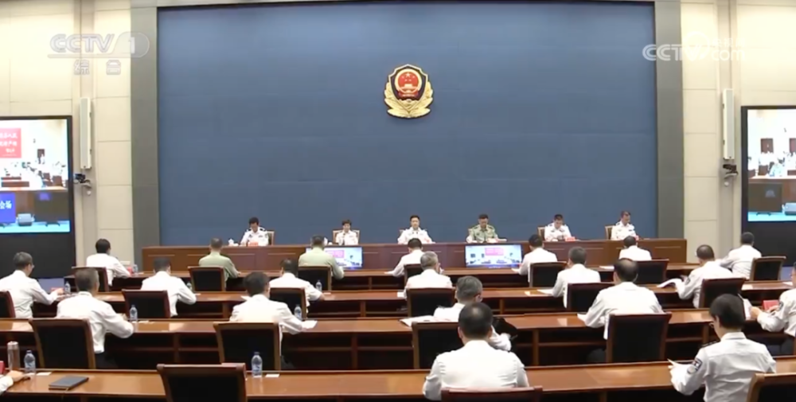

# 特殊时间点，公安部长出席重要会议，还专门对甘肃、青海公安提要求

**撰文丨高语阳**

新华社消息，12月23日，全国公安机关视频会议召开，中共中央书记处书记、公安部部长王小洪出席并讲话。

“准确把握岁末年初形势特点。”王小洪指出，要采取雷霆手段，发起凌厉攻势，更快破大案、更多破小案。

此外，针对甘肃省积石山6.2级地震抗震救灾工作，会议还对甘肃省、青海省公安机关提出具体要求。

重要时间点

政知君注意到，在一些重要时间点，王小洪多次出席全国公安机关视频会议并部署重点工作。

今年6月25日，王小洪在全国公安机关视频会议上要求，要准确把握当前治安维稳形势，深入开展夏季治安打击整治行动。

9月28日，全国公安机关视频会议再次召开，王小洪在会上指出，要总结深化全国公安机关夏季治安打击整治行动成果，抓实当前安保维稳各项工作，确保人民群众度过安宁祥和的中秋、国庆佳节，确保杭州亚运会、第三届“一带一路”国际合作高峰论坛等重大活动安全顺利，确保全国社会大局持续稳定。

当前正值岁末年初，12月23日，王小洪再次出席全国公安机关视频会议。

**他在会上指出，准确把握岁末年初形势特点，强化打防管控各项措施，全警投入、全力以赴，确保社会大局稳定、群众平安过节。**

关于“群众平安过节”，会议还指出，
**要严查群众身边案，紧盯节日期间盗抢骗、酒后滋事闹事、打架斗殴等违法行为，快查快办、快侦快破，防止“小案”变“大案”、“小事”变“大事”** 。

“更快破大案、更多破小案”

王小洪在会上对公安重点工作作出部署。

公安部官网发文介绍，会议强调， **要始终保持对违法犯罪的严打高压态势。**

**“要坚持什么犯罪突出就重点打击什么犯罪、什么治安问题集中就着力整治什么问题，采取雷霆手段，发起凌厉攻势，更快破大案、更多破小案。”**

_资料图_

**要严打电信网络诈骗等突出犯罪** ，持续组织区域会战、发起集群战役，全力斩断犯罪链条；

要依托“昆仑”等专项行动， **依法严厉打击生产销售有毒有害食品、制售假药劣药和非法揽客、强迫消费等违法犯罪活动** ，让群众吃得放心、玩得安心。

**要对“屡整治、屡反复”的治安洼地进行挂账** ，集中整治治安顽疾，不断整街面、净环境。

其中，“严打电信网络诈骗”是当前备受关注的重点。

中共中央办公厅、国务院办公厅印发了《关于加强打击治理电信网络诈骗违法犯罪工作的意见》，要求依法严厉打击电信网络诈骗违法犯罪。

同时，加强国际执法司法合作，积极推动涉诈在逃人员通缉、引渡、遣返工作。

今年5月30日，王小洪在全国打击治理电信网络新型违法犯罪工作电视电话会议上表示，要深入推进打击治理工作，全力夺取反诈人民战争新胜利。

一段时间以来，大批电信诈骗嫌疑人被押解回国，成为公众关注的热点。

例如，11月21日，公安部通报，缅北相关地方执法部门已经向我方移交电信网络诈骗犯罪嫌疑人3.1万名，其中幕后“金主”、组织头目和骨干63名，网上在逃人员1531名。

再例如，10月20日，公安部发布消息，417名实施跨境电信网络诈骗的犯罪嫌疑人从菲律宾被押解回国。

“快速查处网络谣言和有害信息”

此外，当前公安部非常重视依法严厉打击整治网络谣言违法犯罪。

23日的会议指出， **要快速查处网络谣言和有害信息，依法打击查处各类涉网违法犯罪活动，有效治理网络乱象。**

前一天，12月22日上午，公安部召开新闻发布会通报，今年4月至7月，针对热点事件中谣言高发等突出问题，公安部组织全国公安机关开展了为期100天的网络谣言专项整治。截至目前，全国公安机关已侦办网络谣言类案件4800余起，依法查处造谣传谣人员6300余名，依法关停违法违规账号3.4万个。

同时，公安机关依法严厉惩治造谣诽谤等网络暴力违法犯罪活动。截至目前，共查处网络暴力违法犯罪案件110起，刑事打击112人，行政处罚96人，批评教育472人，指导重点网站平台阻断删除涉网络暴力信息2.7万条，禁言违规账号500余个。

此外，公安部党委决定将2024年作为打击整治网络谣言专项行动年，部署全国公安机关开展为期一年的专项行动。

此次专项行动，
**公安机关以编造传播虚假信息进行“造热点”“蹭热点”“带节奏”的网红大V等为目标，查明黑灰利益链条，不断提升网络谣言案件类案打击和生态打击能力。**

对甘肃、青海公安提要求

会议还特别对甘肃、青海公安机关作了要求：

**甘肃、青海等地公安机关要深入开展抗震救灾、群众安置、社会面防控等工作，尽最大努力保障人民群众生命财产安全，全力维护灾区社会稳定。**

12月18日，甘肃临夏州积石山县发生6.2级地震。

此前，甘肃省通报，截至12月22日8时，积石山6.2级地震已造成甘肃117人遇难，781人受伤；青海省通报，截至12月21日22时，地震累计造成青海省海东市31人遇难、3人失联。

政知君注意到，公安部十分重视公安机关的抗震救灾工作。

12月22日，公安部新闻发布会通报，地震发生以后，公安部第一时间启动应急响应机制，部署有关地方公安机关千方百计搜救转移安置遇险、被困群众，加强救灾现场、群众安置点、医疗点巡逻防控和道路交通秩序管控等工作。

甘肃、青海两地公安机关紧急调集5000余名警力，携带相关装备全力投入抢险救援工作，全面提升受灾地区社会面防控等级，加强街面和居民安置点的巡逻防控，依法打击散布涉地震谣言信息违法犯罪人员，维护社会治安秩序。

其中，12月23日，公安部网安局公众号发文通报，甘肃省公安厅网安总队发布了积石山6.2级地震期间，部分编造发布地震谣言的相关违法案例。截至目前，甘肃已依法行政处罚抗震救灾造谣网民11人、批评教育105人。

**资料｜ 新华社 公安部官网 中国政府网等**

**【版权声明】本文著作权归政知新媒体独家所有，未经授权，不得转载。**

