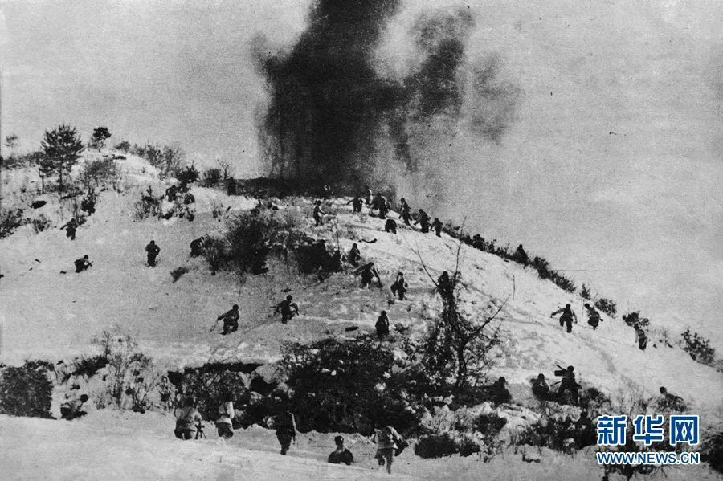

# 胡锡进：无需把平安夜与长津湖战役胜利纪念日对立起来

今天是平安夜，也是长津湖战役胜利纪念日。老胡认为，无需把这两个事情对立起来。因为有那些先烈们，至今有很多解放军官兵驻守边陲，我们的祖国尤其平安。
**把平安夜当节日过的人多有一些信息和联想，多一些缅怀和尊敬，是好事。**

_▲1950年12月，长津湖北部地区外围战斗中，中国人民志愿军第27军某部8连战士们拔除敌人最后一个据点，从四面八方攻入新兴里。（图源：新华社）_

**与此同时，通常含义的平安夜在中国也是光明正大的。**
中国有2000多万基督徒，他们重视这个节日，更多是一些小青年把这个“洋节”当聚会和消费的噱头，商家也趁机多赚点，这也不是问题。全球化时代，节日文化难免相互影响。中国政府不主动推动“洋节”的兴盛，自有我们的道理，但政府也绝无“打压洋节”的任何意思，一些国人过“洋节”是他们的正当权利之一，不应在舆论上受到指责。

_▲中国现有基督徒约2305万人，教牧传道人员3.7万余人，教堂2.5万余座，简易活动场所(聚会点)3万余处。（截图：中华人民共和国中央人民政府官网）_

一些人提醒今天是长津湖战役胜利纪念日，这很正能量。但是如果强调今天只能当长津湖战役胜利纪念日来过，而不能把它当通常意义的平安夜来过，搞这样的对立，就是不对的了。
**这有悖常情、常理，也与国家的宗教事务政策南辕北辙，与公众的消费意愿南辕北辙。**

_▲浙江义乌商店里的各种圣诞产品。（图源：网络）_

什么事情都要遵循正常的逻辑，不能以极端方式制造绝对性，我认为这是今天中国互联网舆论场应当具有的集体理性。
**如果把极端的东西往正能量上嫁接，其实际效果一定是不好的。**

