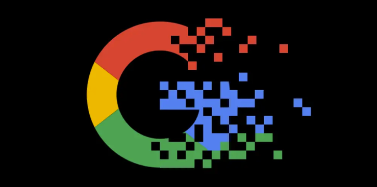
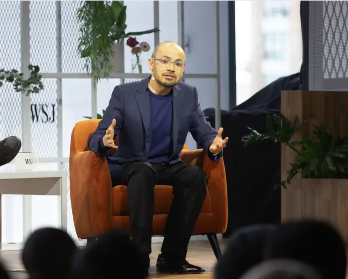
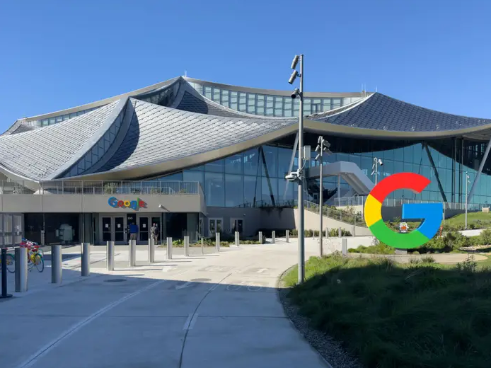

# 谷歌的2023过得不太容易：裁员、转型、争当AI霸主

**划重点：**

  * _1_ 谷歌的2023年可以说是在动荡中度过，忙于裁员、转型以及争夺AI霸主地位。
  * _2_ 尽管面临诸多批评，谷歌依然加快了ChatGPT竞争对手Bard及其大模型的推出速度。
  * _3_ 许多员工认为，2023年是谷歌最终向华尔街屈服的一年，该公司的文化永远发生了改变。

腾讯科技讯 12月23日消息，据外媒报道，12月12日，谷歌首席执行官桑达尔·皮查伊（Sundar
Pichai）召集员工参加该公司2023年最后一次全员大会。对这家科技巨头来说，这是起伏动荡的一年，以前所未有的大裁员开局，并以发布该公司迄今为止最大人工智能项目收尾。

我们有理由为谷歌加油喝彩，谷歌云今年首次实现了盈利，该公司推出了一系列新的人工智能产品和更新。

不过，也有迹象显示，谷歌员工的士气今年受到了重创。在名为Googlegeist的面向全公司的调查中，尽管仍有78%的员工表示为在谷歌工作感到骄傲，但只有45%的员工认为谷歌有着明确的愿景。此外，调查的总体参与度仅为36%，这个数字明显偏低。

与此同时，裁员阴云也始终笼罩着整个公司。员工们最关心的问题之一是，高管们是否仍然认为裁员是必要的。皮查伊回答说：“我们尽可能地避免裁员。”他坚称裁员是个艰难但“重要”的决定。但他的回答并没有让所有员工信服。

对谷歌来说，2023年是加快行动、找到重点，并证明自己仍有能力与更灵活的对手竞争的一年。但有些员工表示，谷歌今年采取的提高效率举措已经让这家搜索巨头曾经引以为豪的企业文化急剧恶化。

当被要求对谷歌即将过去的一年进行总结时，一名员工简单地回答说：“一个词：严峻。”

**01 ChatGPT撼动了搜索巨头**

谷歌在人工智能领域取得了长足的进步，其2017年的《转换器（Transformer）》论文，就为OpenAI的ChatGPT技术奠定了基础。然而，谷歌对于自己最新的研究成果总是显得格外谨慎。

2022年11月，就在ChatGPT发布前几周，谷歌举行了一场媒体活动，展示其在人工智能方面的最新成果，包括文本转视频项目的演示。虽然谷歌的技术生成了长颈鹿和气球的粗略动画，但并未公开发布。

谷歌高级研究总监道格拉斯·埃克（Douglas
Eck）在活动的主旨演讲中说：“我们必须承认，如果我们不多加小心，这项技术可能会带来真正的风险，这就是我们迟迟没有发布它们的原因。我为我们选择缓慢发布这些技术而感到自豪。”

然而，OpenAI推出的ChatGPT改变了这一切。尽管谷歌高管在公开场合对该技术的重要性轻描淡写，但在内部，他们深知这是巨大的威胁。据多名知情人士透露，谷歌高管低估了生成式人工智能在普通公众中产生的巨大反响。

此前，谷歌曾开发过类似的产品，但因为种种担忧并未公开发布。人工智能项目的失败，包括Duplex语音助手与五角大楼协议引发的反弹，都让高管们更加谨慎。

但现在，谷歌的核心业务突然面临着很长时间以来第一次真正的威胁，这促使公司态度发生了变化。他们变得“大胆、负责任”，全力以赴研发和推出新的人工智能产品。

高管们知道，他们必须尽快展开行动。今年3月，谷歌推出了名为Bard的ChatGPT竞品，但结果并不如预期。Bard的功能很强大，但感觉不如ChatGPT聪明。在早期演示中，Bard给出了错误答案，导致谷歌股价暴跌。

4月份，谷歌宣布将DeepMind和Brain这两个研究部门合并，以加速人工智能方面的进展。对于DeepMind来说，这是一个重要的时刻。自2014年被谷歌收购以来，DeepMind主要作为谷歌的附属实验室运营。DeepMind首席执行官戴米斯·哈萨比斯（Demis
Hassabis）一直担心谷歌可能会滥用DeepMind的技术。

名为Google
DeepMind的新实体将肩负重任，负责领导Gemini的研发。Gemini是个被寄予厚望的大语言模型，旨在取代PaLM2，并剑指OpenAI的GPT-4，谷歌期待它能达到甚至超越这一行业标杆。

据内部消息透露，DeepMind内部已对多个人工智能项目进行降级，以集结资源，全力支持那些直接面向消费者的生成式人工智能项目。

高管们还告知人工智能部门的员工，他们将减少DeepMind发表的研究论文数量。此举意在防止竞争对手抄袭他们的创新成果。不过，这一决定在DeepMind内部引发了不满。长期以来，多发论文一直是该部门吸引人才的重要手段。

一位已离职的谷歌员工表示：“大语言模型热潮是谷歌面临的第一个真正的挑战。”
这句话或许道出了谷歌当前的困境。在这个竞争日益激烈的市场中，谷歌必须拿出更多创新才能维持其领先地位。

目前，谷歌正倾尽全力研发Gemini。据多位与谷歌联合创始人谢尔盖·布林（Sergey
Brin）共事的知情人士透露，在Gemini发布前的一个月，布林重返谷歌，几乎全职投入到了该模型的开发中。

在最近的更新中，谷歌并未推出其最强大的Gemini模型。该公司表示，最强大的Gemini Ultra将于明年初发布，其性能将更接近OpenAI的GPT-4。

**02 裁员在谷歌将成为常态？**

今年1月份，谷歌裁掉了约1.2万名员工，约占员工总数的6%。皮查伊在给员工的备忘录中表示，这次裁员是公司为了加强对包括人工智能在内的关键领域的关注。然而，一些员工称，对于一家长期以来始终宣称要从长远考虑、不屈服于华尔街压力的公司来说，这感觉像是一个拐点。

谷歌曾经是硅谷最受欢迎的工作场所，但如今却面临着与微软、亚马逊、Meta等其他科技巨头同样的困境。由于疫情期间的过度招聘和对经济下滑的担忧，这些公司不得不进行裁员。

一位在谷歌工作多年的离职员工表示，看到谷歌转型为一家关注短期股东利益的公司，感觉相当令人失望。几乎所有团队都受到了裁员的影响，有些团队受到的打击更大。谷歌内部的研发孵化器Area
120削减了半数项目，许多正在推进的“登月计划”支出大幅缩减。

一些员工认为谷歌对裁员的处理方式非常糟糕。许多员工在半夜通过电子邮件被解雇，而且立即失去了访问权限。对于过去一直将员工福祉放在首位的谷歌来说，这种处理方式让员工感到心寒。

总的来说，这次裁员与“谷歌式”的做法大相径庭。一名资深员工表示，如果要写一本关于如何做得非常糟糕的教科书，谷歌就是个不错的例子。在本月的全体会议上，皮查伊也承认，该公司原本可以更好地处理这些问题。

在这一年中，许多员工都处于紧张状态，等待着更多的裁员。事实上，谷歌在2023年的确进一步裁员了，包括Google News、Google
Assistant和招聘部门都受到了影响。对于这些员工来说，未来的日子将充满不确定性。

**03 为谷歌的灵魂而战**

今年11月份，谷歌内部紧张的氛围因为一个离职员工的公开信而被公众所知。这位名叫伊恩·希克森（Ian
Hickson）的工程师自2005年以来一直在谷歌工作，他在自己的博客上发表了一篇备忘录，回顾了自己在谷歌18年的工作经历，并对公司文化的转变进行了尖锐的批评。

希克森在信中写道：“士气空前低落。”许多其他员工也有同感。他指出，1月份的裁员对谷歌产生了“潜伏式”影响，导致员工“大幅减少任何冒险行为”。他强调：“现在，这种情况已经成为现实！”

希克森并不是第一个表达对公司不满的离职员工，但他的信似乎引起了很多员工的共鸣，这封信在公司内部广为传播。一位在职员工表示：“这很重要，也符合很多人在裁员后的感受和想法。这意味着，人们考虑的不再是什么才是好的产品或体验，而是什么能在他们的绩效评估中看起来更好。”

谷歌2024年的目标是将其人工智能突破转化为成功的产品。但与此同时，这也将是为了应对今年裁员和转型带来的负面影响。谷歌的一位高管说：“谷歌原来的文化永远消失了！”

然而，希克森在他的备忘录中暗示，老谷歌可能并没有完全消亡。他写道：“如果有人想带领谷歌进入下一个20年，最大限度地造福人类，无视股价的短期波动，就可以把谷歌的技术和激情转化为真正伟大的成就。不过，我确实认为时间在流逝。谷歌文化的恶化最终将变得不可逆转，因为你需要充当道德指南针的那种人，但谷歌现在正缺少这类人。”

这封信再次凸显了谷歌当前面临的挑战，以及员工对公司文化转变的担忧。随着谷歌继续努力在人工智能领域取得突破，并保持其竞争优势，如何平衡创新和员工福祉将成为一项关键任务。对于许多人来说，希克森的信是对过去的一种怀念，也是对未来的一种呼唤，希望谷歌能够回归其初心，重新找回那种曾经让员工感到自豪和激情的公司文化。（编译/金鹿）

