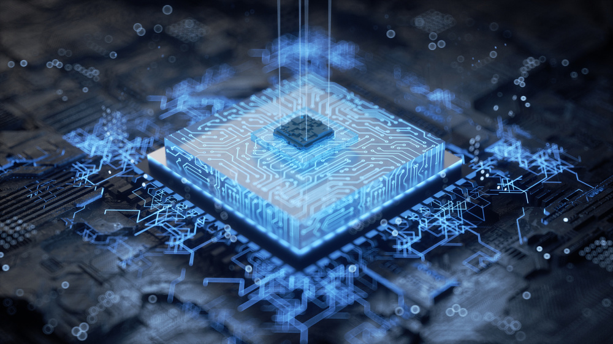

# 阿斯麦第一台2纳米光刻机，给了这家美国巨头：已采购6台

每经编辑：毕陆名

据外媒12月22日报道称，
**荷兰阿斯麦公司将优先向美国英特尔公司交付其新型高数值孔径的极紫外光刻机。据悉，每台新机器的成本超过3亿美元，可帮助计算机芯片制造商生产更小、更快的半导体。**

 _阿斯麦公司在社交平台X上发布的帖文_

阿斯麦公司在社交平台X上发布了一张照片，照片中可以看到，光刻机的一部分被放在一个保护箱中，箱身绑着一圈红丝带，正准备从其位于荷兰埃因霍温的总部发货。

声明中写道：“耗时十年的开创性科学和系统工程值得鞠一躬！我们很高兴也很自豪能将我们的第一台高数值孔径的极紫外光刻机交付给英特尔。”报道称，高数值孔径的极紫外光刻机组装起来比卡车还大，需要被分装在250个单独的板条箱中进行运输，其中包括13个大型集装箱。据估计，它们将从2026年或2027年起用于商业芯片制造。

另据界面新闻12月19日报道，Digitimes援引SamMobile消息称， **ASML计划在2024年生产10台2nm设备，英特尔已采购其中6台。**
未来几年ASML计划将此类芯片制造设备产能提高到每年20台。

英特尔于15日在中国召开产品发布会，宣布推出面向人工智能的第五代至强(Xeon)处理器和新款酷睿Ultra处理器，上述两款产品连同英特尔最新的人工智能(AI)芯片Gaudi
3也在美国市场同期发布。

尽管英特尔没有在中国的发布会上正式推出Gaudi3，不过该款产品还是在美国的发布活动上赚足了眼球。英特尔预计Gaudi3将于2024年正式上市，该公司称Gaudi3的性能将优于英伟达的H100，不过这一说法并未得到独立验证。除了英伟达的H100外，Gaudi
3还要面对AMD同样于2024年向客户交付的“最先进AI加速器”MI300的竞争。

_图片来源：视觉中国_

官方资料显示，英特尔Gaudi3将采用5nm工艺，带宽是前代Gaudi2(7nm工艺)的1.5倍，BF16功率是其4倍，网络算力是其2倍。Gaudi3预计将配备最高128GB的HBM3e内存，AI学习和训练性能大幅提升。

在当前的AI“军备竞赛”中，英伟达暂时是市场份额的佼佼者，上月14日该公司正式发布了新一代人工智能计算芯片H200。官方信息显示，H200芯片基于英伟达Hopper架构打造，处理速度为4.8TB/秒，拥有141GB的内存。与前代产品A100相比，H200的容量几乎翻了一番。英伟达称，要应用生成式人工智能，就必须使用大容量的GPU来高效处理大量数据。

10月18日，阿斯麦（ASML）发布了2023年第三季度财报。期内，ASML实现净销售额67亿欧元，毛利率为51.9%，净利润19亿欧元。今年第三季度的新增订单金额为26亿欧元，其中5亿欧元为EUV光刻机订单。ASML预计2023年第四季度的净销售额在67亿至71亿欧元之间，毛利率在50%至51%之间。ASML确认其2023年预期净销售额增长率达30%。

据澎湃新闻报道，ASML总裁兼首席执行官Peter
Wennink表示：“我们第三季度的净销售额为67亿欧元，处于预测营收区间的中间值；毛利率为51.9%，超出预期目标。这主要得益于DUV产品组合以及一些非经常性的一次性费用。”

“本季度净利润为19亿欧元，新增订单金额为26亿欧元，低于前几个季度，这也在我们的预期之中，主要是因为在当前环境下客户对现金流和资本支出持谨慎态度，因此对开出新订单也同样相对谨慎。目前ASML仍有超过350亿欧元的未交付订单。”ASML首席财务官Roger
Dasse则表示。

每日经济新闻综合界面新闻、澎湃新闻、公开信息

