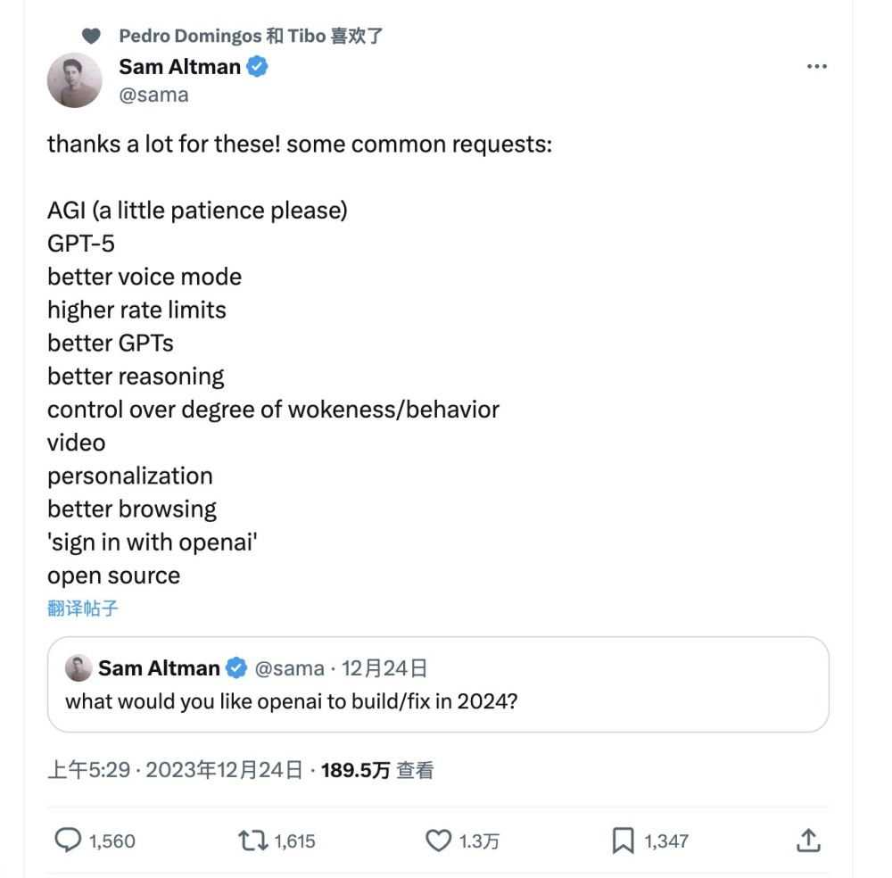
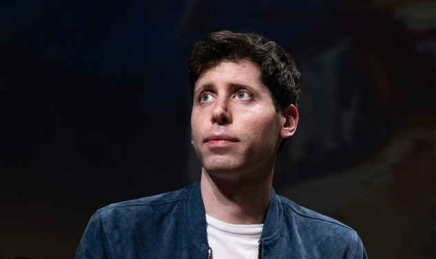
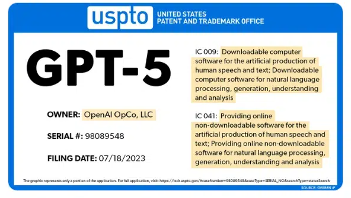
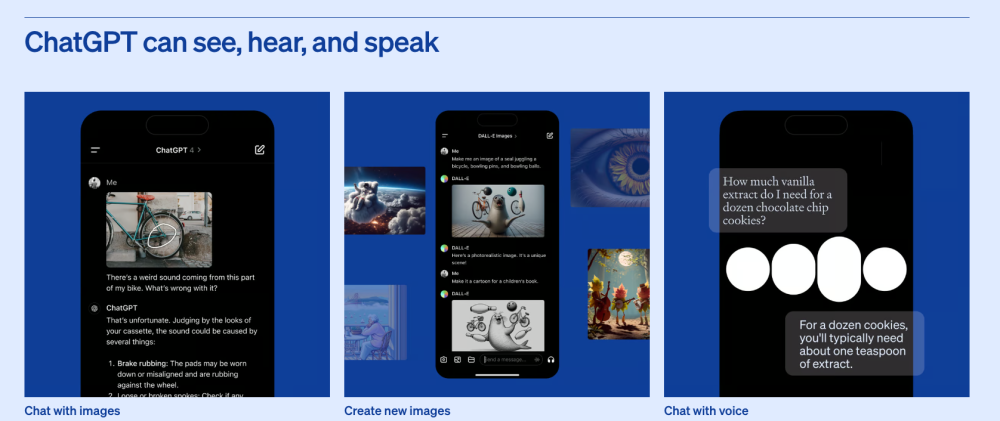
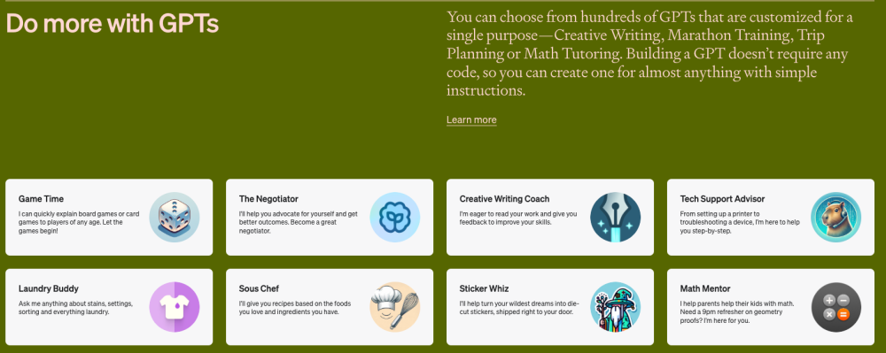

# OpenAI CEO晒网友新年愿望单：通用人工智能、GPT-5呼声最高

文/腾讯科技 郝博阳

在平安夜的清晨，就在大家还在热议GPT-4.5是否已经悄悄上线的时候，OpenAI CEO
山姆·奥特曼发布了一条推文，直接剑指GPT-5，给AI开发者和用户送了份充满充满期待的圣诞礼物。

这份清单其实起源于12月24日，奥特曼在社交媒体上发布了一条征集帖“你希望OpenAI
在2024年能做到哪些事情？”他的粉丝回复热情很高，奥特曼梳理了一份List（如图片所示），除了在AGI旁边标注了“还需要点耐心”的字样外，其它的愿望清单都没有做任何标注，我们有理由相信，也许奥特曼认为其余目标都有可能在2024年做到。

**这份清单包括：**

  * _1_ AGI（还需要些耐心）
  * _2_ GPT-5
  * _3_ 更好的语音模式
  * _4_ 更高的使用频率限制
  * _5_ 更好的GPTs
  * _6_ 更好的推理能力
  * _7_ 控制觉醒程度/行为
  * _8_ 视频功能
  * _9_ 个性化部署
  * _10_ 更好的浏览体验
  * _11_ 可以使用OpenAI账号登录
  * _12_ 开源项目推进

其中最引人注目的是四项内容：GPT-5、视频、开源、更好的GPTs /
个性化部署，这几项内容可能带来AI开发生态、用户体验、及产品能力上质的跃迁。“控制觉醒程度/行为”，不出意外的也出现在这个清单之中，可以看出大众对这家公司的责任担当的期待。那么，如果要完成这份清单，OpenAI可能需要解决的难题及突破重点有哪些呢？

01 想要在2024年完成GPT-5的训练，OpenAI要做的不少

OpenAI正在训练GPT-5这件事已经越来越明晰了。早在7月18日，他们已经向美国专利商标局提交了GPT-5的商标申请。到了11月14日，奥特曼接受金融时报采访时也终于承认GPT-5已经在路上了，虽然可能仅仅是开发的准备阶段。奥特曼在采访中的表述是“在我们训练这个模型之前，这对我们来说就像是一个有趣的猜谜游戏”，这说明OpenAI应该还没开始训练模型。在准备阶段他们在做的可能涉及建立训练方法、组织注释器，以及最关键的数据集管理。

**数据瓶颈**

数据问题一直被认为是OpenAI发布下一代大模型的主要瓶颈。因为缩放效应这种“喂的越多模型就越强”的逻辑仍然是AI能力进步的主要主导思想。但在训练GPT-4时，OpenAI已经有些捉襟见肘了。传闻称，GPT-4的训练数据共
13T（13 万亿个）token。这一数据量级基本耗尽了现有数据：CommonCrawl 和 RefinedWeb 两个公开数据集都是 5T 个
token；据说余下部分来源 Twitter、Reddit 和 YouTube；最近沸沸扬扬的争论中，马斯克还指控OpenAI使用了来自
LibGen、SciHub 等盗版电子图书网站中的数据。

但这一问题当下也有一定的解决方法。

第一个方法就是买：对于私人或公司领域的数据，OpenAI在之前的训练中少有涉及，但这部分需付费的内容在互联网中占比是非常大的。今年OpenAI就曾表示愿意每年支付高达八位数的费用，用以获取彭博社自有的历史和持续的金融文件数据访问权限。虽然彭博没答应，而是自己搞了个Bloomberg
GPT，但高价之下，总是可以买来一部分数据的。

第二个就是合成数据训练，微软开发的高质量小模型Phi-1就已经实践了利用合成数据训练模型的尝试，在3T的训练集中用了大概1.5B
GPT-3.5生成的高质量合成数据，并取得了模型能力的提升。虽然1.5B看起来占比很小，但考虑到微软是用这些数据做教程用的，并非基础能力构建。如果GPT-5把遵循一定的条件限制的高质量合成数据应用在更多领域，那这一合成数据占比肯定能提升不少。

**训练周期**

按照Dylan Patel
泄漏的GPT-4的训练周期看，在完成训练准备后，OpenAI在大约25000个A100上训练了90到100天才完成，之后又经过了长达6个月的对齐工作才发布。整体周期需要9个月时间。考虑到GPT-5更大，更复杂这一时间长度完全有可能更长，那在2024年发布GPT-5似乎并不乐观。

但奥特曼的自信并非全无道理。GPT-4之所以训练了这么久的原因是 **故障过多导致GPU利用率较低**
，利用率仅为32%到36%之间。而每次故障都需要重新从之前的检查点开始训练。考虑到今年Gemini在训练过程中TPU的利用率应该大于50%，而且当谷歌使用模型状态的冗余内存副本，并且在任何计划外的硬件故障时，可以直接从完整的模型副本中快速恢复。有着英伟达H200加成及微软从2019年就启动的名为雅典娜的类TPU项目加持，GPT-5在训练利用率上应该会较GPT-4有很大的提升。

而对齐工作在今年的进展就更大了。首先是AI辅助自动进行对齐工作的可能性被验证有效（RLAIF），这衍生出了很多在AI参与乃至主导下的对齐研究。通过这种方式，可以大大缩短之前最费人力和时间的RLHF这一对齐步骤，提升对齐效率。但之前这种方法主要适用于用能力强的模型对齐能力弱的模型，提高其能力。但OpenAI在12月刚刚发布的弱到强泛化论文，提供了较弱AI仍然可以对齐能力更强AI的证据和方法。两种技术相结合，用GPT-4自动对齐GPT-5的逻辑和方法都有了，因此对齐时间有望被大幅缩短。

在以上条件下，有理由相信GPT-5的全部训练周期可能会短于GPT-4，这样它在2024年发布就不成问题了。

02 多模态还是必争之地，OpenAI剑指文生视频爆发元年

在这个愿望清单上， **另一个值得注意的点是视频功能的支持**
。这一点OpenAI的竞争对手Google已经处于领先地位了。在训练Gemini的过程中，谷歌使用了多模态原生的数据，其中就包括视频。这说明Gemini已经有了对于视频的理解能力。但具体能理解到什么程度，因为Google用力过猛的演示让大家都疑虑重重。而且它还缺了生成式AI的重要一环，生成视频的能力。

实际上，在文生图，ChatBot齐头并进吸引走大家的主要注意力之时，文生视频类软件在今年也获得了巨大的进步。11月PIKA
1.0的发布就引发了相当的关注，利用这个工具我们可以随意用新的生成替换原视频，或生成视频中的任意内容。这些新进展主要归功于Animatediff这个框架，它使得一部分运镜限制下，生成视频的闪烁和连贯性都得到了有效控制。

但目前文生视频系统有三个相对重要的短板：1. 高连贯性内容长度难以超过3秒 2. 稳定内容对运镜和动作仍然限制很大
3.生成现实性内容的能力不强，需要用Midjourney等工具辅助。

但其中部分问题已经能看到被解决的曙光了。比如说时长问题，近期Google Mind
发布的新建模方法VideoPoet，它从本质上是利用支持视频的多模态，将文字和视频进行令牌化（tokenized），从而用大语言模型擅长的自回归模式去预测下一段视频的内容。这与传统的基于Diffusion（扩散）模型的文生图框架并不相同，理论上它可以生成无限长、具有高度时间一致性的视频。而在生成图像真实度方面，李飞飞的团队近期发表的模型W.A.L.T在生成拟真度上有了比较高的提升，已接近照片水准。

在Gemini发布时，业界基本预测下一代GPT-5也会是一个 **大一统的原生多模态模型**
，这就意味着用类似VideoPoet的技术GPT-5也可以实现视频生成的能力，补齐这一短板。考虑到OpenAI自身在Diffusion方面的积累和GPT-5潜在的超强能力，生成视频的质量应该也相对有保障。文生视频按目前的技术积累看，就在爆发前夜。而GPT-5也许就是引爆这一领域的产品。

03 个性化水平再提升，从知识库到工具的核心路径

在OpenAI首届开发者日上，真正的主角其实并非GPT-4
Turbo，而是GPTs。因为它第一次把个人化AI这一过去门槛颇高的产品落到个体层面，这样才能真正实现个人化的AI。而只有个人化的AI才能满足每个人最个性化的需求，成为私人助理。

但现在这个产品还存在着诸多问题，比如提供了个人数据库后，GPT的回应还是会经常呈现出它原始的表达模式，在风格模仿上能力有限。另外出于隐私保护逻辑，GPTs只支持上传内容和接入公共网络工具API，无法完全利用本地数据。这些都在很大程度上限制了个性化AI的足够“个性化”。另外GPTs目前的交互也非常依赖Prompt，缺乏UI类的支持。这类问题如果在新的一年解决，ChatGPT对于大多数人来讲可能就不再是一个只有在搜索知识时好用的产品，而是一个真正可用的万能工具了。

这条路上目前没有其他的大玩家，因为决定个性化水平的基本上是模型能力。只要OpenAI保持着模型水平的领先，这一工具化领域的优先权他们就能随时把控。对于一般用户而言，如果能在原生模型软件上完成任务，谁还会去用其他个性化工具呢？

在这篇文章发布的时候，奥特曼收集粉丝2024年愿望清单的活动还在持续：“我们将继续收集粉丝们的意见，并尽可能多地将它们纳入考虑，当然也包括许多其他让我们感到兴奋不已但尚未提及的内容。”正如奥特曼在11月接受《时代》杂志采访时所说：“这将是一个截然不同的世界。这是科幻小说长期以来向我们展示的世界。我想这是第一次，我们可以开始看到它的雏形。”在圣诞夜，我们可以一起期待，AI将在2024给我们带来什么样的惊喜。

