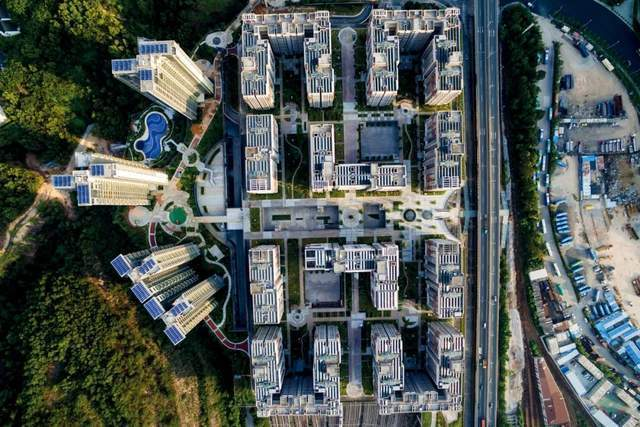
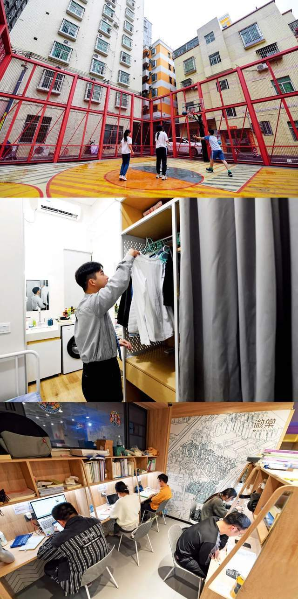
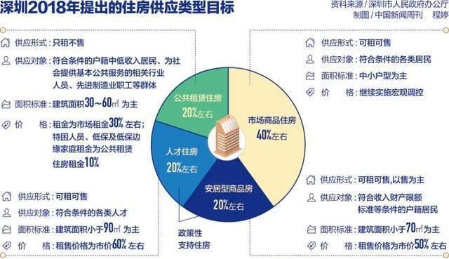
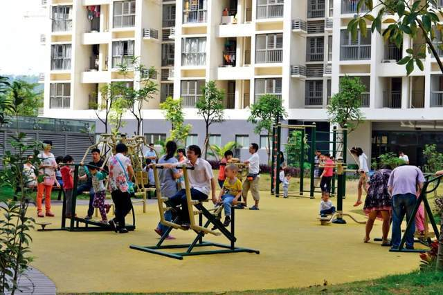
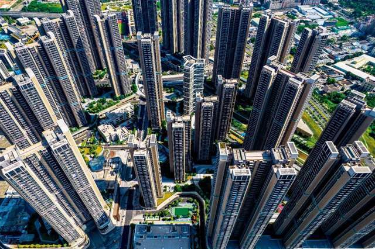

# 六成市民可入住政府提供住房，深圳如何做到？

深圳可能是国内第一座提及“二次房改”概念的城市，早在2018年，便提出到2035年筹建100万套以上保障性住房的目标，这一目标达成的时间目前已经提前至2027年。深圳还曾明确规划未来六成人口居住于保障性住房的远景目标。

在2020年8月的一次演讲中，时任深圳市住建局局长张学凡表示，新加坡是深圳学习的榜样，将来深圳有60％的市民住在政府提供的租赁或出售的住房中。

“深圳提出‘二次房改’早于全国，目标便是解决深圳人地错配，从而导致住房供需严重失衡，进而推动深圳房价不断上涨的根源性问题。”
国家高端智库CDI研究员宋丁告诉《中国新闻周刊》，深圳希望效仿新加坡的住房“双轨制”模式，人才房、安居型商品房分别为商品房售价的60％、50％，形成保障房占据住宅供应总量六成的目标，这一目标远远超过过往保障房在新增住房中的占比。

深圳长期以来土地供应不足，城市可以利用的低成本建设空间极为有限，这些都成为深圳颇具雄心的保障房计划最大的挑战。2023年，规划建设保障性住房被列为全国性“三大工程”之一，在不断加码的保障房筹建目标下，深圳需要找到增量的来源。

 _广东深圳市，位于南山区的龙瑞佳园公租房小区。图/视觉中国_

**如何与全国“接轨”**

2023年8月底，深圳推出两个项目的配售人才房702套，申请门槛进一步下调，学历由此前的本科降低至“申请人具有全日制专科学历，或者具有中级及以上专业技术资格，且具有中专及以上学历等”。此外，三人家庭也可申购三房户型。

这是今年以来深圳第二次降低人才房申请门槛。早在2月底，深圳就将未婚单身人群购买人才房的年龄限制由35岁降至30岁，同时放宽了对共同申请人的户籍要求。

配售型人才房是深圳住房保障体系的重要组成，以留住人才为目的，符合条件的申请者根据条件的差异进入优先级不同的申请队列轮候。人才房售价约为同片区商品房的6折，签订买卖合同满10年后，可申请取得住房完全产权。

2022年11月深圳推出第一批人才房，超1.5万户家庭选购4422套房源，选房历时20天，最终仅有1930套被选定，去化率约43.65％。不同区域项目分化严重，两房三房分化也较为明显，其中龙岗宝龙和大鹏新区的3个项目销售惨淡，大鹏新区的安居君兰湾府三房最终选房率只有1％左右，龙岗宝龙的安居颢龙苑三房也仅有22％的选房率。

考虑到一线城市中深圳户籍的准入门槛相对较低，其实第一批人才房的申请门槛也并不高，需要购房者自身在深圳无房，且具有全日制本科以上学历或二级以上国家职业资格证书、深圳户籍以及在深圳缴纳社保。

自深圳人才房推出首批项目以来，其较高的弃选率便引发外界关注。在房地产市场整体低迷的原因之外，“十年内禁止交易”的规则被视为主因。

而据深圳乐居统计，2023年人才房的去化率尚可。截至11月底，深圳今年已配售及在售中的人才房项目共有18个，供应总量超1.5万套，累计超10万家庭参与申购人才房，已有12个项目售罄，部分进入常态化配售的项目也仅剩少量房源，整体去化率高达80％以上。

在人才房去化率差强人意的情况下，深圳今年两次下调申请门槛，“去化库存”的意味明显，因为人才房也将会停止建设。

2023年7月3日，深圳一次性发布了《深圳市公共租赁住房管理办法》《深圳市保障性租赁住房管理办法》《深圳市共有产权住房管理办法》《深圳市保障性住房规划建设管理办法》四个文件，于8月1日正式实施。施行之日起，不再安排建设安居型商品房和人才住房，这距离深圳推出首批人才房仅半年有余。

尽管深圳已宣布不再建设人才房，但结合此前深圳市规划和自然资源局公布的存量住宅用地清单来看，深圳未来还将有近19个人才房项目入市，总房源达1.4万套以上。

7月发布的四份文件，意味着深圳的住房保障体系将由当前公租房、人才房、安居型商品房为主，“转轨”为2021年6月国务院发布的《关于加快发展保障性租赁住房的意见》提出的以公租房、保租房、共有产权住房为主。

其中共有产权房被认为是对人才房、安居型商品房的替代。不过，相比于后两者10年后可以上市交易的规定，共有产权房封闭性更强。

有接近地方住建部门的人士向《中国新闻周刊》分析，其实早在2014年4月，深圳便与北京、上海、成都、淮安、黄石等5座城市成为首批共有产权住房改革试点城市，但此后一直未能推出共有产权房。“其实一些已经推出的共有产权房项目往往沦为‘鸡肋’，因为其只能转让给符合条件的对象，并未充分保护购房者产权。”

不过，在8月底国常会审议通过的《关于规划建设保障性住房的指导意见》中并未提及“共有产权房”，取而代之的是封闭运营的配售型保障房。

宋丁告诉《中国新闻周刊》，关于配售型保障房的模式，目前正处在政策的模糊点上，但是其中有两点精神被明确：一是通过配售型保障房供应，让中低收入阶层“居者有其屋”；二是让商品住房回归商品属性，意味着未来将取消一系列针对商品住房的限制性措施。“‘14号文’对于配售型保障房某种意义上‘留白’，地方政府进入一个政策研究的阶段。”

11月28日，深圳规自局宝安管理局发布的关于宝安区（机场东地区）法定图则06-11地块规划调整的公示中，出现“建设配售型保障性住房”的表述。

此后一天，深圳公共资源交易平台发布《龙岗区宝龙街道等8个保障性住房项目基坑支护、土石方及桩基础工程（批量招标）》。值得关注的是，原招标项目名称为“深圳市第一批配售型保障性住房基坑支护、土石方及桩基础工程（批量招标）”。这意味着，深圳第一批配售型保障房至少安排了8个项目。

尽管深圳住房保障体系在今年频频“转轨”，但是其并未偏离深圳2018年“二次房改”的目标。

_上图：4月2日，在广东深圳市龙华区元芬村，居民在增设的篮球场打篮球。中图：元芬村的一间青年公寓内，租户张毅掾整理衣橱。下图：元芬村青年公寓住户在社区增设的自习室工作学习。图/新华_

**“二次房改”的雄心与现实**

2018年，深圳开启“二次房改”，提出了一个雄心勃勃的目标：到2035年筹建各类住房170万套，其中带有政策支持性的住房总量不少于100万套，占市场供应量的60％左右。届时，深圳将形成商品房占40％，人才住房、安居型商品房和公共租赁住房各占20％的住房结构，后三种住房便属于“保障房”。

当时的背景是，深圳房价上涨过快，住房矛盾非常突出。而问题的根源在于土地、住宅供给不足。

2020年以前，在房地产开发处于高峰期的10年间，相比于北上广等一线城市以及多数二线城市，深圳供地量始终较少。这10年间，深圳住宅用地成交面积431.5万平方米，居103个城市倒数第四，不到北京的10％、上海的5.8％。

为什么供应这么少？“对于多数中国城市而言，供应土地支撑房地产投资是拉动经济增长的重要动力。深圳其实也想进行这场游戏，但苦于手中无地。”宋丁表示。

深圳面积不足2000平方公里，其中一半划入基本生态控制线内，剩余一半可用于开发建设，不足1000平方公里。其中又有近30％的土地，也就是270平方公里被划入工业区块线，只能用于发展工业。真正留给包括住宅在内的城市建设用地仅有700余平方公里，已经基本被开发殆尽。

深圳人口与广州接近，但是市域面积只有广州的四分之一。以2019年为例，该市全年计划供应1100公顷建设用地，其中居住用地只占14％，产业及商业用地占32％，且绝大部分居住用地要靠城市更新来完成。

宋丁告诉记者，近年深圳政府能够供应的“净地”可能只有十几平方公里，并且散落在各区，存量最多的坪山区可能也仅有8~10平方公里。这意味深圳不可能像其他城市那样大手笔供地，也使得深圳对于房地产业的依赖较小，必须押注产业经济。利用有限的空间，一方面通过提高容积率，如现在推行“工业上楼”提高产业用地效率；另一方面就是依靠更多高新技术产业实现内涵式增长。当一些城市因为此次房地产下行谷底被“套牢”之时，深圳受此拖累较少。

但是，这确实造成深圳住宅用地出让较少，特别是在2020年之前，最少的一年仅出让一块宅地，平时每年出让宅地数量也不会超过五块。因此造成人地错配，人口持续增长，但住宅供应难以跟上。“民间一直在呼吁深圳扩容，但实际上深圳过去较长时间通过住房需求外溢的方式解决人地错配问题，惠州、东莞承接了大量深圳的外溢需求，东莞一些毗邻深圳区域的房价甚至高于东莞主城区。”宋丁说。

需求外溢之余，深圳也希望更多挖掘内部增量，一方面是依靠城市更新增加住宅供应，另一方面便是通过二手房市场。“其实深圳二手房源数量很少，此前深圳不足200万套，有限的供应成为推高深圳房价的源头。”宋丁说，供需错配带来的另一个结果是深圳住宅容积率不断提升，10年前深圳住宅多为32层，此后逐渐增加至45层、60层以上，甚至75层，只能通过不断增加的容积率解决供应不足的问题。

深圳一直没有解决土地供应的瓶颈，直到2020年之后，深圳每年利用土地整备的项目，以及释放各类主体持有的闲置土地，每年供应近30块土地，其中便有为住宅用地“补课”的考虑。

土地供应不足也制约着深圳保障房发展。2018年提出“二次房改”前，深圳每年4万套左右的住宅供应基本以商品房为主，保障房往往只有几千套，而且保障性住房筹建一直存在一个现象，即无法完成年初承诺的筹建数量。

深圳市原副市长张思平曾撰文称，2005年~2015年，深圳保障房与商品房建设规模的比例大体为1：9，即商品房建设占深圳住房建设总规模的90％，保障房只有10％。

而按照广东省住房政策研究中心首席研究员李宇嘉的统计，深圳“十一五”（2006~2010年）、“十二五”（2011~2015年）曾分别计划建设保障房17万套、24万套，但最终均未达成，“十一五”“十二五”保障房的竣工量仅为两万套、10.2万套。其根源便是在划分有限的土地资源时，没有将供地大规模留给保障房。

因此在宋丁看来，相比于保障房的具体模式、供应数量与占比等，深圳“二次房改”最重要的意义在于将保障性住房明确为未来住房供应的主体，这意味着包括土地在内各类资源的倾斜。

2018年，深圳曾定下2035年筹建100万套保障房的目标，不过这一目标达成的时间目前已经提前至2027年。“因为按照原计划已经不足以满足需求，必须加大筹建数量、缩短筹建时间。”宋丁说。

深圳市住房建设局相关负责人表示，2021~2027年全市将累计新增建设筹集保障性住房100万套（间），覆盖约350万~400万人。预计到2035年，保障性住房覆盖人群将达到约500万人，约占全市常住人口的26％。短期内深圳保障房的筹建不断“加码”，但问题是，深圳如何发掘增量？

_深圳龙华区公租房项目龙悦居小区内的住户。图/视觉中国_

**何处寻增量？**

在2022年发布的住房十四五规划中，深圳提出建设筹集住房89万套（间），包括商品房35万套、保障性住房54万套（间）。近期，深圳调整了保障性住房目标，从原先的54万套（间）调整为不少于74万套（间），增加的20万套（间）均为保障性租赁住房。

这一规划目标分解到2023年的任务是，建设筹集保障性住房18.5万套（间），其中：公租房1万套（间）、保障性租赁住房16万套（间）、共有产权房1.5万套。

在深圳新版住房保障体系中，保租房占据最为重要的位置。宋丁告诉记者，“保租房筹建需要策略，因为新建受制于土地供应并不现实。”

 _深圳光明区的长圳公共住房项目。图/视觉中国_

深圳找到的一条重要途径是城中村改造。广东省公寓协会会长刘昕告诉《中国新闻周刊》，2023年中央提出推动新一轮城中村改造，其实重点便是在大湾区，因为不同于北京、上海已经将大量土地收储，广州、深圳因历史遗留问题仍有大面积城中村。

深圳近2000万人中有1200万人居住在租赁住房中，其中八九百万人居住在城中村，意味着深圳人口的近一半居住在城中村，而深圳拥有正规商品房的人不到总人口的30％，与北上广动辄百分之六七十的住房自有率无法相比。

但对于将城中村改造为保租房的必要性存在争议，外界认为城中村房源本就是“天然的保障房”。

今年年中，深圳白芒村的“统租事件”引发大量关注。“统租”的本质便是为了提升白芒村的居住品质，同时也为了筹集保租房，南山区国资委直属的深圳市深汇通投资控股有限公司（下称“深汇通”）号召白芒村业主将房屋统一租给深汇通，深汇通将房屋改造之后再对外出租，而其中一部分改造完成的房源会纳入保租房范畴，但是遭遇租客抵制。

宋丁解释称，考虑到现有城中村环境与配套较差，一些初到深圳的群体可能不愿租住，从而导致这些人离开深圳。另外租赁人口其实最为关注房租、水电费用的收取，国企取代原本的“二房东”或村民运营城中村房源，可以更好地稳定租金涨幅。“城中村改造有其必要性，白芒村统租的方向是对的，只是操之过急。短期内让5万余名租客全部搬离，面临寻找新住所、孩子上学等一系列问题。”

城中村改造主要分为两种模式，一种是由开发商以市场化的方式推进，但因为高昂的拆迁成本，这种模式显然难以为继，推进速度较慢，而且较高的成本也使其难以作为保障房运营。另外一种方式主要由国有企业介入，进行综合整治，修建配套设施，对少量房屋拆除重建，这是未来城中村改造的主要路线。

深圳近年来逐渐转向第二种城中村改造模式。2019年，《深圳市城中村（旧村）综合整治总体规划（2019-2025）》对外发布，划定了全市城中村综合整治分区范围，其中福田、罗湖和南山综合整治分区划定比例不低于75％，其余各区不低于54％，规定综合整治分区内的城中村不得拆除重建，同时由各区政府直接投资对纳入综合整治的城中村进行基础设施改造。

此后，城中村的一个重要方向便是规模化租赁。

当时比较大规模推进的是万科的“万村计划”，通常签约城中村20％左右的房子，提高每间房子的标准，再配置电器等设施。改造之后，出租给白领群体、高收入的蓝领群体，租金当然会适当增加。但是会引发剩余80％房源业主自发进行改造，这就间接抬高了整个村的租金，导致类似的计划被叫停。

宋丁认为，政府希望将城中村房源改造为品质更好的租赁住房，但是交由房企以市场化的方式推进，自然会将改造成本体现于租金上涨，但是中低收入群体对于租金又极为敏感，“租金相比于居住环境会放在第一位考虑，导致万科的‘万村计划’最终夭折。”

谁来进行改造至关重要，让村民主动将城中村房源“纳保”缺少动力，而鉴于市场化主体的逐利性，必须以国企，或是国企与民企的联合体介入改造。宋丁告诉记者，目前深圳的策略是在尽量短的时间里实现城中村改造全覆盖，也就是不要一个城中村只改一半，另一半不动。

宋丁曾对深圳城中村改造保租房较为成功的元芬村案例进行调研。他告诉记者，“国企会逐步租下城中村房源，如深圳元芬村房源便是国企持有40％，二房东持有40％，村民自持20％，未来国企持有的房源比例还会上升。而且往往会付给原住村民更高的房租，甚至是原有租客房租的一倍，因此在原住村民处一般不会遇到阻力。即使是在今年的白芒村统租争议中，几乎没有原住村民反对的声音，更大的阻力来自于‘二房东’，因为统租直接伤害其利益。”

当国企以更高租金租下城中村房源，再进行改造，如何在确保租金相对较低，且涨幅受限的情况下尽量实现收支平衡？

宋丁告诉记者，国企依然有降低成本、增加利润的空间。比如重新进行空间布局，将单间房屋面积变小，普遍缩小几平方米至十平方米，从而可以改造出更多房间。再比如可以通过“地内损失地外补”的方式，政府会将城中村配套服务设施的运营也交给负责改造的国有企业，类似香港地铁用物业租赁的收入填补地铁运营的亏损。从元芬村的案例来看，国企基本可以达到收支平衡，甚至微利的状态。

中央财政也进行了部分支持。2022年年底，财政部发文支持深圳在财政政策体系与管理体制方面探索创新，提及了中央财政加大推动深圳住房供需问题解决的支持力度。元芬新村规模化租赁住房改造项目便纳入中央财政支持住房租赁市场发展试点资金补助范畴，获得补助资金2334.8万元。

今年，深圳计划通过规模化品质化改造提升城中村，筹集5.2万套（间）保障房，占全市年度计划建设筹集保障性住房18.5万套（间）的近三成。

在深圳有限的城市空间中，城中村房源改造甚至被受访者认为是较低成本供应保障房为数不多的选择。

杂志标题：100万套：一座超大城市的雄心与挑战

记者：陈惟杉

编辑：闵杰

