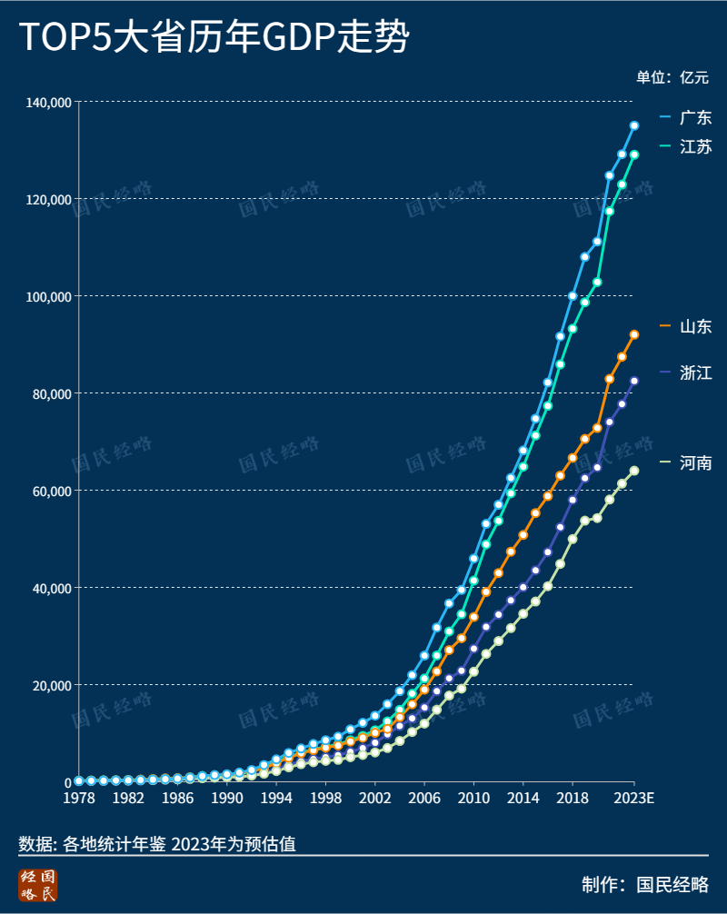
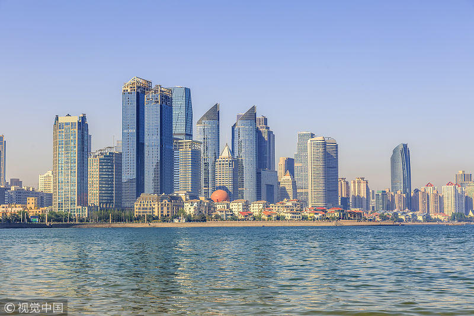
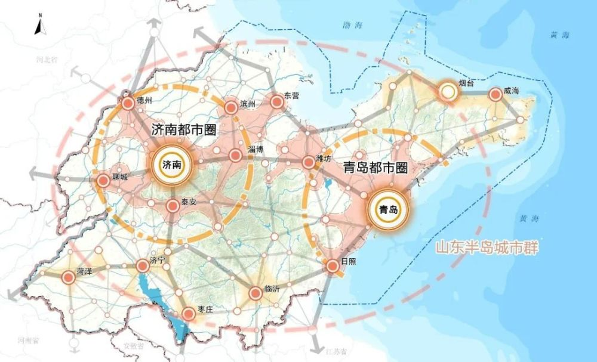
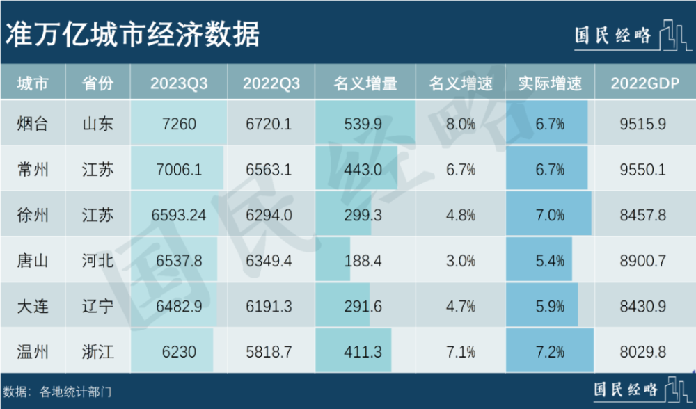
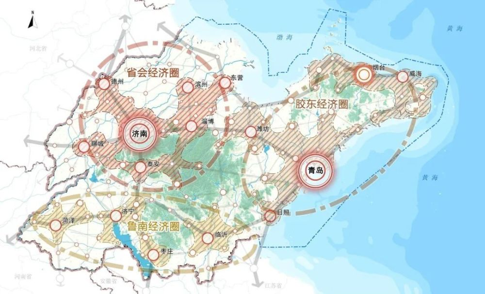
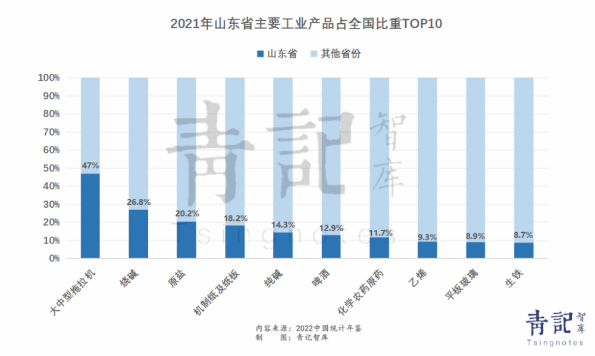

# 又一个GDP总量达9万亿的大省，呼之欲出

**文|凯风**

2023年行将收官，谁在跃升？

根据官方媒体报道，据相关预测，山东能够圆满完成年初确定的经济增长目标，今年 **经济总量有望迈上9万亿元台阶、过万亿城市有望达到3个。**

这意味着，山东作为中国经济第三大省的地位将会进一步巩固，而烟台大概率成为继青岛、济南之后山东第三个万亿城市。

万亿城市扩容，经济大省晋级，影响有多大？

01

9万亿大省，意味着什么？

全球共有180多个国家和地区，但GDP总量超过9万亿（约合1.3万亿美元）的不超过20个。

换言之，山东经济总量已经超过世界上80%以上的国家， **放在全球可以排在第16名，** 超过荷兰、土耳其等国，堪称“富可敌国”。

去年，山东GDP总量就已达到8.74万亿，而今年前三季度同比增速高达6%，名义增量超过3700亿元，超过年初的预期目标。

可见，只要四季度不出现负增长，山东全年GDP突破9万亿，再次跨过新的万亿大关，几乎没有悬念。

显然，四季度负增长的可能性无限趋近于0。且不说去年同期超预期事件冲击带来的低基数，近期外贸、工业形势改善也给年度经济带来强支撑。

站在9万亿， **10万亿大省已经遥遥在望。**

根据十四五规划目标，山东2021年-2025年年均GDP增速设定为5.5%左右,工作中力争达到6%以上。

虽然超预期因素冲击带来一定扰动，但即使按照5%的实际增速目标来看，到2025年山东GDP总量突破10万亿，也未必没有可能。

当然，这一切对于山东只是新征程的开始，而非终点。

要知道，同为经济大省，广东今年GDP总量即将迈上13万亿大关，而江苏超过12万亿，而浙江也在紧随其后，今年大概率站上8万亿。

可见，山东前有标兵、后有追兵，经济发展之路没有丝毫松懈的可能。

要知道，早在30多年前， **山东一度与广东、江苏争锋** ，共同竞逐第一大省，直到1989年广东站在第一大省之位，这一站就是34年之久。

如今，山东经济强势反弹，未来未必没有再次赶上粤苏的可能。

**02**

万亿俱乐部扩容，山东坐实第三大省之位。

在GDP迈上新的万亿台阶的同时，山东省内还将诞生第三个万亿GDP城市。

作为山东第三大市， **烟台今年跻身万亿俱乐部** 同样没有悬念。

去年，烟台GDP就已突破9500万亿元，而今年前三季度增量就已超过500亿，晋级万亿可谓板上钉钉。

烟台并非无足轻重的普通地级市，而是不折不扣的 **工业大市。**

重化工业是最大支柱，而电子信息产业、有色及贵金属产业、食品加工产业也都达到了千亿级。

烟台工业之强，超过了济南、合肥、西安等众多省会。数据显示，2022年烟台全部工业增加值3481.35亿元，排在全国20名左右。

虽然新旧动能转换始终是个困扰，但烟台引进的众多百亿级乃至千亿级大型项目，足以保证未来几年GDP的稳步增长。

这其中，最受瞩目的当属 **投资近1500亿元的裕龙岛炼化一体化项目** ，这是山东省迄今为止单体投资规模最大的工业项目，也是名副其实的“一号工程”。

一旦完全建成投产，将为烟台带来巨大的GDP和财政收入增量，支撑烟台在万亿城市上快走一步。

烟台一旦晋级， **山东将成为北方地区唯一拥有3大万亿城市的省份** ，也成为全国第三个拥有3个及以上万亿城市的大省。

目前，内地共有24个万亿GDP城市，其中南方18个，北方仅有6个。

在各大地市中，今年烟台、常州有望联袂晋级。届时，万亿GDP俱乐部将会扩容到26席，南方增加到19席，北方也扩容到7席。

从省域分布来看，江苏将以5席位居首位，广东仍旧保持4席，山东扩容到3席，而浙江福建都是2席，无一例外都是经济大省。

虽然南北差距依旧存在，但山东的持续跃升，将成为北方经济最大的亮点，堪称北方经济最大的压舱石之一。

事实上， **在烟台之后，北方还将有多个地市晋级。**

根据各地规划及最新数据，河北唐山、辽宁大连有望在两年左右完成突破，而辽宁沈阳、河北石家庄、山东潍坊有望在三到四年左右实现突围。

届时，山东将会诞生第四个万亿城市，而辽宁、河北也将打破零万亿城市的尴尬。

**03**

山东区域经济最大的特点，当属均衡。

与江苏坐拥“十三太保”，素有“散装江苏”之称相似， **山东同样没有强省会，没有独一无二的强中心城市。**

目前，山东共下设16个地市，其中济南、青岛为副省级城市，烟台、潍坊、聊城等为普通地级市。

虽然没有TOP10城市，但无论是百强市还是百强县，山东都名列前茅，与其经济第三大省的地位相匹配。

从百强市来看，山东共有16个地市，其中 **11市晋级全国百强市之列** ，总量超过了广东。

山东的百强市，基本都是工业城市，都不乏独挡一面的能力，潍坊、淄博等普通地级市制造业“单项冠军”数量，足以与中西部省份相提并论。

从百强县来看， **山东共有13个百强县，仅次于江苏和浙江，总量位居全国第三。**

目前，全国共有52个千亿GDP大县，其中山东占据5席，分别是青岛胶州市、烟台龙口市、威海荣成市、济宁邹城市和潍坊寿光市。

相对均衡的区域结构，让山东形成了三大经济圈齐头并进的发展模式： **省会经济圈、胶东经济圈、鲁南经济圈。**

当然，鲁南经济圈虽然人口众多、地域广阔，但由于缺乏强中心城市，难以自成一体，山东仍旧是济南、青岛双城记为主导。

不过，由于各大城市都不乏主导产业，不必全面依赖于强中心城市，因此不乏各自出圈的可能。

**去年的曹县，今年的淄博、潍坊，** 都成了网红城市的佼佼者，也成了普通城市在流量经济时代突围的典范。

未来，随着烟台、潍坊纷纷晋级万亿俱乐部，山东经济将会诞生更多新增长极，区域均衡之路会更加畅通。

**04**

谁能想到，就在四五年前，山东一度陷入经济放缓的争议。

当时，第四次全国经济普查结果出炉，山东一次性被“挤”出了数千亿的水分，GDP总量直接从7万多亿回落到6万亿区间。

同时，随着“双碳”时代到来，传统能源化工产业面临持续的转型压力，作为传统石化、钢铁重镇的山东自然首当其冲。

在山东，一向有两个70%之说： **传统产业占工业比重约70%，重化工业占传统产业比重约70%。**

这与粤苏之间形成了一定差异。

广东江苏均以电子信息产业、电气机械和器材制造业为第一、第二大支柱产业，以手机、笔记本、集成电路、锂电池、智能家电等为主要工业品。

与之对比，山东工业品产量位居全国前列的，多是 **生铁、粗钢、钢材、纯碱、乙烯、硫酸等能源化工产品** ，凸显了山东作为重工业大省的底色。

面对这一问题，山东并未就此躺平。早在2018年，山东有关人士就直言不讳表示，山东面临着 **“由别人追着跑到追着别人跑”** 的窘境。

解决这一问题的关键就在于： **新旧动能转换。**

同年，《山东省新旧动能转换综合试验区建设总体方案》获批，这是全国第一个以新旧动能转换为主题的区域发展战略。

随后， **山东淘汰了上万亿的落后产能，** 累计治理“散乱污”企业超过11万家，分别压减了上千万吨的粗钢、焦化产能，关停低效煤电机组939.3万千瓦。

任何转型都会伴随着阵痛，淘汰落后产能更是如此，难免对经济造成短期冲击，但只要稳步推进，经济终究会回到正常轨道上来。

5年过去，山东证明了这一点。

目前，山东培育了 **以 “十强”产业为代表的新动能** ，主要包括新一代信息技术、高端装备、新能源新材料、现代医药等。

这几年，许多人对山东的印象，早已不再是传统的“傻大黑粗”，在 **专精特新、单项冠军、先进制造业国家队** 等主要榜单中，山东的身影越来越常见。

截至2023年底，山东省已拥有国家级制造业单项冠军企业186家，位居全国第二；专精特新“小巨人”756家，位居全国第三，竞争力之强，可见一斑。

当然，研发强度不足、战略性新兴产业不够发达，仍旧是山东亟需弥补的短板。

