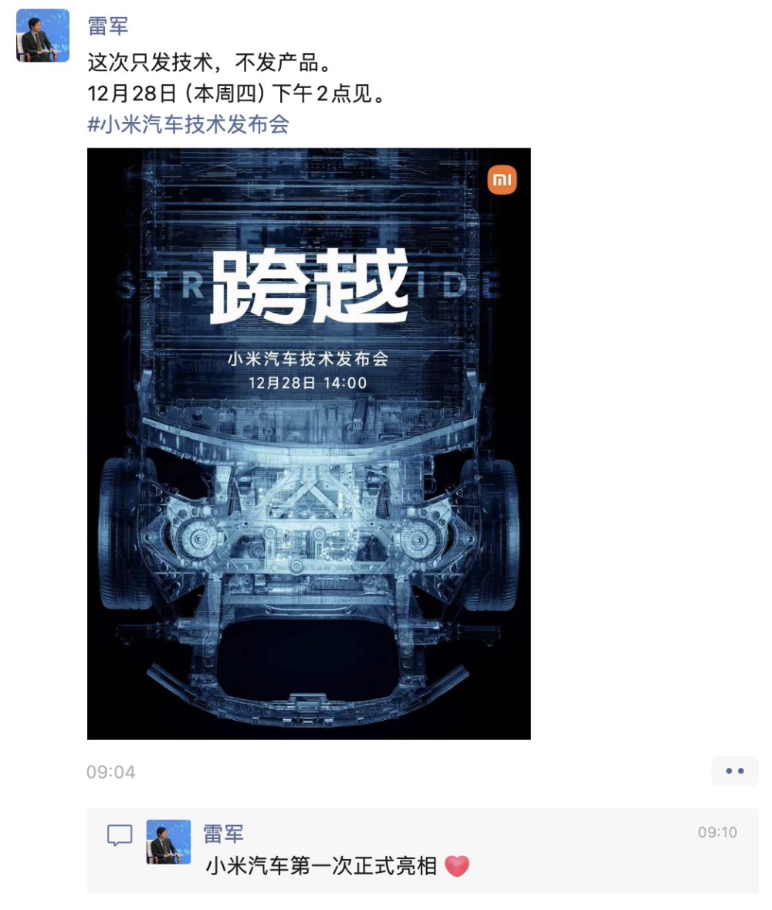
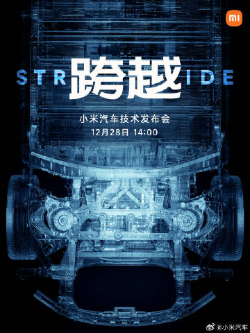
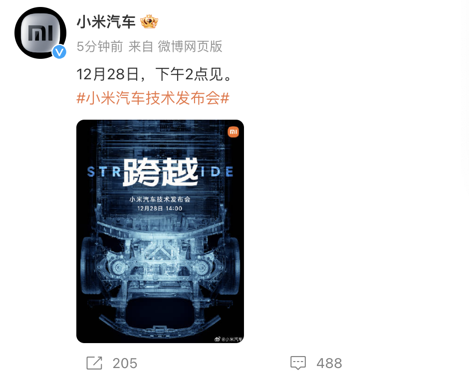
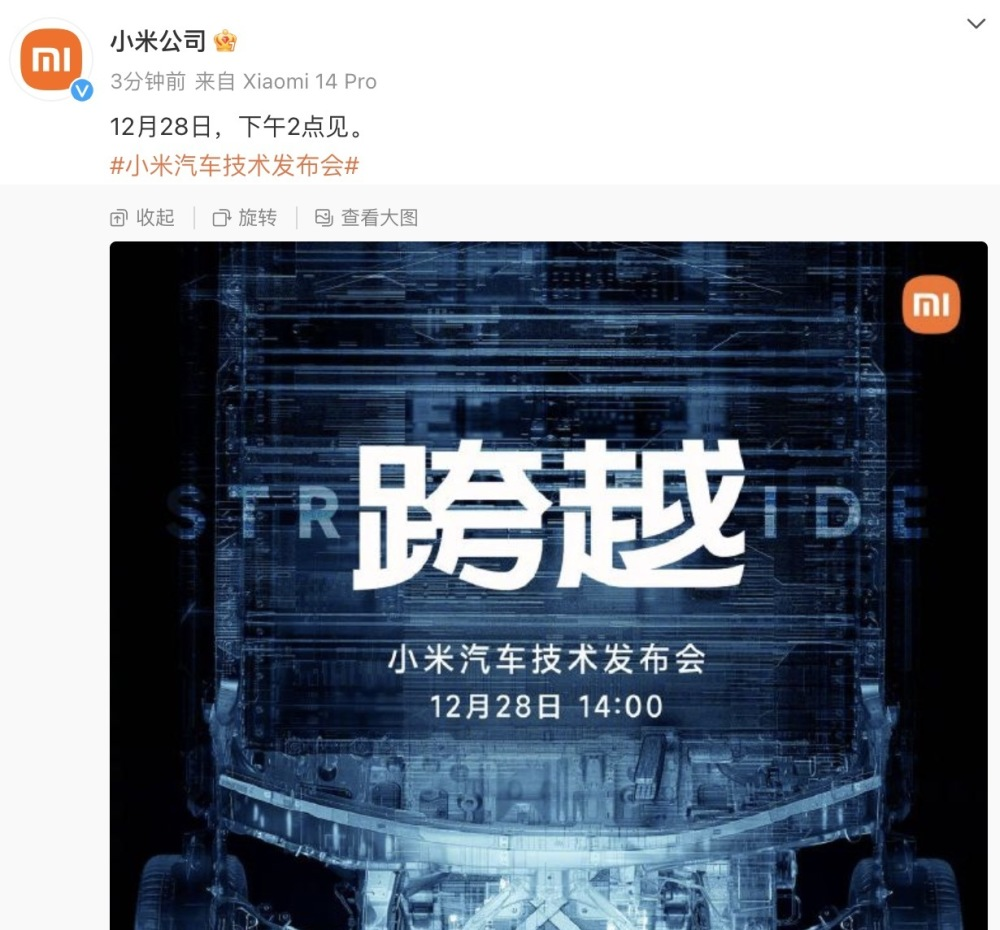

# 官宣！小米汽车12月28日开发布会，雷军：“第一次正式亮相”

腾讯汽车讯 小米公司、小米汽车微博12月25日发布消息称，小米汽车技术发布会将于12月28日（本周四）下午2点进行。

小米集团创始人、董事长及首席执行官雷军也发布微信朋友圈称，这次只发技术，不发产品。12月28日（本周四）下午2点见。

同时，雷军在朋友圈回复，这是“小米汽车第一次正式亮相”。

另据腾讯汽车查阅，小米汽车的官方微信公众号、视频号昨晚也已正式上线。

