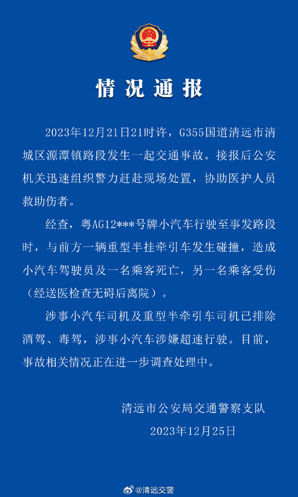

# 广东警方通报“理想L7车祸”：小车司机及一名乘客死亡，小车涉嫌超速

刚刚，广东清远警方通报“理想L7事故”最新情况：

**事故造成小汽车驾驶员及一名乘客死亡，另一名乘客受伤。**

来源：@清远交警

**此前报道：**

[疑似开斗气车？理想L7惨烈车祸视频公布：踩刹车时车速为178km/h](https://news.qq.com/rain/a/20231224A06HWJ00)

