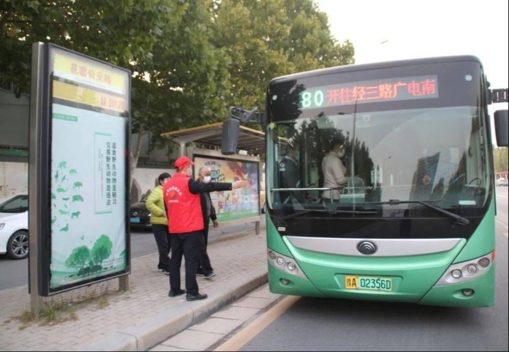
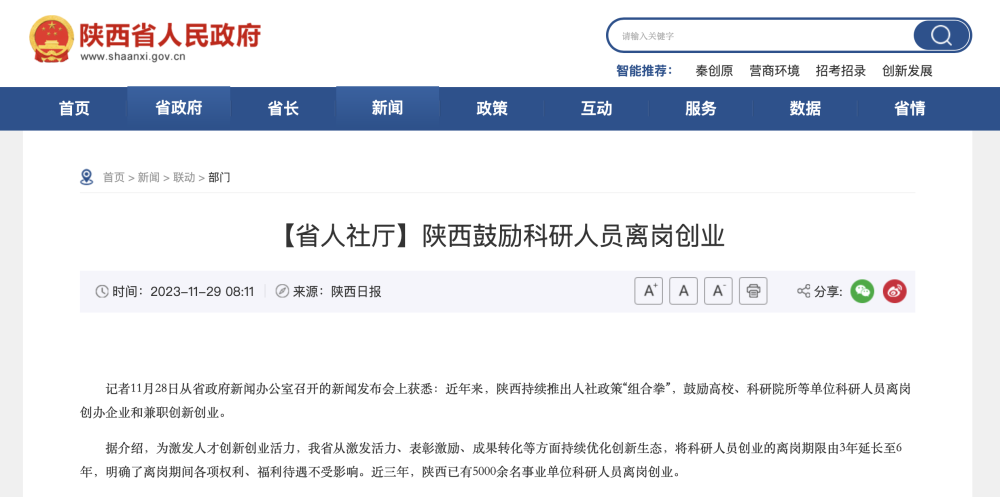

# 郑州公交回应“鼓励工作满10年职工自主创业”：文件真实，是征集意见

顶端新闻记者 杨晓妍

12月24日，有网友发文并曝出截图，称郑州公共交通集团12月21日发布了鼓励职工个人自主创业实施办法的征求意见，截图显示该意见征求是“为进一步缓解集团经营和资金压力”等。

25日，顶端新闻记者向该公司员工求证，工作人员证实该意见稿确为公司所发，“是真实的，但不是正式的文件，是征集意见，具体什么时候施行还不确定。”

记者检索发现，类似企业发文鼓励职工自主创业等现象，此前在江苏、陕西等地已有尝试。

_郑州公交_

**公交公司鼓励职工自主创业?**

据网友发文截图显示，郑州市公共交通公司(下称郑州公交)12月21日发布了关于征求《郑州市公共交通集团有限公司鼓励支持职工个人自主创业实施办法》意见的通知(下称《通知》)。

文件内容写明，该《通知》由人力资源部起草，按照集团公司工作安排，依据国家相关法律法规和集团公司的相关制度，并加盖了该公司公章。

内文附件中还有一份《郑州市公共交通集团有限公司鼓励支持职工个人自主创业实施办法(征求意见稿)》(下称《意见》)。第一条写明：为进一步缓解集团公司经营和资金压力，最大限度地保障广大职工的合法权益，满足职工自主创业的实际需求，集团公司鼓励职工个人进行自主创业，激发全体职工的创造力和创业活力。

该《意见》共27条，其中包含：1.该办法适用于在集团公司工作满10年及以上的职工；2.创业期间离岗，集团公司保留其劳动关系；3.自主创业期限不超过2年；4.创业期间保留原职级，工龄可连续计算，管理人员不再保留其职务；5.期间停发工资、奖金和津贴补助，不再享受各项福利待遇；6.创业期间社会保险等费用由公司承担，住房公积金及企业年金终止或由本人承担缴纳；7.创业期间提前终止协议，可向所在单位提出申请，批准后可提前返回工作岗位等。

截图显示，该《意见》征集截至2023年12月26日中午12时。上述内容发布后，引发网友热烈讨论，不少本地市民担心此举是否会影响公交正常运行。

对于文件中公司经营和资金压力等相关问题，该公司工作人员回应其并非征集方案部门，不清楚公司经营的具体情况，“征集意见后，正式文件何时下发、何时施行，目前都还没确定。”

**鼓励职工自主创业在全国多地已有先例**

顶端新闻记者检索发现，企业鼓励职员创业，郑州公交公司并非首例。

据报道，2023年9月，江苏省人力资源和社会保障厅发布“关于实施重点群体创业推进行动”的通知，提出到2025年底，力争实现每年支持成功自主创业20万人。其中，特别提出，对于事业单位专业技术人员离岗创业者，可在3年内保留人事关系，不影响其社保、工龄及晋升。

9月27日，广西建工集团第四建筑工程有限公司下发通知，为降低企业人力成本，鼓励员工自主创业、自谋职业。广西建工四建工作人员称，因为企业营业情况没有以前好，才出台了一系列处置员工的政策。这些政策可以帮员工托底，也可以帮员工留档案，如果到时候有空缺岗位，员工可以申请回来上班。

事实上，类似政策此前在多地也有尝试，且不缺乏国家层面的支持。如早在2015年5月，国务院印发的《关于进一步做好新形势下就业创业工作的意见》就要求，探索高校、科研院所等事业单位专业技术人员在职创业、离岗创业有关政策，允许科研人员保留职位3年离岗创业。

就在今年11月28日，陕西省政府新闻办公室召开的新闻发布会，鼓励高校、科研院所等单位科研人员离岗创办企业和兼职创新创业。

据该发布会介绍：为激发人才创新创业活力，我省从激发活力、表彰激励、成果转化等方面持续优化创新生态，将科研人员创业的离岗期限由3年延长至6年，明确了离岗期间各项权利、福利待遇不受影响。近三年，陕西已有5000余名事业单位科研人员离岗创业。

**今年多地调整公交票价**

就在今年10月9日晚间，交通运输部、国家发改委、公安部、财政部等九部门曾联合发布《关于推进城市公共交通健康可持续发展的若干意见》，提出五方面共15项政策举措，包括完善城市公共交通支持政策、加强从业人员权益保障等，并就财政补贴、公交票价、员工欠薪等热点问题做出回应。

目前已有不少城市公交公司通过涨票价、区间计费等方式创收。

例如，甘肃兰州自今年9月23日起执行新票价：由之前的1元票价调整为采用单票制线路与多票制线路相结合的方式计费，其中单票制线路票价为2元；多票制线路2元起价，可乘10站，0.50元进位加乘5站，以此类推。

10月，广州市发改委公开征求意见，计划取消1元公交票价，起步价上调至2元。方案一为微调方案版，日班车线路基础票价根据运营里程设置4种价位，分为2元、3元、4元和5元。方案二为一票制方案版，全程营运里程小于或等于15公里的线路票价为2元，大于15公里的线路票价为3元。

顶端新闻记者查询发现，自2015年开始，中国城市公共汽电车客运量进入下降通道。根据交通运输部数据，全国公共汽电车客运量在2014年达到约782亿人高峰后，此后逐步下滑，2022年这一数字仅为353亿人。

数据显示，疫情三年期间，乘坐公共汽电车人数出现大幅下滑。疫情之前的2019年，全国公共汽电车客运量为692亿人。

