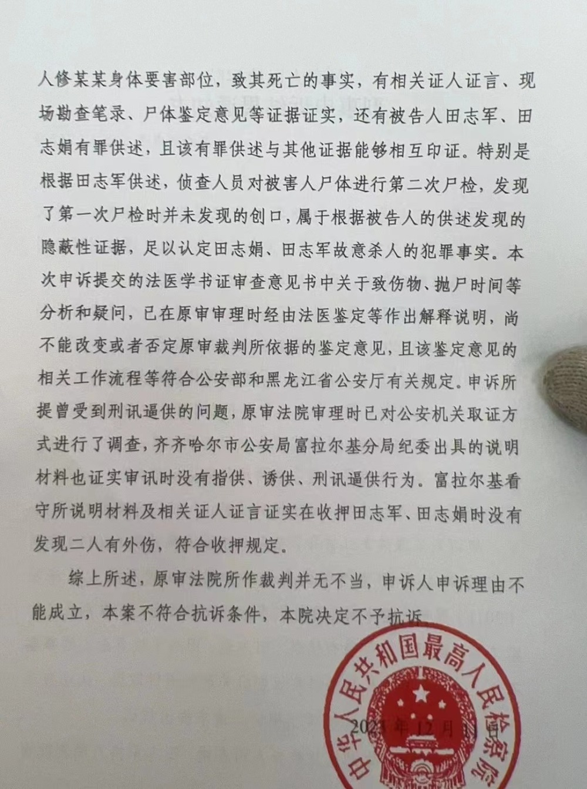

# 黑龙江“姐弟囚徒”申诉20年终被最高检驳回，该案曾五次一审判决

12月11日，针对田志娟等人的申诉，最高检作出刑事申诉结果通知书：决定不予抗诉。

_最高检刑事申诉结果通知书_

田志娟是黑龙江一起故意杀人案的被告人之一，她和弟弟田志军此前被判犯故意杀人罪，双双被判无期徒刑。澎湃新闻曾刊发报道《黑龙江“姐弟囚徒”的五次无期徒刑和17年申诉之路》[《黑龙江“姐弟杀人案”申诉续：省高院决定不立案，曾四次重审》](https://news.qq.com/rain/a/20210913A0BYIH00)对该案进行过详细报道。

2003年9月13日，齐齐哈尔市下岗职工修某某遗体被人发现，此前其已失踪半年之久。之后，曾与修某某有情人关系的田志军及其姐姐田志娟被警方列为杀害修某某的犯罪嫌疑人，双双被捕。澎湃新闻此前报道，自案件侦查阶段起，二人就开始喊冤，并称遭到刑讯逼供。从案发到终审判决，此案经历了9年的司法程序。在审查起诉阶段，检方曾两次退回补充侦查，起诉后，又以“事实、证据变化为由”撤诉，后重新起诉。

2005年8月25日、2007年7月5日、2008年4月24日、2010年1月22日、2011年6月9日，齐齐哈尔中院五次作出一审判决，均认定田志娟田志军姐弟二人犯故意杀人罪，判处无期徒刑。该案第五次一审判决后，田志娟田志军仍提起上诉，但被黑龙江高院于2012年11月12日驳回，维持原判。

入狱后，姐弟二人坚持不认罪，并持续申诉。

2020年7月，黑龙江高院对二人的申诉开展立案复查前的审查工作。2021年9月10日，黑龙江高院向申诉代理人及家属当面告知“决定不予重新立案”的审查结果。对这一结果，田氏姐弟家属及律师团队并不认可，他们又向最高检申诉，请求最高检提出抗诉。

2023年12月11日，最高检作出刑事申诉结果通知书，驳回了田志娟的申诉。

上诉通知书称，经依法审查，原判认定被告人田志娟、田志军持刀捅刺被害人修某某身体要害部位，致其死亡的事实，有相关证人证言、现场勘查笔录、尸体鉴定意见等证据证实，还有被告人田志军、田志娟有罪供述，且该有罪供述与其他证据能够相互印证。

“特别是根据田志军供述，侦查人员对被害人尸体进行第二次尸检，发现了第一次尸检时未发现的创口，属于根据被告人的供述发现的隐蔽性证据，足以认定田志娟、田志军故意杀人的犯罪事实。”通知书称，“本次申诉提交的法医学书证审查意见书中关于致伤物、抛尸时间等分析和疑问，已在原审审理时经由法医鉴定等作出解释说明，尚不能改变或否定原审裁判所依据的鉴定意见，且该鉴定意见的相关工作流程符合公安部和黑龙江省公安厅有关规定。”

上述通知书还表示，二人申诉所提曾受到刑讯逼供的问题，原审法院审理时已对公安机关取证方式进行了调查，齐齐哈尔市公安局富拉尔基分局纪委出具的说明材料也证实审讯时没有指供、诱供、刑讯逼供行为。富拉尔基看守所说明材料及相关证人证言证实在收押田志军、田志娟时没有发现二人有外伤，符合收押规定。

据上，最高检认为：“原审法院所作裁判并无不当，申诉人申诉理由不能成立，本案不符合抗诉条件，本院决定不予抗诉。”

